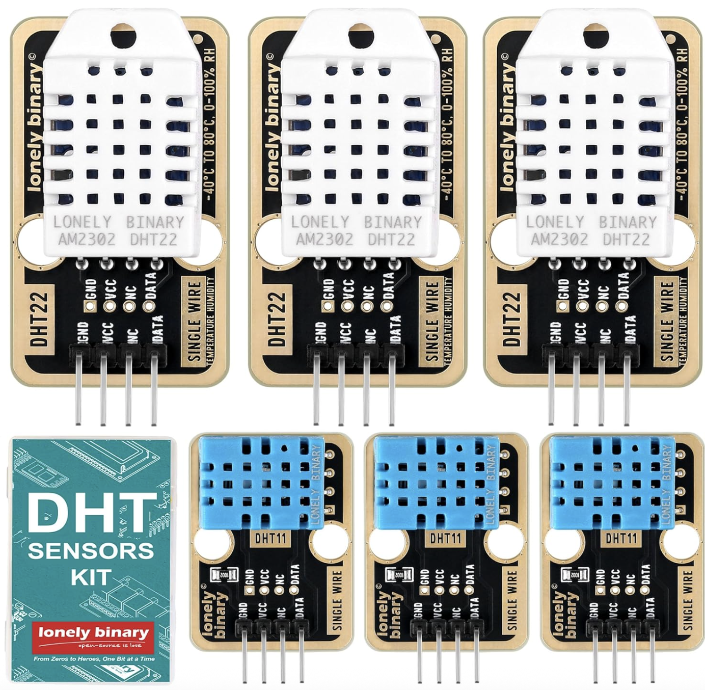

The bundle includes three DHT22 modules for high-accuracy measurements in challenging environments, three DHT11 modules for everyday basic monitoring, and a handy storage container to keep everything organized and protected from dust or damage.

[Amazon US Link](https://www.amazon.com/DHT22-DHT11-Temperature-Humidity-Raspberry/dp/B0G2KT4NLT)

| Index | Code | Sensor                            |
| ----- | ---- | --------------------------------- |
| 01    | TK38 | [DHT11](Sensors/TK38%20-%20DHT11) |
| 02    | TK39 | [DHT22](Sensors/TK39%20-%20DHT22) |
