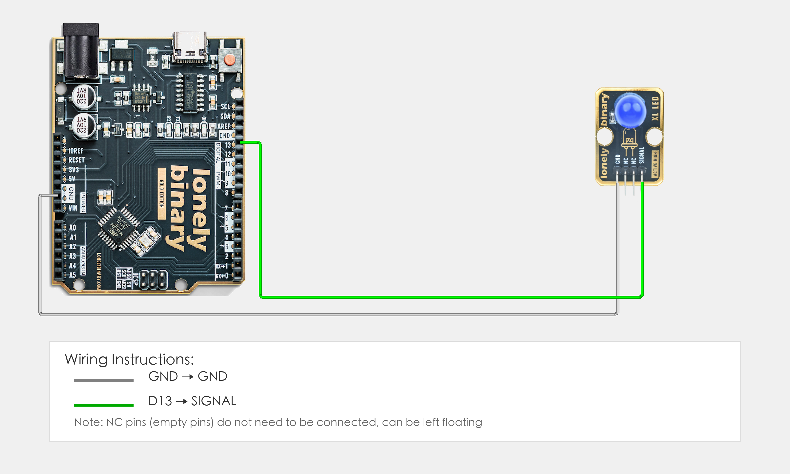

# Arduino Uno R3 程序示例

## 目标

本示例演示如何使用 TK01-XL LED 模块在 Arduino Uno R3 上实现 LED 闪烁，掌握 Arduino 程序结构（setup、loop）与数字输出、串口打印、延时的基本用法。

## 连线



- **GND** → Arduino Uno R3 的 GND
- **SIGNAL** → Arduino Uno R3 的 D13（若程序中修改了 `LED_PIN`，则接对应数字引脚）
- **NC** → 悬空不接

## 代码

```cpp
// 定义引脚号：根据实际接线修改这个数字
#define LED_PIN 13  // SIGNAL引脚连接的Arduino数字引脚号（如D13）

void setup() {
  // 设置LED引脚为输出模式（用来控制LED亮灭）
  pinMode(LED_PIN, OUTPUT);

  // 启动串口通信，用于调试（波特率9600）
  Serial.begin(9600);
}

void loop() {
  // LED闪烁效果
  digitalWrite(LED_PIN, HIGH);  // 输出高电平，点亮LED
  Serial.println("LED点亮");
  delay(1000);                  // 等待1秒

  digitalWrite(LED_PIN, LOW);   // 输出低电平，熄灭LED
  Serial.println("LED熄灭");
  delay(1000);                  // 等待1秒
}
```

## 效果


## 程序讲解

**第 2 行：定义引脚**
```cpp
#define LED_PIN 13  // SIGNAL引脚连接的Arduino数字引脚号（如D13）
```

- **`LED_PIN`：** 定义 LED 引脚连接到 Arduino 的 D13 数字引脚（如果接在其他引脚，修改这个数字）

**第 4–10 行：初始化（setup 函数）**
```cpp
void setup() {
  // 设置LED引脚为输出模式（用来控制LED亮灭）
  pinMode(LED_PIN, OUTPUT);

  // 启动串口通信，用于调试（波特率9600）
  Serial.begin(9600);
}
```

- **`setup()` 函数：** Arduino 程序启动时只运行一次
- **`pinMode(LED_PIN, OUTPUT)`：** 设置 LED 引脚为输出模式，用于控制 LED 亮灭
- **`Serial.begin(9600)`：** 启动串口通信，波特率为 9600，用于调试输出

**第 12–21 行：主循环（loop 函数）**
```cpp
void loop() {
  // LED闪烁效果
  digitalWrite(LED_PIN, HIGH);  // 输出高电平，点亮LED
  Serial.println("LED点亮");
  delay(1000);                  // 等待1秒

  digitalWrite(LED_PIN, LOW);   // 输出低电平，熄灭LED
  Serial.println("LED熄灭");
  delay(1000);                  // 等待1秒
}
```

- **`loop()` 函数：** Arduino 会不停地重复运行这个函数
- **`digitalWrite(LED_PIN, HIGH)`：** 输出高电平，点亮 LED
- **`digitalWrite(LED_PIN, LOW)`：** 输出低电平，熄灭 LED
- **`Serial.println(...)`：** 在串口监视器打印 LED 状态信息
- **`delay(1000)`：** 等待 1000 毫秒（1 秒），控制 LED 闪烁频率
