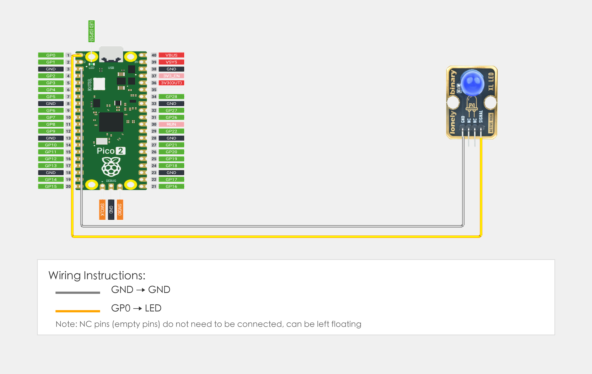

# 树莓派 Pico 2 程序示例

## 目标

本示例演示如何使用 TK01 XL LED 模块在树莓派 Pico 2 上实现 LED 闪烁，掌握 MicroPython 下 GPIO 输出与基本程序结构（循环、延时、打印）的用法。

## 连线



- **GND** → 树莓派 Pico 2 的 GND
- **SIGNAL** → 树莓派 Pico 2 的 GPIO 0（若程序中修改了 `LED_PIN`，则接对应引脚）
- **NC** → 悬空不接

## 代码

```python
# 导入需要的库
from machine import Pin  # 控制GPIO引脚
import time              # 时间相关功能（用于延时）

# 定义引脚号：根据实际接线修改这个数字
LED_PIN = 0  # SIGNAL引脚连接的GPIO号（如GPIO 0）

# 创建引脚对象
led = Pin(LED_PIN, Pin.OUT)  # 设置LED引脚为输出模式（用来控制LED亮灭）

# 主循环：程序会一直运行
while True:
    # LED闪烁效果
    led.on()                 # 输出高电平，点亮LED
    print("LED点亮")         # 在终端显示信息
    time.sleep(1)            # 等待1秒

    led.off()                # 输出低电平，熄灭LED
    print("LED熄灭")         # 在终端显示信息
    time.sleep(1)            # 等待1秒
```

## 效果


## 程序讲解

**第 1–3 行：导入库**
```python
# 导入需要的库
from machine import Pin  # 控制GPIO引脚
import time              # 时间相关功能（用于延时）
```

- **`machine.Pin`：** 用于控制 Pico 的 GPIO 引脚
- **`time`：** 提供 `sleep()` 等时间相关功能

**第 6 行：引脚定义**
```python
LED_PIN = 0  # SIGNAL引脚连接的GPIO号（如GPIO 0）
```

- **`LED_PIN`：** 定义 LED 引脚连接到 Pico 的 GPIO 0（如果接在其他引脚，修改这个数字）

**第 9 行：创建引脚对象**
```python
led = Pin(LED_PIN, Pin.OUT)  # 设置LED引脚为输出模式（用来控制LED亮灭）
```

- **`Pin(LED_PIN, Pin.OUT)`：** 将引脚设为输出模式，用于控制 LED 亮灭

**第 12–20 行：主循环**
```python
# 主循环：程序会一直运行
while True:
    # LED闪烁效果
    led.on()                 # 输出高电平，点亮LED
    print("LED点亮")         # 在终端显示信息
    time.sleep(1)            # 等待1秒

    led.off()                # 输出低电平，熄灭LED
    print("LED熄灭")         # 在终端显示信息
    time.sleep(1)            # 等待1秒
```

- **`while True`：** 无限循环，程序持续运行
- **`led.on()`：** 输出高电平，点亮 LED
- **`led.off()`：** 输出低电平，熄灭 LED
- **`print(...)`：** 在终端打印 LED 状态信息
- **`time.sleep(1)`：** 等待 1 秒，控制 LED 闪烁频率
