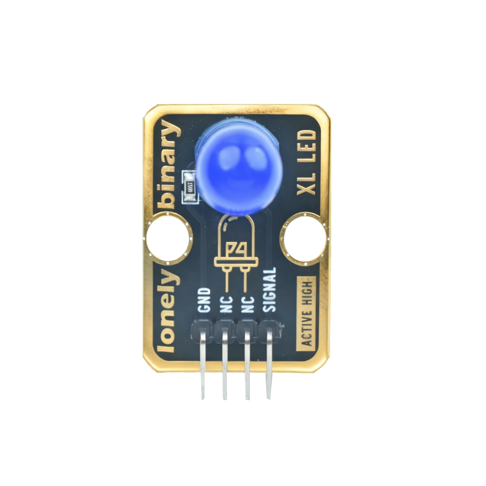
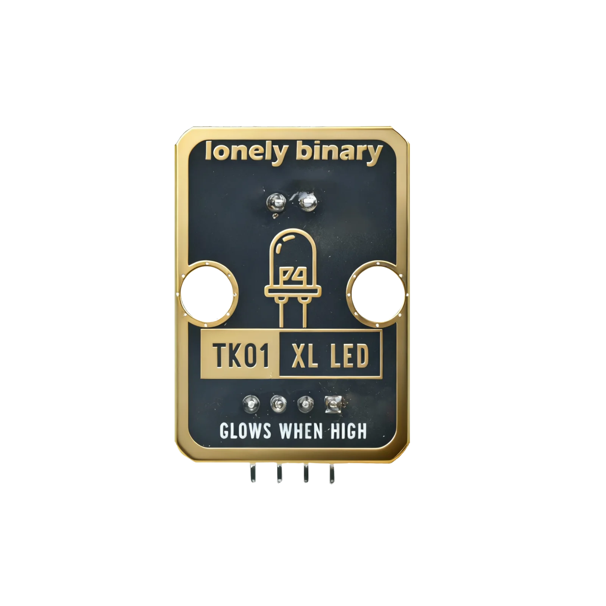
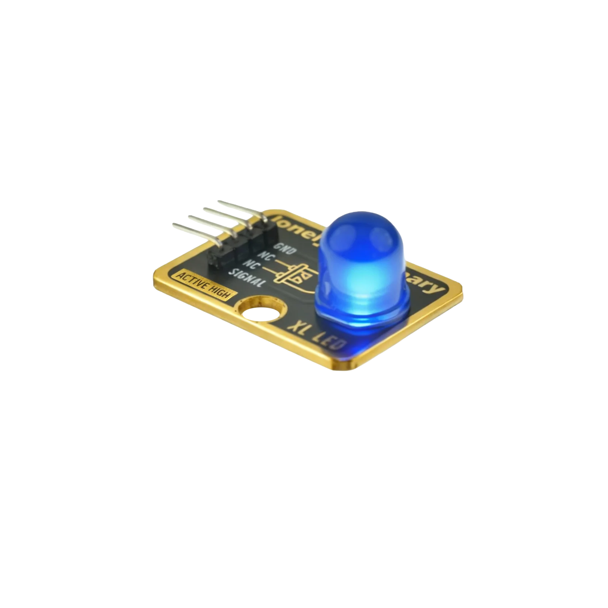

# YouTube

*Click the image above to watch the demo video.*

# Function

This module is a blue LED module. You can control the LED on/off via code. An LED is a light-emitting diode that emits blue light when powered. It can be used as an indicator or decorative light.

# Appearance

|  |  |  |
| :-----------------------: | :-----------------------: | :-----------------------: |
|          **Front**          |          **Back**          |          **Side**          |

The module has one blue LED and a 4-pin header. You can identify each pin by the silkscreen (text printed next to the pins).

# Pinout

- **GND** (negative): Connect to the controller board’s GND (like the negative terminal of a battery).
- **NC** (no connect): Not connected in the circuit; left for a unified interface. Can be left unconnected.
- **NC** (no connect): Not connected in the circuit; left for a unified interface. Can be left unconnected.
- **SIGNAL** (input): Controls the LED on/off. Connect to a digital pin on the controller (e.g. Arduino D13 or Pico GPIO 0).
  - LED on when HIGH (1)
  - LED off when LOW (0)

**Note:** This module has two NC pins; both can be left unconnected.

# Features

- Blue LED, moderate brightness
- Operating voltage: 3.3 V or 5 V
- Low power consumption

# Quick Wiring (3 steps)

1. GND → controller GND
2. SIGNAL → controller digital pin (use the pin number defined in your code)
3. NC pins can be left unconnected
