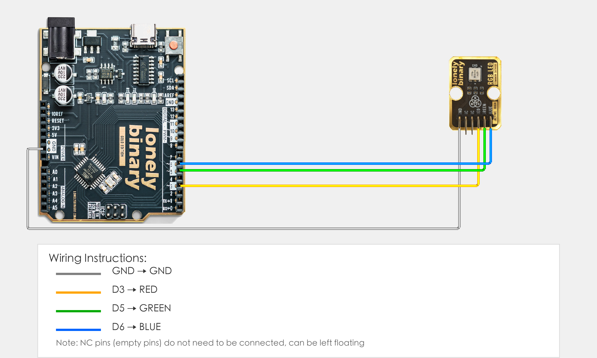

# Arduino Uno R3 Example

## Goal

This example shows how to use the RGB LED module on an Arduino Uno R3 to create different colors.

## Wiring



- **GND** → Arduino Uno R3 GND
- **RED** → Arduino Uno R3 D3
- **GREEN** → Arduino Uno R3 D5
- **BLUE** → Arduino Uno R3 D6
- **NC** → Leave unconnected

## Code

```cpp
// Pin number: change this to match your wiring
#define RED_PIN 3    // RED pin connected to Arduino PWM pin (e.g. D3)
#define GREEN_PIN 5  // GREEN pin connected to Arduino PWM pin (e.g. D5)
#define BLUE_PIN 6   // BLUE pin connected to Arduino PWM pin (e.g. D6)

void setup() {
  // Set RGB pins as output
  pinMode(RED_PIN, OUTPUT);
  pinMode(GREEN_PIN, OUTPUT);
  pinMode(BLUE_PIN, OUTPUT);
  
  // Start serial for debugging (9600 baud)
  Serial.begin(9600);
}

void loop() {
  // red
  analogWrite(RED_PIN, 255);    // red brightest
  analogWrite(GREEN_PIN, 0);    // green off
  analogWrite(BLUE_PIN, 0);     // blue off
  Serial.println("red");
  delay(1000);
  
  // green
  analogWrite(RED_PIN, 0);
  analogWrite(GREEN_PIN, 255);
  analogWrite(BLUE_PIN, 0);
  Serial.println("green");
  delay(1000);
  
  // blue
  analogWrite(RED_PIN, 0);
  analogWrite(GREEN_PIN, 0);
  analogWrite(BLUE_PIN, 255);
  Serial.println("blue");
  delay(1000);
  
  // white (all colors brightest)
  analogWrite(RED_PIN, 255);
  analogWrite(GREEN_PIN, 255);
  analogWrite(BLUE_PIN, 255);
  Serial.println("white");
  delay(1000);
}
```

## Effect


## Code Walkthrough

**Line 2–4: Pin definition**

```cpp
#define RED_PIN 3    // RED pin connected to Arduino PWM pin (e.g. D3)
#define GREEN_PIN 5  // GREEN pin connected to Arduino PWM pin (e.g. D5)
#define BLUE_PIN 6   // BLUE pin connected to Arduino PWM pin (e.g. D6)
```

- **`RED_PIN`:** The Arduino PWM pin connected to RED LED. Change this if you use another pin.
- **`GREEN_PIN`:** The Arduino PWM pin connected to GREEN LED. Change this if you use another pin.
- **`BLUE_PIN`:** The Arduino PWM pin connected to BLUE LED. Change this if you use another pin.

**Line 6–14: Initialization (setup function)**

```cpp
void setup() {
  // Set RGB pins as output
  pinMode(RED_PIN, OUTPUT);
  pinMode(GREEN_PIN, OUTPUT);
  pinMode(BLUE_PIN, OUTPUT);
  
  // Start serial for debugging (9600 baud)
  Serial.begin(9600);
}
```

- **`setup()`:** Runs once when the Arduino starts.
- **`pinMode(RED_PIN, OUTPUT)`:** Set red pin as output.
- **`pinMode(GREEN_PIN, OUTPUT)`:** Set green pin as output.
- **`pinMode(BLUE_PIN, OUTPUT)`:** Set blue pin as output.
- **`Serial.begin(9600)`:** Start serial at 9600 baud.

**Line 16–45: Main loop (loop function)**

```cpp
void loop() {
  // red
  analogWrite(RED_PIN, 255);    // red brightest
  analogWrite(GREEN_PIN, 0);    // green off
  analogWrite(BLUE_PIN, 0);     // blue off
  Serial.println("red");
  delay(1000);
  
  // green
  analogWrite(RED_PIN, 0);
  analogWrite(GREEN_PIN, 255);
  analogWrite(BLUE_PIN, 0);
  Serial.println("green");
  delay(1000);
  
  // blue
  analogWrite(RED_PIN, 0);
  analogWrite(GREEN_PIN, 0);
  analogWrite(BLUE_PIN, 255);
  Serial.println("blue");
  delay(1000);
  
  // white (all colors brightest)
  analogWrite(RED_PIN, 255);
  analogWrite(GREEN_PIN, 255);
  analogWrite(BLUE_PIN, 255);
  Serial.println("white");
  delay(1000);
}
```

- **`loop()`:** Runs repeatedly.
- **Red phase:** `analogWrite(RED_PIN, 255)` sets red brightness to maximum value (255), other colors to 0, displays red.
- **Green phase:** `analogWrite(GREEN_PIN, 255)` sets green brightness to maximum value, other colors to 0, displays green.
- **Blue phase:** `analogWrite(BLUE_PIN, 255)` sets blue brightness to maximum value, other colors to 0, displays blue.
- **White phase:** All three colors set to maximum value (255), displays white.
- **`Serial.println(...)`:** Print to the Serial Monitor.
- **`delay(1000)`:** Wait 1 second.
