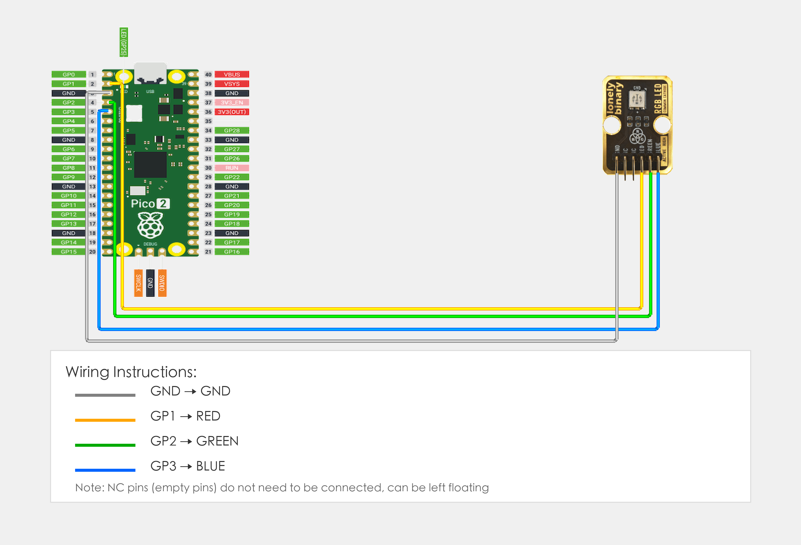

# Raspberry Pi Pico 2 Example

## Goal

This example shows how to use the RGB LED module on a Raspberry Pi Pico 2 to create different colors.

## Wiring



- **GND** → Raspberry Pi Pico 2 GND
- **RED** → Raspberry Pi Pico 2 GPIO 1 (or the pin you set as `RED_PIN` in code)
- **GREEN** → Raspberry Pi Pico 2 GPIO 2 (or the pin you set as `GREEN_PIN` in code)
- **BLUE** → Raspberry Pi Pico 2 GPIO 3 (or the pin you set as `BLUE_PIN` in code)
- **NC** → Leave unconnected

## Code

```python
# Import required modules
from machine import Pin, PWM  # GPIO control and PWM
import time                   # For delay (time.sleep)

# Pin number: change this to match your wiring
RED_PIN = 1    # RED pin connected to GPIO (e.g. GPIO 1, must be PWM-capable pin)
GREEN_PIN = 2  # GREEN pin connected to GPIO (e.g. GPIO 2)
BLUE_PIN = 3   # BLUE pin connected to GPIO (e.g. GPIO 3)

# Create PWM objects
red = PWM(Pin(RED_PIN))
green = PWM(Pin(GREEN_PIN))
blue = PWM(Pin(BLUE_PIN))

# Set PWM frequency (1000 Hz)
red.freq(1000)
green.freq(1000)
blue.freq(1000)

# Main loop: runs forever
while True:
    # red
    red.duty_u16(65535)    # red brightest (65535 is maximum value)
    green.duty_u16(0)       # green off
    blue.duty_u16(0)        # blue off
    print("red")
    time.sleep(1)
    
    # green
    red.duty_u16(0)
    green.duty_u16(65535)
    blue.duty_u16(0)
    print("green")
    time.sleep(1)
    
    # blue
    red.duty_u16(0)
    green.duty_u16(0)
    blue.duty_u16(65535)
    print("blue")
    time.sleep(1)
    
    # white (all colors brightest)
    red.duty_u16(65535)
    green.duty_u16(65535)
    blue.duty_u16(65535)
    print("white")
    time.sleep(1)
```

## Effect


## Code Walkthrough

**Lines 1–2: Imports**

```python
from machine import Pin, PWM  # GPIO control and PWM
import time                   # For delay (time.sleep)
```

- **`machine.Pin`:** Used to control Pico GPIO pins.
- **`machine.PWM`:** Used to control Pico PWM output.
- **`time`:** Provides `sleep()` and other time-related functions.

**Lines 5–7: Pin definition**

```python
RED_PIN = 1    # RED pin connected to GPIO (e.g. GPIO 1, must be PWM-capable pin)
GREEN_PIN = 2  # GREEN pin connected to GPIO (e.g. GPIO 2)
BLUE_PIN = 3   # BLUE pin connected to GPIO (e.g. GPIO 3)
```

- **`RED_PIN`:** GPIO number for RED LED (must be PWM-capable pin). Change this if you use another pin.
- **`GREEN_PIN`:** GPIO number for GREEN LED. Change this if you use another pin.
- **`BLUE_PIN`:** GPIO number for BLUE LED. Change this if you use another pin.

**Lines 10–12: Create PWM objects**

```python
red = PWM(Pin(RED_PIN))
green = PWM(Pin(GREEN_PIN))
blue = PWM(Pin(BLUE_PIN))
```

- **`PWM(Pin(RED_PIN))`:** Create PWM object for red pin to control brightness.
- **`PWM(Pin(GREEN_PIN))`:** Create PWM object for green pin.
- **`PWM(Pin(BLUE_PIN))`:** Create PWM object for blue pin.

**Lines 15–17: Set PWM frequency**

```python
red.freq(1000)
green.freq(1000)
blue.freq(1000)
```

- **`freq(1000)`:** Set PWM frequency to 1000 Hz.

**Lines 20–47: Main loop**

```python
while True:
    # red
    red.duty_u16(65535)    # red brightest (65535 is maximum value)
    green.duty_u16(0)       # green off
    blue.duty_u16(0)        # blue off
    print("red")
    time.sleep(1)
    
    # green
    red.duty_u16(0)
    green.duty_u16(65535)
    blue.duty_u16(0)
    print("green")
    time.sleep(1)
    
    # blue
    red.duty_u16(0)
    green.duty_u16(0)
    blue.duty_u16(65535)
    print("blue")
    time.sleep(1)
    
    # white (all colors brightest)
    red.duty_u16(65535)
    green.duty_u16(65535)
    blue.duty_u16(65535)
    print("white")
    time.sleep(1)
```

- **`while True`:** Infinite loop; the program keeps running.
- **Red phase:** `red.duty_u16(65535)` sets red brightness to maximum value (65535), other colors to 0, displays red.
- **Green phase:** `green.duty_u16(65535)` sets green brightness to maximum value, other colors to 0, displays green.
- **Blue phase:** `blue.duty_u16(65535)` sets blue brightness to maximum value, other colors to 0, displays blue.
- **White phase:** All three colors set to maximum value (65535), displays white.
- **`print(...)`:** Print to terminal.
- **`time.sleep(1)`:** Delay 1 second.
