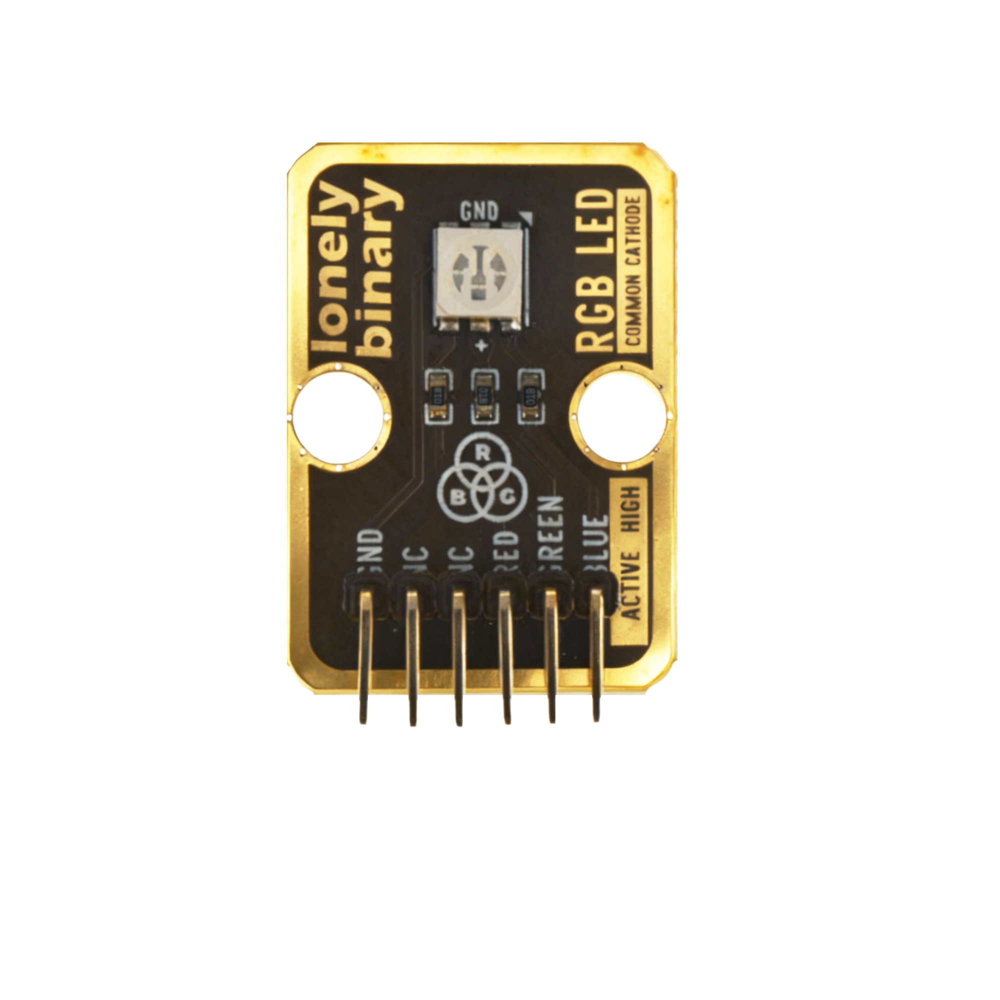
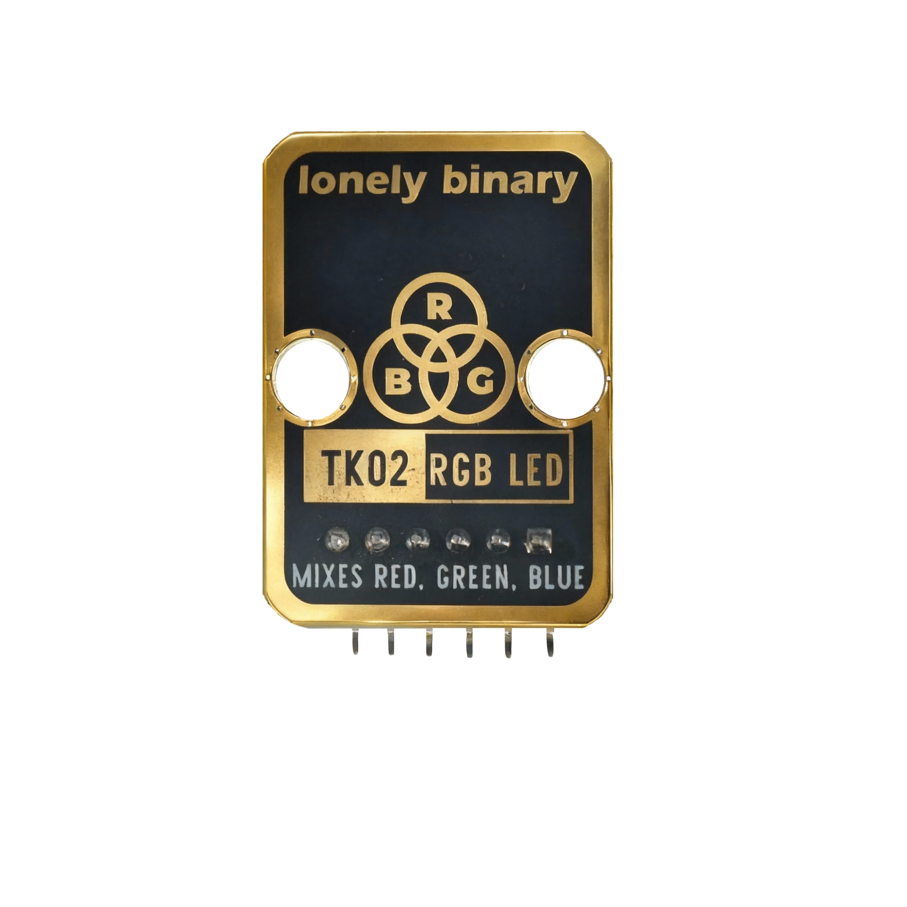
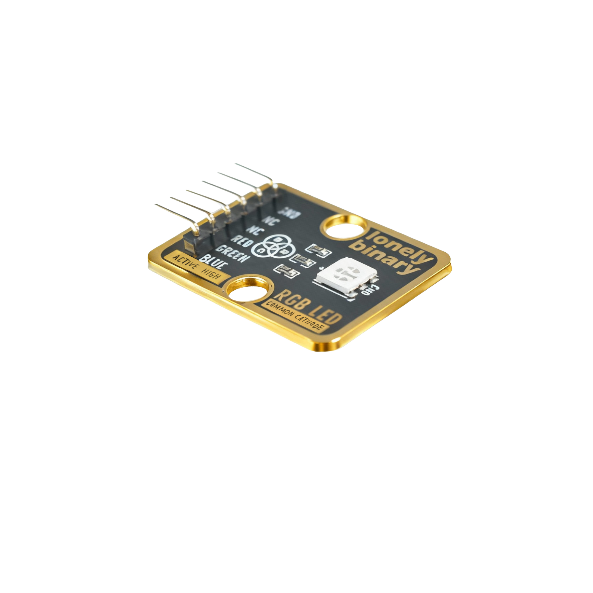

# Function

This module is an RGB LED module that combines red, green, and blue LEDs. By controlling the brightness of each color through code, you can mix any color to create colorful lighting effects.

# Appearance

|  |  |  |
| :-----------------------: | :-----------------------: | :-----------------------: |
|          **Front**          |          **Back**          |          **Side**          |

The module has three LEDs (red, green, blue) and a 6-pin header. You can identify each pin by the silkscreen (text printed next to the pins).

# Pinout

- **GND** (negative): Connect to the controller board's GND (like the negative terminal of a battery).
- **NC** (no connect): Not connected in the circuit; left for a unified interface. Can be left unconnected.
- **NC** (no connect): Not connected in the circuit; left for a unified interface. Can be left unconnected.
- **RED** (control): Controls the red LED. Connect to a PWM pin on the controller (e.g. Arduino D3 or Pico GPIO 1).
- **GREEN** (control): Controls the green LED. Connect to a PWM pin on the controller (e.g. Arduino D5 or Pico GPIO 2).
- **BLUE** (control): Controls the blue LED. Connect to a PWM pin on the controller (e.g. Arduino D6 or Pico GPIO 3).

# Features

- RGB three-color LED that can mix any color
- Requires PWM control: must use PWM-capable pins
- Operating voltage: 3.3 V or 5 V

# Quick Wiring (4 steps)

1. GND → controller board GND
2. RED → controller board PWM pin (use the pin number defined in your code)
3. GREEN → controller board PWM pin (use the pin number defined in your code)
4. BLUE → controller board PWM pin (use the pin number defined in your code)
