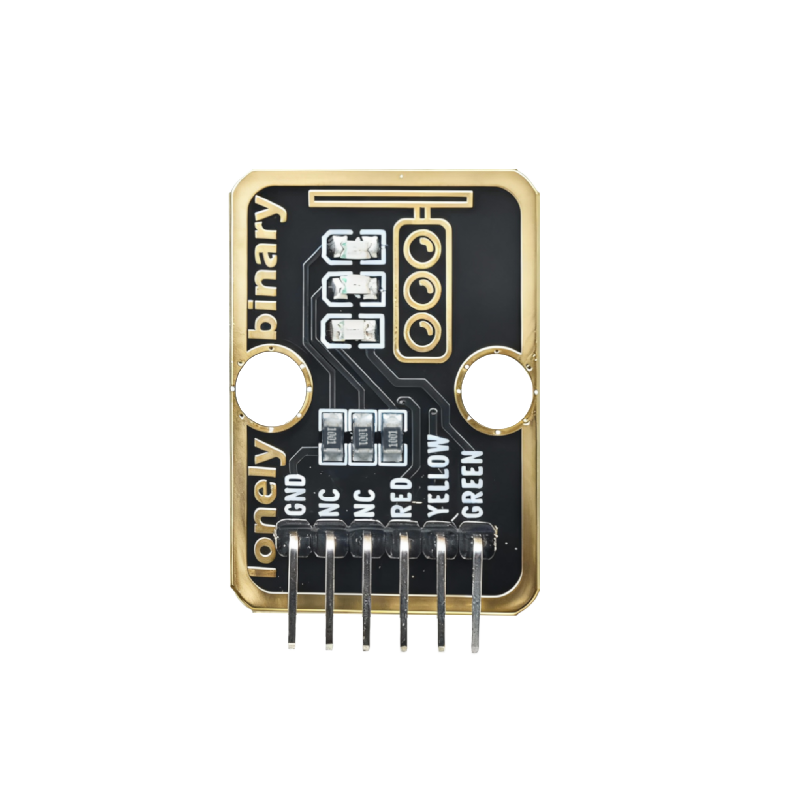
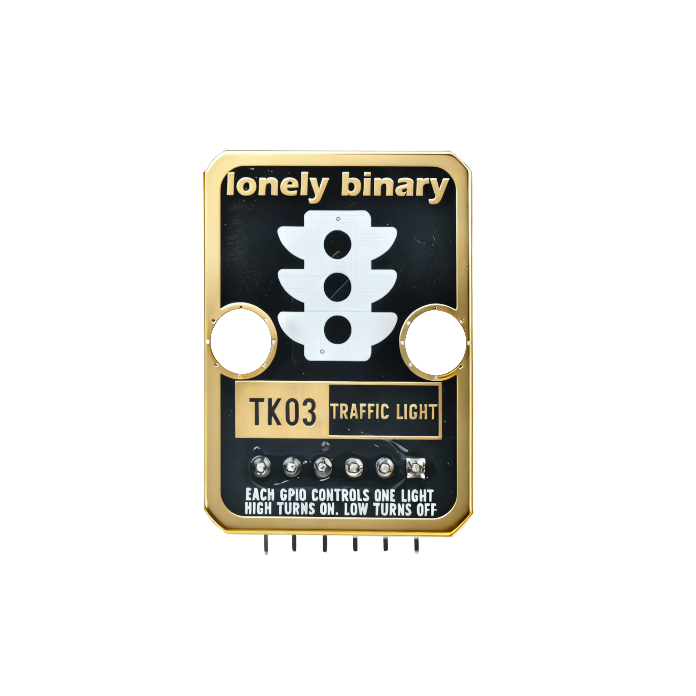
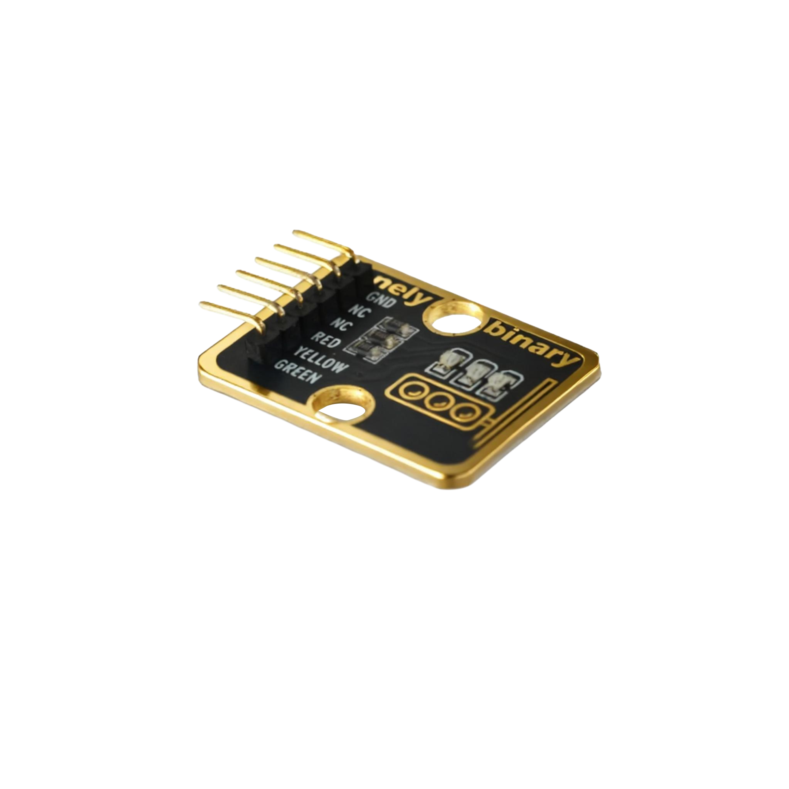

# Function

This module is a traffic light module that contains three LEDs: red, yellow, and green. By controlling the on/off sequence of the three LEDs through code, you can simulate real traffic light effects. It can be used to make traffic light models, status indicators, and other applications.

# Appearance

|  |  |  |
| :-----------------------: | :-----------------------: | :-----------------------: |
|          **Front**          |          **Back**          |          **Side**          |

The module has three LEDs (red, yellow, green) and a 6-pin header. You can identify each pin by the silkscreen (text printed next to the pins).

# Pinout

- **GND** (negative): Connect to the controller board's GND (like the negative terminal of a battery).
- **NC** (no connect): Not connected in the circuit; left for a unified interface. Can be left unconnected.
- **NC** (no connect): Not connected in the circuit; left for a unified interface. Can be left unconnected.
- **RED** (control): Controls the red LED. Connect to a digital pin on the controller (e.g. Arduino D2 or Pico GPIO 0).
- **YELLOW** (control): Controls the yellow LED. Connect to a digital pin on the controller (e.g. Arduino D3 or Pico GPIO 1).
- **GREEN** (control): Controls the green LED. Connect to a digital pin on the controller (e.g. Arduino D4 or Pico GPIO 2).

# Features

- Three-color LED: red, yellow, and green independent LEDs
- Operating voltage: 3.3 V or 5 V
- Low power consumption
- Suitable for making traffic light models

# Quick Wiring (4 steps)

1. GND → controller board GND
2. RED → controller board digital pin (use the pin number defined in your code)
3. YELLOW → controller board digital pin (use the pin number defined in your code)
4. GREEN → controller board digital pin (use the pin number defined in your code)
