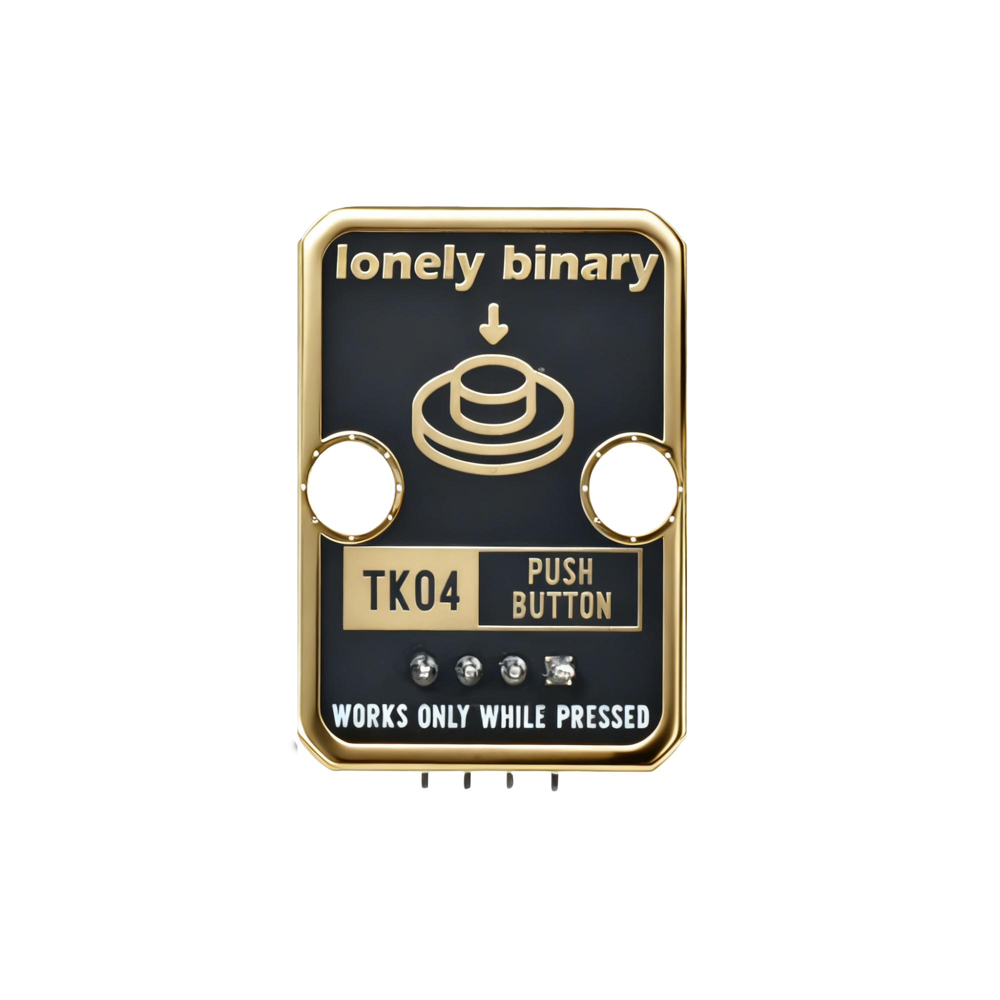
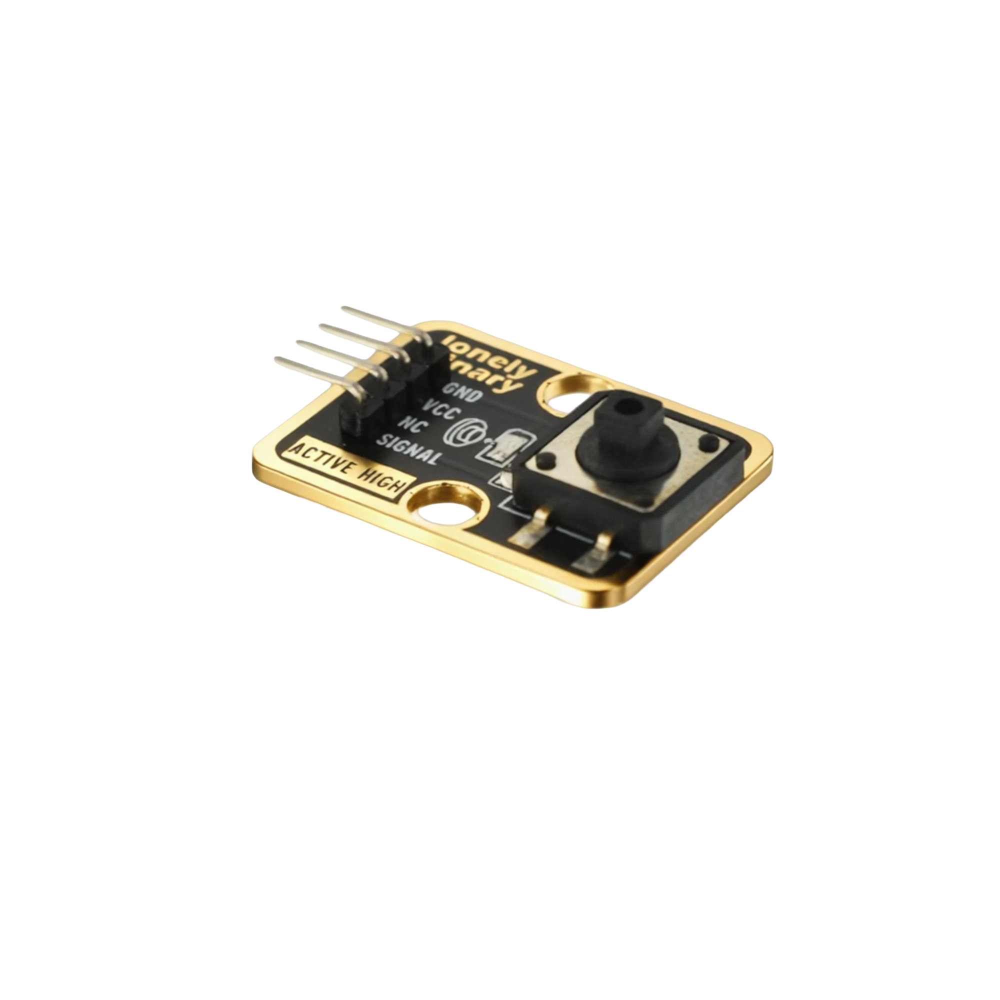

# Function

This module is a push button module that can detect whether the button is pressed. When the button is pressed, the module outputs a HIGH signal. It can be used to make switches, control LEDs, trigger actions, and other applications.

# Appearance

|  |  |  |
| :-----------------------: | :-----------------------: | :-----------------------: |
|          **Front**          |          **Back**          |          **Side**          |

The module has a button switch and a 4-pin header. You can identify each pin by the silkscreen (text printed next to the pins).

# Pinout

- **GND** (negative): Connect to the controller board's GND (like the negative terminal of a battery).
- **VCC** (positive): Connect to the controller board's 3.3V or 5V (This module supports 3.3V and 5V).
- **NC** (no connect): Not connected in the circuit; left for a unified interface. Can be left unconnected.
- **SIGNAL** (output): Button detection output pin. Connect to a digital pin on the controller (e.g. Arduino D2 or Pico GPIO 0).
  - Outputs HIGH (1) when button is pressed
  - Outputs LOW (0) when button is released

# Features

- Button detection: outputs HIGH when button is pressed
- Operating voltage: 3.3 V or 5 V
- Simple and easy to use: suitable for beginners

# Quick Wiring (3 steps)

1. GND → controller board GND
2. VCC → controller board 3.3V or 5V
3. SIGNAL → controller board digital pin (use the pin number defined in your code)
