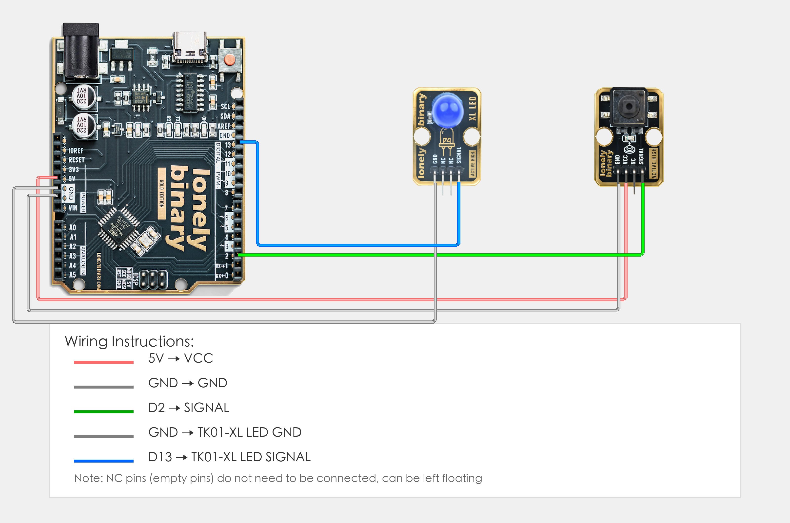

# Arduino Uno R3 Example

## Goal

This example shows how to use the TK04 - PUSH BUTTON module on an Arduino Uno R3 to detect button presses. It covers basic Arduino structure (setup, loop), digital input, conditional statements, serial print, and delay.

## Wiring



- **VCC** → Arduino Uno R3 5V
- **GND** → Arduino Uno R3 GND
- **SIGNAL** → Arduino Uno R3 D2 (or the digital pin you set as `BUTTON_PIN` in code)
- **NC** → Leave unconnected

## Code

```cpp
// Pin number: change this to match your wiring
#define BUTTON_PIN 2  // SIGNAL pin connected to Arduino digital pin (e.g. D2)
#define LED_PIN 13    // LED pin (Arduino built-in LED on pin 13, or external LED)

void setup() {
  // Initialize pin modes
  pinMode(BUTTON_PIN, INPUT);   // Set button pin as input (to read button state)
  pinMode(LED_PIN, OUTPUT);      // Set LED pin as output (to control LED on/off)
  
  // Start serial for debugging (9600 baud)
  Serial.begin(9600);
  
  Serial.println("Button module program started");
}

void loop() {
  // Read button state
  int buttonState = digitalRead(BUTTON_PIN);  // Read button pin level: HIGH (1) = pressed, LOW (0) = released
  
  // Control LED based on button state
  if(buttonState == HIGH) {
    // When button is pressed: turn on LED and print to serial
    digitalWrite(LED_PIN, HIGH);  // Output HIGH to turn LED on
    Serial.println("Button pressed!");
  } else {
    // When button is released: turn off LED
    digitalWrite(LED_PIN, LOW);   // Output LOW to turn LED off
  }
  
  delay(50);  // Brief delay to avoid reading too fast
}
```

## Effect


## Code Walkthrough

**Line 2–3: Pin definition**

```cpp
#define BUTTON_PIN 2  // SIGNAL pin connected to Arduino digital pin (e.g. D2)
#define LED_PIN 13    // LED pin (Arduino built-in LED on pin 13, or external LED)
```

- **`BUTTON_PIN`:** The Arduino digital pin connected to button SIGNAL. Change this if you use another pin.
- **`LED_PIN`:** The Arduino digital pin connected to LED (Arduino built-in LED on pin 13, or external LED).

**Line 5–14: Initialization (setup function)**

```cpp
void setup() {
  // Initialize pin modes
  pinMode(BUTTON_PIN, INPUT);   // Set button pin as input (to read button state)
  pinMode(LED_PIN, OUTPUT);      // Set LED pin as output (to control LED on/off)
  
  // Start serial for debugging (9600 baud)
  Serial.begin(9600);
  
  Serial.println("Button module program started");
}
```

- **`setup()`:** Runs once when the Arduino starts.
- **`pinMode(BUTTON_PIN, INPUT)`:** Set button pin as input to read button state.
- **`pinMode(LED_PIN, OUTPUT)`:** Set LED pin as output to control LED on/off.
- **`Serial.begin(9600)`:** Start serial at 9600 baud.
- **`Serial.println("Button module program started")`:** Print start message to the Serial Monitor.

**Line 16–31: Main loop (loop function)**

```cpp
void loop() {
  // Read button state
  int buttonState = digitalRead(BUTTON_PIN);  // Read button pin level: HIGH (1) = pressed, LOW (0) = released
  
  // Control LED based on button state
  if(buttonState == HIGH) {
    // When button is pressed: turn on LED and print to serial
    digitalWrite(LED_PIN, HIGH);  // Output HIGH to turn LED on
    Serial.println("Button pressed!");
  } else {
    // When button is released: turn off LED
    digitalWrite(LED_PIN, LOW);   // Output LOW to turn LED off
  }
  
  delay(50);  // Brief delay to avoid reading too fast
}
```

- **`loop()`:** Runs repeatedly.
- **`digitalRead(BUTTON_PIN)`:** Read button pin level, returns HIGH (1) when pressed, LOW (0) when released.
- **`if(buttonState == HIGH)`:** Check if button is pressed; if pressed, execute LED on operation.
- **`digitalWrite(LED_PIN, HIGH)`:** Output HIGH to turn LED on.
- **`digitalWrite(LED_PIN, LOW)`:** Output LOW to turn LED off.
- **`Serial.println("Button pressed!")`:** Print button press message to the Serial Monitor.
- **`delay(50)`:** Wait 50 milliseconds before reading again to avoid reading too fast and reduce CPU usage.
