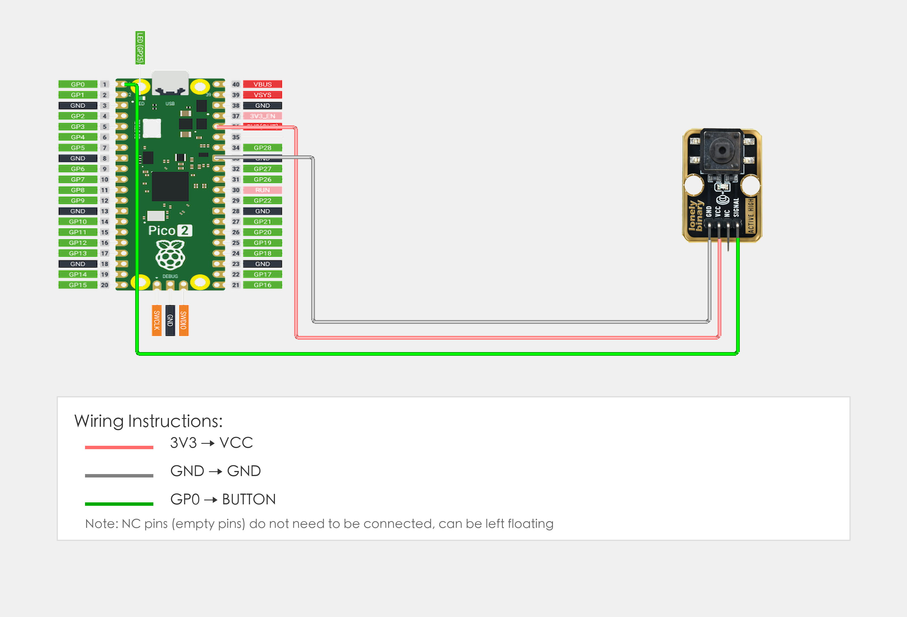

# Raspberry Pi Pico 2 Example

## Goal

This example shows how to use the TK04 - PUSH BUTTON module on a Raspberry Pi Pico 2 to detect button presses. It covers GPIO input, conditional statements, loops, delay, and print in MicroPython.

## Wiring



- **VCC** → Raspberry Pi Pico 2 3.3V or 5V
- **GND** → Raspberry Pi Pico 2 GND
- **SIGNAL** → Raspberry Pi Pico 2 GPIO 0 (or the pin you set as `BUTTON_PIN` in code)
- **NC** → Leave unconnected

## Code

```python
# Import required modules
from machine import Pin  # GPIO control
import time              # For delay (time.sleep)

# Pin number: change this to match your wiring
BUTTON_PIN = 0   # SIGNAL pin connected to GPIO (e.g. GPIO 0)
LED_PIN = 25     # Pico built-in LED pin (GPIO 25, or external LED)

# Create pin objects
button = Pin(BUTTON_PIN, Pin.IN)   # Set button pin as input (to read button state)
led = Pin(LED_PIN, Pin.OUT)        # Set LED pin as output (to control LED on/off)

print("Button module program started")

# Main loop: runs forever
while True:
    # Read button state
    button_state = button.value()  # Read button pin level: 1 = pressed (HIGH), 0 = released (LOW)
    
    # Control LED based on button state
    if button_state == 1:
        # When button is pressed: turn on LED and print to terminal
        led.on()                 # Output HIGH, LED on
        print("Button pressed!")
    else:
        # When button is released: turn off LED
        led.off()                # Output LOW, LED off
    
    time.sleep(0.05)  # Brief delay to avoid reading too fast
```

## Effect


## Code Walkthrough

**Lines 1–2: Imports**

```python
from machine import Pin  # GPIO control
import time              # For delay (time.sleep)
```

- **`machine.Pin`:** Used to control Pico GPIO pins.
- **`time`:** Provides `sleep()` and other time-related functions.

**Lines 6–7: Pin definition**

```python
BUTTON_PIN = 0   # SIGNAL pin connected to GPIO (e.g. GPIO 0)
LED_PIN = 25     # Pico built-in LED pin (GPIO 25, or external LED)
```

- **`BUTTON_PIN`:** GPIO number for button SIGNAL. Change this if you use another pin.
- **`LED_PIN`:** GPIO number for LED (Pico built-in LED is GPIO 25, or external LED).

**Lines 10–11: Create pin objects**

```python
button = Pin(BUTTON_PIN, Pin.IN)   # Set button pin as input (to read button state)
led = Pin(LED_PIN, Pin.OUT)        # Set LED pin as output (to control LED on/off)
```

- **`Pin(BUTTON_PIN, Pin.IN)`:** Set button pin as input to read button state.
- **`Pin(LED_PIN, Pin.OUT)`:** Set LED pin as output to control LED on/off.

**Line 13: Print start message**

```python
print("Button module program started")
```

- **`print(...)`:** Print program start message to terminal.

**Lines 16–29: Main loop**

```python
while True:
    # Read button state
    button_state = button.value()  # Read button pin level: 1 = pressed (HIGH), 0 = released (LOW)
    
    # Control LED based on button state
    if button_state == 1:
        # When button is pressed: turn on LED and print to terminal
        led.on()                 # Output HIGH, LED on
        print("Button pressed!")
    else:
        # When button is released: turn off LED
        led.off()                # Output LOW, LED off
    
    time.sleep(0.05)  # Brief delay to avoid reading too fast
```

- **`while True`:** Infinite loop; the program keeps running.
- **`button.value()`:** Read button pin level, returns 1 when pressed (HIGH), 0 when released (LOW).
- **`if button_state == 1`:** Check if button is pressed; if pressed, execute LED on operation.
- **`led.on()`:** Output HIGH, LED on.
- **`led.off()`:** Output LOW, LED off.
- **`print("Button pressed!")`:** Print button press message to terminal.
- **`time.sleep(0.05)`:** Wait 50 milliseconds before reading again to avoid reading too fast and reduce CPU usage.
