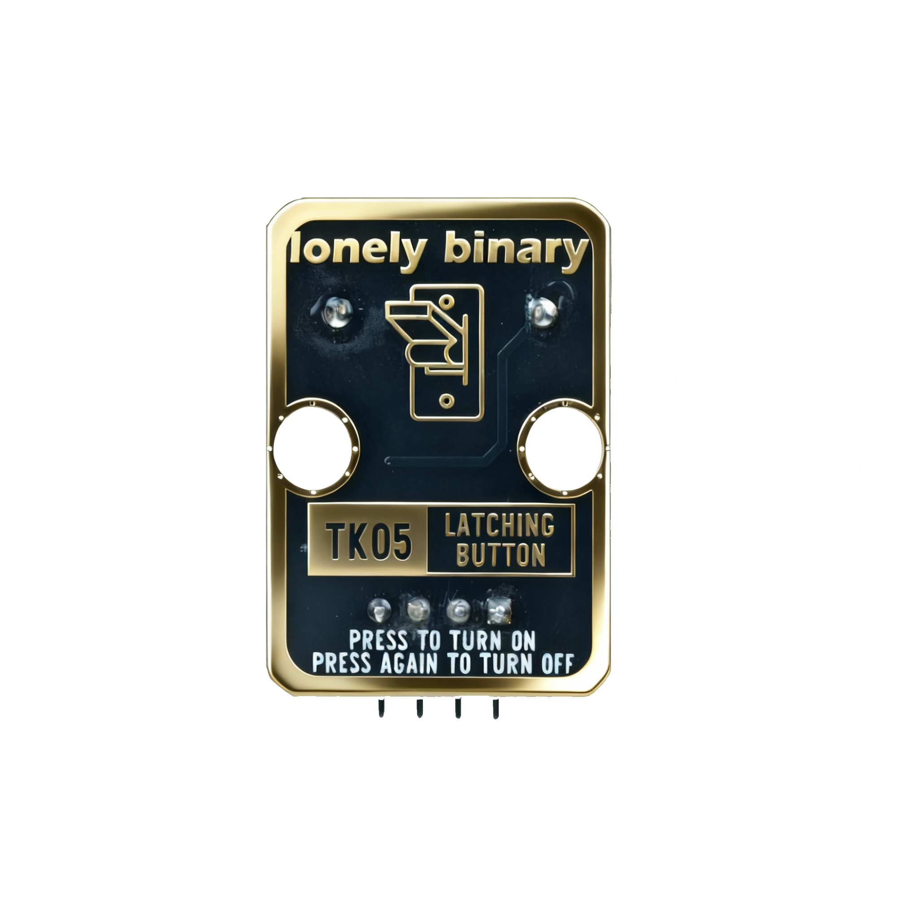
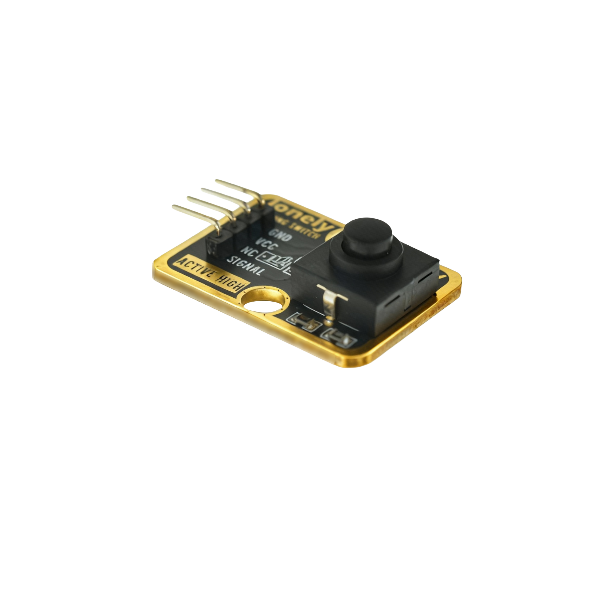

# Function

This module is a latching button switch. Once pressed, it remains locked until pressed again to unlock. Unlike a regular button, the latching button has a self-locking function, making it suitable for applications requiring a maintained state, such as power switches or mode toggles.

# Appearance

|  |  |  |
| :-----------------------: | :-----------------------: | :-----------------------: |
|          **Front**          |          **Back**          |          **Side**          |

The module has a latching button switch and a 4-pin header. You can identify each pin by the silkscreen (text printed next to the pins).

# Pinout

- **GND** (negative): Connect to the controller board's GND (like the negative terminal of a battery).
- **VCC** (positive): Connect to the controller board's 3.3V or 5V (This module supports 3.3V and 5V).
- **NC** (no connect): Not connected in the circuit; left for a unified interface. Can be left unconnected.
- **SIGNAL** (output): Button state output pin. Connect to a digital pin on the controller (e.g. Arduino D2 or Pico GPIO 0).
  - Outputs HIGH (1) when button is locked (pressed)
  - Outputs LOW (0) when button is unlocked (released)

# Features

- Lock function: Maintains locked state after pressing
- Press again to unlock: Can toggle locked/unlocked state
- Operating voltage: 3.3 V or 5 V
- Suitable for power switch, mode switching and other applications

# Quick Wiring (3 steps)

1. GND → controller board GND
2. VCC → controller board 3.3V or 5V
3. SIGNAL → controller board digital pin (use the pin number defined in your code)
