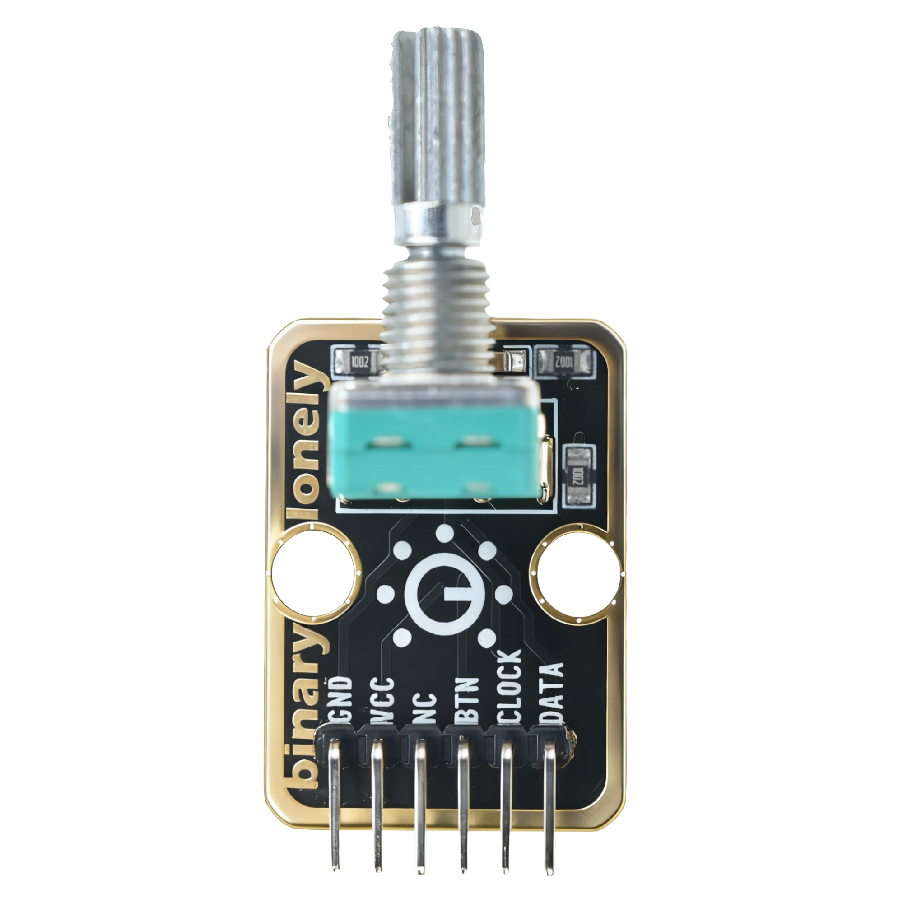

# Function

This module is a rotary encoder module that can detect rotation direction and rotation steps. By rotating the encoder knob, it outputs pulse signals. It can be used for volume control, menu selection, value adjustment, and other applications.

# Appearance

|  |  |  |
| :-----------------------: | :-----------------------: | :-----------------------: |
|          **Front**          |          **Back**          |          **Side**          |

The module has a rotatable encoder knob and a 6-pin header. You can identify each pin by the silkscreen (text printed next to the pins).

# Pinout

- **GND** (negative): Connect to the controller board's GND (like the negative terminal of a battery).
- **VCC** (positive): Connect to the controller board's 3.3V or 5V (This module supports 3.3V and 5V).
- **NC** (no connect): Not connected in the circuit; left for a unified interface. Can be left unconnected.
- **BTN** (button): Encoder built-in button. Outputs LOW when pressed. Connect to a digital pin on the controller (e.g. Arduino D3 or Pico GPIO 2).
- **CLOCK** (clock signal): Rotary encoder clock output pin. Connect to a digital pin on the controller (e.g. Arduino D4 or Pico GPIO 3).
- **DATA** (data signal): Rotary encoder data output pin. Connect to a digital pin on the controller (e.g. Arduino D5 or Pico GPIO 4).

# Features

- Rotation detection: Can detect clockwise and counterclockwise rotation
- Step output: Outputs one pulse per rotation step
- Built-in button: Knob can be pressed as a button
- Operating voltage: 3.3 V or 5 V

# Quick Wiring (5 steps)

1. GND → controller board GND
2. VCC → controller board 3.3V or 5V
3. CLOCK → controller board digital pin (use the pin number defined in your code)
4. DATA → controller board digital pin (use the pin number defined in your code)
5. BTN → controller board digital pin (optional, can be left unconnected if button function is not needed)
