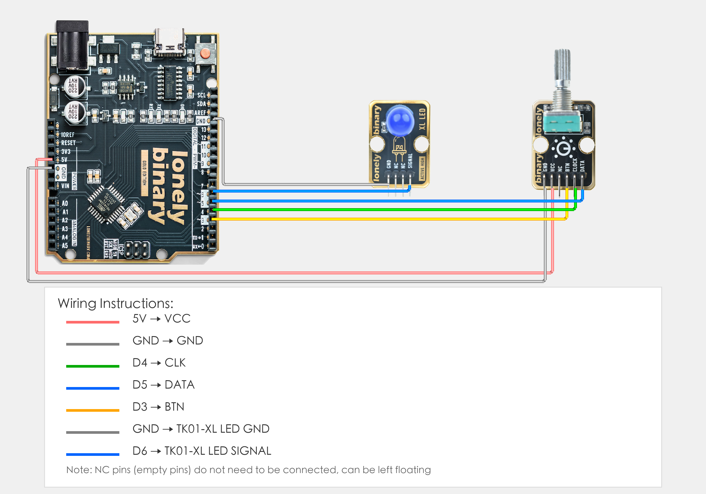

# Arduino Uno R3 Example

## Goal

This example shows how to use the TK06 - ROTARY ENCODER module on an Arduino Uno R3 to control LED brightness by rotating the encoder knob.

## Wiring



- **VCC** → Arduino Uno R3 5V
- **GND** → Arduino Uno R3 GND
- **CLOCK** → Arduino Uno R3 D4 (or the digital pin you set as `CLOCK_PIN` in code)
- **DATA** → Arduino Uno R3 D5 (or the digital pin you set as `DATA_PIN` in code)
- **BTN** → Arduino Uno R3 D3 (or the digital pin you set as `BTN_PIN` in code, optional)
- **NC** → Leave unconnected

## Code

```cpp
// Pin number: change this to match your wiring
#define CLOCK_PIN 4   // CLOCK pin connected to Arduino digital pin (e.g. D4)
#define DATA_PIN 5    // DATA pin connected to Arduino digital pin (e.g. D5)
#define BTN_PIN 3     // BTN pin connected to Arduino digital pin (e.g. D3)
#define LED_PIN 6     // LED pin connected to Arduino digital pin (must be PWM pin, e.g. D6)

// Variables
int lastClockState = HIGH;  // Last CLOCK pin state
int lastBtnState = HIGH;    // Last BTN pin state
int brightness = 128;       // LED brightness value (0-255)
bool ledEnabled = true;     // LED switch state

void setup() {
  // Initialize pin modes
  pinMode(CLOCK_PIN, INPUT_PULLUP);  // Set CLOCK pin as input, enable internal pull-up resistor
  pinMode(DATA_PIN, INPUT_PULLUP);   // Set DATA pin as input, enable internal pull-up resistor
  pinMode(BTN_PIN, INPUT_PULLUP);    // Set BTN pin as input, enable internal pull-up resistor
  pinMode(LED_PIN, OUTPUT);           // Set LED pin as output
  
  // Start serial for debugging (9600 baud)
  Serial.begin(9600);
  
  // Read initial state
  lastClockState = digitalRead(CLOCK_PIN);
  lastBtnState = digitalRead(BTN_PIN);
  
  // Set initial LED brightness
  analogWrite(LED_PIN, brightness);
  
  Serial.println("Rotary encoder LED brightness control program started");
  Serial.println("Rotate clockwise to increase brightness, counterclockwise to decrease");
  Serial.println("Press button to toggle LED on/off");
}

void loop() {
  // Read current CLOCK pin state
  int currentClockState = digitalRead(CLOCK_PIN);
  
  // Detect CLOCK pin state change (from HIGH to LOW)
  if (currentClockState != lastClockState) {
    if (currentClockState == LOW) {
      // When CLOCK becomes LOW, read DATA pin state to determine rotation direction
      int dataState = digitalRead(DATA_PIN);
      
      if (dataState == LOW) {
        // DATA is LOW, clockwise rotation, increase brightness
        brightness = min(255, brightness + 20);
        Serial.print("Clockwise rotation, brightness: ");
        Serial.println(brightness);
      } else {
        // DATA is HIGH, counterclockwise rotation, decrease brightness
        brightness = max(0, brightness - 20);
        Serial.print("Counterclockwise rotation, brightness: ");
        Serial.println(brightness);
      }
      
      // Update LED brightness (if LED is enabled)
      if (ledEnabled) {
        analogWrite(LED_PIN, brightness);
      }
    }
    
    // Update last state
    lastClockState = currentClockState;
  }
  
  // Detect button press (detect falling edge)
  int currentBtnState = digitalRead(BTN_PIN);
  if (currentBtnState == LOW && lastBtnState == HIGH) {
    // Toggle LED switch state
    ledEnabled = !ledEnabled;
    
    if (ledEnabled) {
      analogWrite(LED_PIN, brightness);
      Serial.print("LED on, brightness: ");
      Serial.println(brightness);
    } else {
      analogWrite(LED_PIN, 0);
      Serial.println("LED off");
    }
    
    delay(200);  // Debounce delay
  }
  lastBtnState = currentBtnState;
}
```

## Effect


## Code Walkthrough

**Line 2–5: Pin definition**

```cpp
#define CLOCK_PIN 4   // CLOCK pin connected to Arduino digital pin (e.g. D4)
#define DATA_PIN 5    // DATA pin connected to Arduino digital pin (e.g. D5)
#define BTN_PIN 3     // BTN pin connected to Arduino digital pin (e.g. D3)
#define LED_PIN 6     // LED pin connected to Arduino digital pin (must be PWM pin, e.g. D6)
```

- **`CLOCK_PIN`:** The Arduino digital pin connected to rotary encoder CLOCK. Change this if you use another pin.
- **`DATA_PIN`:** The Arduino digital pin connected to rotary encoder DATA. Change this if you use another pin.
- **`BTN_PIN`:** The Arduino digital pin connected to rotary encoder button. Change this if you use another pin.
- **`LED_PIN`:** The Arduino digital pin connected to LED (must be PWM pin). Change this if you use another pin.

**Line 8–11: Variable definition**

```cpp
int lastClockState = HIGH;  // Last CLOCK pin state
int lastBtnState = HIGH;    // Last BTN pin state
int brightness = 128;       // LED brightness value (0-255)
bool ledEnabled = true;     // LED switch state
```

- **`lastClockState`:** Save last CLOCK pin state to detect state changes.
- **`lastBtnState`:** Save last BTN pin state to detect button press.
- **`brightness`:** LED brightness value (0-255), initial value is 128 (medium brightness).
- **`ledEnabled`:** LED switch state, initial value is true (on).

**Line 13–33: Initialization (setup function)**

```cpp
void setup() {
  // Initialize pin modes
  pinMode(CLOCK_PIN, INPUT_PULLUP);  // Set CLOCK pin as input, enable internal pull-up resistor
  pinMode(DATA_PIN, INPUT_PULLUP);   // Set DATA pin as input, enable internal pull-up resistor
  pinMode(BTN_PIN, INPUT_PULLUP);    // Set BTN pin as input, enable internal pull-up resistor
  pinMode(LED_PIN, OUTPUT);           // Set LED pin as output
  
  // Start serial for debugging (9600 baud)
  Serial.begin(9600);
  
  // Read initial state
  lastClockState = digitalRead(CLOCK_PIN);
  lastBtnState = digitalRead(BTN_PIN);
  
  // Set initial LED brightness
  analogWrite(LED_PIN, brightness);
  
  Serial.println("Rotary encoder LED brightness control program started");
  Serial.println("Rotate clockwise to increase brightness, counterclockwise to decrease");
  Serial.println("Press button to toggle LED on/off");
}
```

- **`setup()`:** Runs once when the Arduino starts.
- **`pinMode(CLOCK_PIN, INPUT_PULLUP)`:** Set CLOCK pin as input, enable internal pull-up resistor.
- **`pinMode(DATA_PIN, INPUT_PULLUP)`:** Set DATA pin as input, enable internal pull-up resistor.
- **`pinMode(BTN_PIN, INPUT_PULLUP)`:** Set BTN pin as input, enable internal pull-up resistor.
- **`pinMode(LED_PIN, OUTPUT)`:** Set LED pin as output.
- **`Serial.begin(9600)`:** Start serial at 9600 baud.
- **`digitalRead(CLOCK_PIN)` and `digitalRead(BTN_PIN)`:** Read initial state and save to variables.
- **`analogWrite(LED_PIN, brightness)`:** Set initial LED brightness.
- **`Serial.println(...)`:** Print program start message and instructions to the Serial Monitor.

**Line 35–85: Main loop (loop function)**

```cpp
void loop() {
  // Read current CLOCK pin state
  int currentClockState = digitalRead(CLOCK_PIN);
  
  // Detect CLOCK pin state change (from HIGH to LOW)
  if (currentClockState != lastClockState) {
    if (currentClockState == LOW) {
      // When CLOCK becomes LOW, read DATA pin state to determine rotation direction
      int dataState = digitalRead(DATA_PIN);
      
      if (dataState == LOW) {
        // DATA is LOW, clockwise rotation, increase brightness
        brightness = min(255, brightness + 20);
        Serial.print("Clockwise rotation, brightness: ");
        Serial.println(brightness);
      } else {
        // DATA is HIGH, counterclockwise rotation, decrease brightness
        brightness = max(0, brightness - 20);
        Serial.print("Counterclockwise rotation, brightness: ");
        Serial.println(brightness);
      }
      
      // Update LED brightness (if LED is enabled)
      if (ledEnabled) {
        analogWrite(LED_PIN, brightness);
      }
    }
    
    // Update last state
    lastClockState = currentClockState;
  }
  
  // Detect button press (detect falling edge)
  int currentBtnState = digitalRead(BTN_PIN);
  if (currentBtnState == LOW && lastBtnState == HIGH) {
    // Toggle LED switch state
    ledEnabled = !ledEnabled;
    
    if (ledEnabled) {
      analogWrite(LED_PIN, brightness);
      Serial.print("LED on, brightness: ");
      Serial.println(brightness);
    } else {
      analogWrite(LED_PIN, 0);
      Serial.println("LED off");
    }
    
    delay(200);  // Debounce delay
  }
  lastBtnState = currentBtnState;
}
```

- **`loop()`:** Runs repeatedly.
- **`digitalRead(CLOCK_PIN)`:** Read CLOCK pin state to detect rotary encoder rotation.
- **`if (currentClockState != lastClockState)`:** Detect CLOCK pin state change.
- **`if (currentClockState == LOW)`:** When CLOCK becomes LOW, read DATA pin to determine rotation direction.
- **`digitalRead(DATA_PIN)`:** Read DATA pin state, LOW means clockwise rotation, HIGH means counterclockwise rotation.
- **`brightness = min(255, brightness + 20)`:** Increase brightness when rotating clockwise, maximum is 255.
- **`brightness = max(0, brightness - 20)`:** Decrease brightness when rotating counterclockwise, minimum is 0.
- **`analogWrite(LED_PIN, brightness)`:** Use PWM to control LED brightness (0-255).
- **`digitalRead(BTN_PIN)`:** Read button pin state.
- **`if (currentBtnState == LOW && lastBtnState == HIGH)`:** Detect button falling edge (press).
- **`ledEnabled = !ledEnabled`:** Toggle LED switch state.
- **`Serial.print(...)` and `Serial.println(...)`:** Print rotation direction and brightness information to the Serial Monitor.
- **`delay(200)`:** Debounce delay 200 milliseconds to avoid false triggers.
