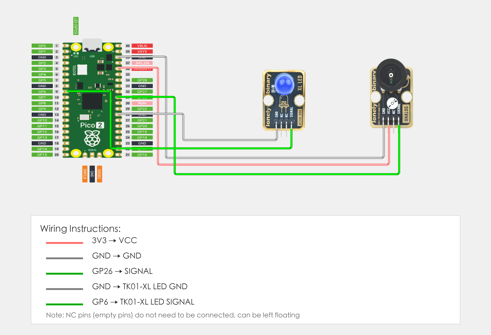

# Raspberry Pi Pico 2 Example

## Goal

This example shows how to use the TK07 - DIS POTENTIOMETER module on a Raspberry Pi Pico 2 to control LED brightness by rotating the potentiometer knob.

## Wiring



- **VCC** → Raspberry Pi Pico 2 3.3V or 5V
- **GND** → Raspberry Pi Pico 2 GND
- **SIGNAL** → Raspberry Pi Pico 2 GPIO 26 (or the pin you set as `POT_PIN` in code, must be ADC-capable pin)
- **NC** → Leave unconnected

## Code

```python
# Import required modules
from machine import Pin, ADC, PWM  # GPIO control, analog input and PWM
import time                         # For delay (time.sleep)

# Pin number: change this to match your wiring
POT_PIN = 26  # SIGNAL pin connected to GPIO (e.g. GPIO 26, must be ADC-capable pin)
LED_PIN = 6   # LED pin connected to GPIO (must be PWM-capable pin, e.g. GPIO 6)

# Create ADC and PWM objects
pot = ADC(Pin(POT_PIN))  # Create ADC object to read analog value
led = PWM(Pin(LED_PIN))  # Create PWM object to control LED brightness

# Configure PWM frequency (1000 Hz)
led.freq(1000)

print("Digital potentiometer LED brightness control program started")
print("Rotate potentiometer to adjust LED brightness")

# Main loop: runs forever
while True:
    # Read potentiometer analog value (0-65535)
    potValue = pot.read_u16()  # Read analog value: 0 = minimum, 65535 = maximum
    
    # Map potentiometer value (0-65535) to LED brightness (0-65535)
    # Use potentiometer value directly as LED brightness value
    brightness = potValue
    
    # Use PWM to control LED brightness
    led.duty_u16(brightness)
    
    # Convert analog value to voltage value (0-3.3V)
    voltage = potValue * (3.3 / 65535.0)
    
    # Display values in terminal
    print("Potentiometer value: {} | Voltage: {:.2f}V | LED brightness: {}".format(potValue, voltage, brightness))
    
    # Delay 100 milliseconds to avoid reading too fast
    time.sleep_ms(100)
```

## Effect


## Code Walkthrough

**Lines 1–2: Imports**

```python
from machine import Pin, ADC, PWM  # GPIO control, analog input and PWM
import time                         # For delay (time.sleep)
```

- **`machine.Pin`:** Used to control Pico GPIO pins.
- **`machine.ADC`:** Used to read analog signals.
- **`machine.PWM`:** Used to control Pico PWM output.
- **`time`:** Provides `sleep()` and other time-related functions.

**Lines 5–6: Pin definition**

```python
POT_PIN = 26  # SIGNAL pin connected to GPIO (e.g. GPIO 26, must be ADC-capable pin)
LED_PIN = 6   # LED pin connected to GPIO (must be PWM-capable pin, e.g. GPIO 6)
```

- **`POT_PIN`:** GPIO number for potentiometer SIGNAL (must be ADC-capable pin). Change this if you use another pin.
- **`LED_PIN`:** GPIO number for LED (must be PWM-capable pin). Change this if you use another pin.

**Lines 9–10: Create ADC and PWM objects**

```python
pot = ADC(Pin(POT_PIN))  # Create ADC object to read analog value
led = PWM(Pin(LED_PIN))  # Create PWM object to control LED brightness
```

- **`ADC(Pin(POT_PIN))`:** Create ADC object to read analog value from potentiometer.
- **`PWM(Pin(LED_PIN))`:** Create PWM object to control LED brightness.

**Line 13: Configure PWM frequency**

```python
led.freq(1000)
```

- **`freq(1000)`:** Set PWM frequency to 1000 Hz.

**Lines 16–17: Print start message**

```python
print("Digital potentiometer LED brightness control program started")
print("Rotate potentiometer to adjust LED brightness")
```

- **`print(...)`:** Print program start message and instructions to terminal.

**Lines 20–32: Main loop**

```python
while True:
    # Read potentiometer analog value (0-65535)
    potValue = pot.read_u16()  # Read analog value: 0 = minimum, 65535 = maximum
    
    # Map potentiometer value (0-65535) to LED brightness (0-65535)
    # Use potentiometer value directly as LED brightness value
    brightness = potValue
    
    # Use PWM to control LED brightness
    led.duty_u16(brightness)
    
    # Convert analog value to voltage value (0-3.3V)
    voltage = potValue * (3.3 / 65535.0)
    
    # Display values in terminal
    print("Potentiometer value: {} | Voltage: {:.2f}V | LED brightness: {}".format(potValue, voltage, brightness))
    
    # Delay 100 milliseconds to avoid reading too fast
    time.sleep_ms(100)
```

- **`while True`:** Infinite loop; the program keeps running.
- **`pot.read_u16()`:** Read potentiometer analog value (0-65535), 0 means minimum, 65535 means maximum.
- **`brightness = potValue`:** Use potentiometer value directly as LED brightness value.
- **`led.duty_u16(brightness)`:** Use PWM to control LED brightness (0-65535).
- **`potValue * (3.3 / 65535.0)`:** Convert analog value (0-65535) to voltage value (0-3.3V).
- **`print(...)`:** Print potentiometer value, voltage value, and LED brightness to terminal.
- **`time.sleep_ms(100)`:** Wait 100 milliseconds before reading again to avoid reading too fast.
