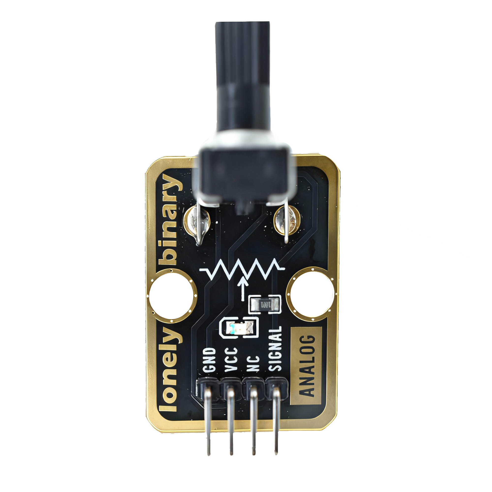
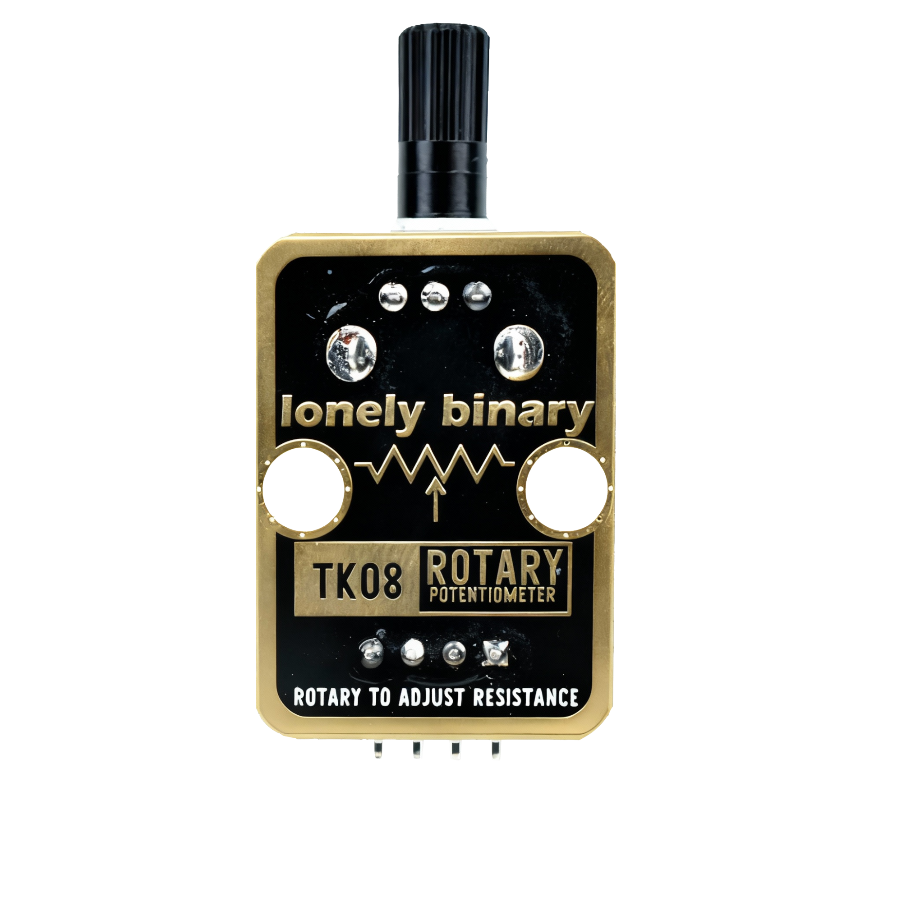
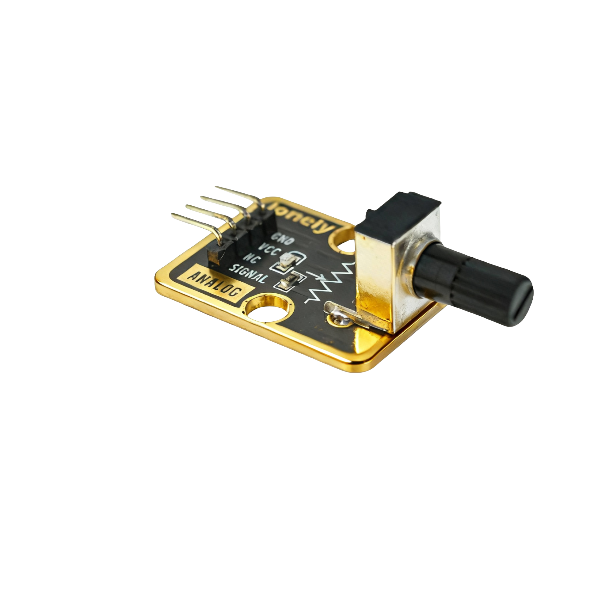

# Function

This module is a rotary potentiometer module. By rotating the knob, you can adjust the resistance value and output analog voltage signals between 0V and VCC. By reading the analog value, you can determine the knob position. It can be used to control volume, brightness, speed, and other continuously variable parameters.

# Appearance

|  |  |  |
| :-----------------------: | :-----------------------: | :-----------------------: |
|          **Front**          |          **Back**          |          **Side**          |

The module has a rotatable potentiometer knob and a 4-pin header. You can identify each pin by the silkscreen (text printed next to the pins).

# Pinout

- **GND** (negative): Connect to the controller board's GND (like the negative terminal of a battery).
- **VCC** (positive): Connect to the controller board's 3.3V or 5V (This module supports 3.3V and 5V).
- **NC** (no connect): Not connected in the circuit; left for a unified interface. Can be left unconnected.
- **SIGNAL** (output): Potentiometer output pin. Connect to an analog input pin on the controller (e.g. Arduino A0 or Pico GPIO 26).
  - Outputs analog voltage signal (0V to VCC)
  - Different knob positions output different voltages

# Features

- Continuous adjustment: Can continuously adjust resistance value
- Analog output: Outputs analog voltage signals
- Operating voltage: 3.3 V or 5 V
- Suitable for continuous control such as volume and brightness

# Quick Wiring (3 steps)

1. GND → controller board GND
2. VCC → controller board 3.3V or 5V
3. SIGNAL → controller board analog input pin (use the pin number defined in your code)
