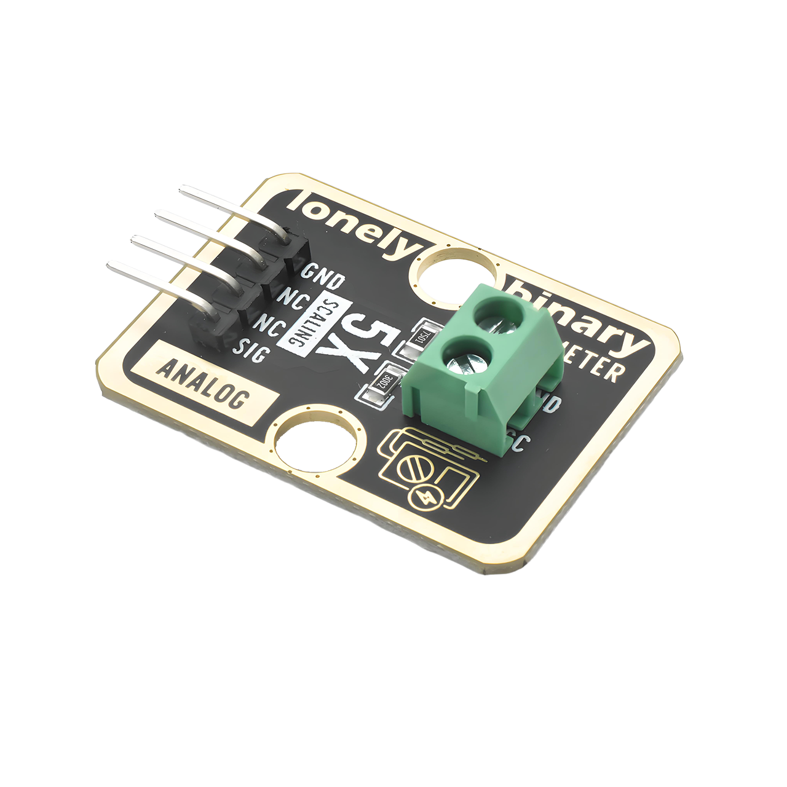

# Function

This module is a voltage detection module that can scale high voltage signals to a range that MCUs can safely read. The module uses an internal voltage divider circuit to proportionally reduce the input voltage before outputting it. For 5V MCUs (such as Arduino Uno R3), it can detect voltages up to 25V; for 3.3V MCUs (such as Raspberry Pi Pico), it can detect voltages up to 16.5V. The module scales the input voltage by a ratio of 1:5, meaning when 25V is input, 5V is output; when 16.5V is input, 3.3V is output.

# Appearance

|  |  |  |
| :-----------------------: | :-----------------------: | :-----------------------: |
|          **Front**          |          **Back**          |          **Side**          |

The module has an operational amplifier chip and a 4-pin header interface. Each pin can be identified by the silkscreen (text printed next to the pin).

# Pinout

- **GND** (negative): Like the negative terminal (-) of a battery, connect to the control board's GND
- **VCC** (positive): Like the positive terminal (+) of a battery, connect to the control board's 3.3V or 5V (this module supports both 3.3V and 5V)
- **NC** (no connection): No actual circuit connection, included for unified interface, can be left unconnected
- **SIG** (signal output): Voltage detection output pin
  - Output: Connect to the control board's analog input pin (scaled voltage signal)
  - Note: The positive terminal of the voltage being measured connects to the module's VCC pin, and the negative terminal connects to the GND pin

# Features

- Voltage detection: Can scale high voltages (up to 25V) to MCU-safe range (0-5V)
- Voltage divider ratio: 1:5 (input voltage is 5 times the output voltage)
- Operating voltage: 3.3V or 5V
- Suitable for detecting battery voltage, power supply voltage, and other high voltage signals

# Quick Wiring

1. GND → Control board GND (also connect to the negative terminal of the voltage being measured)
2. VCC → Control board 3.3V or 5V (also connect to the positive terminal of the voltage being measured, up to 25V)
3. SIG output → Control board analog input pin (e.g. Arduino A0 or Pico GPIO 26)
4. Voltage being measured → Connect between the module's VCC and GND (note voltage range)
