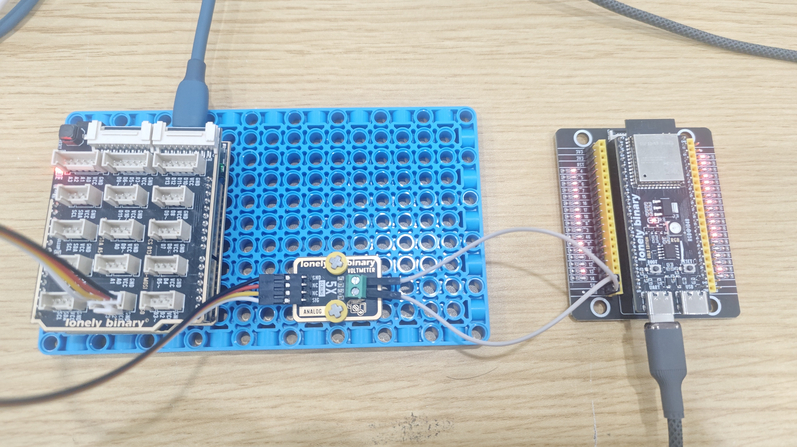

# Arduino Uno R3 Example

## Goal

This example shows how to use the TK09 - VOLMETER module on an Arduino Uno R3 to detect voltage.

## Wiring


- **GND** → Arduino Uno R3 GND
- **NC** → Leave unconnected

## Code

```cpp
// Pin number: change this to match your wiring
#define VOLTAGE_PIN A0  // Arduino analog input pin connected to SIG output (e.g. A0)

// Voltage divider ratio: adjust according to actual measurement
// If connecting 5V shows 25V, it means ADC read 5V, may need to adjust this ratio
// Default value is 5.0 (1:5 voltage divider), modify this value if measurement is inaccurate
const float VOLTAGE_DIVIDER_RATIO = 5.0;  // Voltage divider ratio

void setup() {
  // Start serial for debugging (9600 baud)
  Serial.begin(9600);
  
  Serial.println("Voltage detection module program started");
  Serial.println("Reading scaled voltage signal and calculating original voltage (0-25V)");
}

void loop() {
  // Read analog input value (0-1023)
  int sensorValue = analogRead(VOLTAGE_PIN);  // Read scaled voltage signal value
  
  // Convert analog value to voltage (0-5V)
  float voltage = sensorValue * (5.0 / 1023.0);  // Arduino analog input range is 0-1023, corresponding to 0-5V
  
  // Multiply scaled voltage by divider ratio to get original voltage
  float originalVoltage = voltage * VOLTAGE_DIVIDER_RATIO;
  
  // Print debug information
  Serial.print("ADC value: ");
  Serial.print(sensorValue);
  Serial.print(" | Scaled voltage: ");
  Serial.print(voltage, 3);
  Serial.print("V | Original voltage: ");
  Serial.print(originalVoltage, 3);
  Serial.println("V");
  
  delay(500);  // Wait 0.5 seconds before reading again
}
```

## Effect




## Code Walkthrough

**Line 2: Pin definition**

```cpp
#define VOLTAGE_PIN A0  // Arduino analog input pin connected to SIG output (e.g. A0)
```

- **`VOLTAGE_PIN`:** The Arduino analog input pin connected to voltage detection signal. Change this if you use another pin.

**Line 4–7: Define constants**

```cpp
// Voltage divider ratio: adjust according to actual measurement
// If connecting 5V shows 25V, it means ADC read 5V, may need to adjust this ratio
// Default value is 5.0 (1:5 voltage divider), modify this value if measurement is inaccurate
const float VOLTAGE_DIVIDER_RATIO = 5.0;  // Voltage divider ratio
```

- **`VOLTAGE_DIVIDER_RATIO`:** Voltage divider ratio, default value is 5.0 (1:5 voltage divider), used to convert scaled voltage to original voltage. Adjust this value for calibration if measurement is inaccurate.

**Line 9–15: Initialization (setup function)**

```cpp
void setup() {
  Serial.begin(9600);
  Serial.println("Voltage detection module program started");
  Serial.println("Reading scaled voltage signal and calculating original voltage (0-25V)");
}
```

- **`setup()`:** Runs once when the Arduino starts.
- **`Serial.begin(9600)`:** Start serial at 9600 baud.

**Line 17–37: Main loop (loop function)**

```cpp
void loop() {
  // Read analog input value (0-1023)
  int sensorValue = analogRead(VOLTAGE_PIN);  // Read scaled voltage signal value
  
  // Convert analog value to voltage (0-5V)
  float voltage = sensorValue * (5.0 / 1023.0);  // Arduino analog input range is 0-1023, corresponding to 0-5V
  
  // Multiply scaled voltage by divider ratio to get original voltage
  float originalVoltage = voltage * VOLTAGE_DIVIDER_RATIO;
  
  // Print debug information
  Serial.print("ADC value: ");
  Serial.print(sensorValue);
  Serial.print(" | Scaled voltage: ");
  Serial.print(voltage, 3);
  Serial.print("V | Original voltage: ");
  Serial.print(originalVoltage, 3);
  Serial.println("V");
  
  delay(500);  // Wait 0.5 seconds before reading again
}
```

- **`loop()`:** Runs repeatedly.
- **`analogRead(VOLTAGE_PIN)`:** Read analog value (0-1023) from VOLTAGE_PIN, corresponding to scaled voltage signal.
- **`sensorValue * (5.0 / 1023.0)`:** Convert analog value (0-1023) to voltage value (0-5V), this is the scaled voltage.
- **`voltage * VOLTAGE_DIVIDER_RATIO`:** Multiply scaled voltage by divider ratio (5.0) to get original voltage (0-25V).
- **`Serial.print(...)` and `Serial.println(...)`:** Print ADC value, scaled voltage, and original voltage to the Serial Monitor.
- **`delay(500)`:** Wait 500 milliseconds before reading again to control output frequency.
