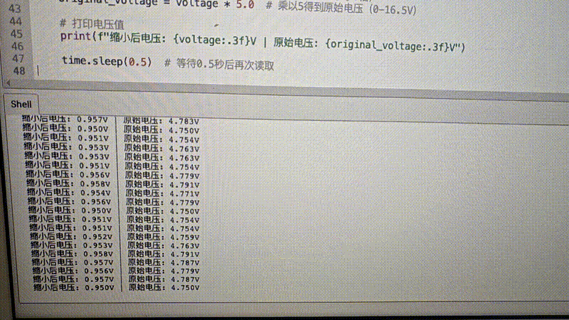

# Raspberry Pi Pico 2 Example

## Goal

This example shows how to use the TK09 - VOLMETER module on a Raspberry Pi Pico 2 to detect voltage.

## Wiring


## Code

```python
# Import required modules
from machine import Pin, ADC  # GPIO control and ADC
import time                   # For delay (time.sleep)

# Pin number: change this to match your wiring
VOLTAGE_PIN = 26  # GPIO connected to SIG output (e.g. GPIO 26, must be ADC-capable pin)

# Create ADC object
voltage_adc = ADC(Pin(VOLTAGE_PIN))  # Set voltage detection output pin as ADC mode (to read analog signal)

print("Voltage detection module program started")
print("Reading scaled voltage signal and calculating original voltage (0-16.5V)")

# Main loop: runs forever
while True:
    # Read analog input value (0-65535)
    sensor_value = voltage_adc.read_u16()  # Read scaled voltage signal value
    
    # Convert analog value to voltage (0-3.3V)
    voltage = sensor_value * (3.3 / 65535.0)  # Pico analog input range is 0-65535, corresponding to 0-3.3V
    
    # Multiply scaled voltage by 5 to get original voltage (module scales voltage by 5x)
    original_voltage = voltage * 5.0  # Multiply by 5 to get original voltage (0-16.5V)
    
    # Print voltage value
    print(f"Scaled voltage: {voltage:.3f}V | Original voltage: {original_voltage:.3f}V")
    
    time.sleep(0.5)  # Wait 0.5 seconds before reading again
```

## Effect





## Code Walkthrough

**Lines 1–2: Imports**

```python
from machine import Pin, ADC  # GPIO control and ADC
import time                   # For delay (time.sleep)
```

- **`machine.Pin`:** Used to control Pico GPIO pins.
- **`machine.ADC`:** Used to read analog signals.
- **`time`:** Provides `sleep()` and other time-related functions.

**Line 4: Pin definition**

```python
VOLTAGE_PIN = 26  # GPIO connected to SIG output (e.g. GPIO 26, must be ADC-capable pin)
```

- **`VOLTAGE_PIN`:** GPIO number for voltage detection signal (must be ADC-capable pin). Change this if you use another pin.

**Line 7: Create ADC object**

```python
voltage_adc = ADC(Pin(VOLTAGE_PIN))  # Set voltage detection output pin as ADC mode (to read analog signal)
```

- **`ADC(Pin(VOLTAGE_PIN))`:** Create ADC object to read analog signal.

**Lines 13–27: Main loop**

```python
while True:
    # Read analog input value (0-65535)
    sensor_value = voltage_adc.read_u16()  # Read scaled voltage signal value
    
    # Convert analog value to voltage (0-3.3V)
    voltage = sensor_value * (3.3 / 65535.0)  # Pico analog input range is 0-65535, corresponding to 0-3.3V
    
    # Multiply scaled voltage by 5 to get original voltage (module scales voltage by 5x)
    original_voltage = voltage * 5.0  # Multiply by 5 to get original voltage (0-16.5V)
    
    # Print voltage value
    print(f"Scaled voltage: {voltage:.3f}V | Original voltage: {original_voltage:.3f}V")
    
    time.sleep(0.5)  # Wait 0.5 seconds before reading again
```

- **`while True`:** Infinite loop; the program keeps running.
- **`voltage_adc.read_u16()`:** Read ADC analog value (0-65535), corresponding to scaled voltage signal.
- **`sensor_value * (3.3 / 65535.0)`:** Convert analog value (0-65535) to voltage value (0-3.3V), this is the scaled voltage.
- **`voltage * 5.0`:** Multiply scaled voltage by 5 to get original voltage (0-16.5V), because the module scales voltage by 5x.
- **`print(f"...")`:** Print scaled voltage and original voltage to terminal.
- **`time.sleep(0.5)`:** Wait 0.5 seconds before reading again to control output frequency.
