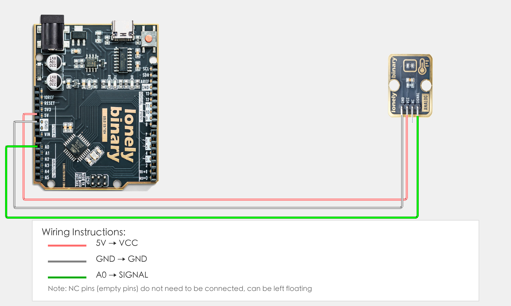
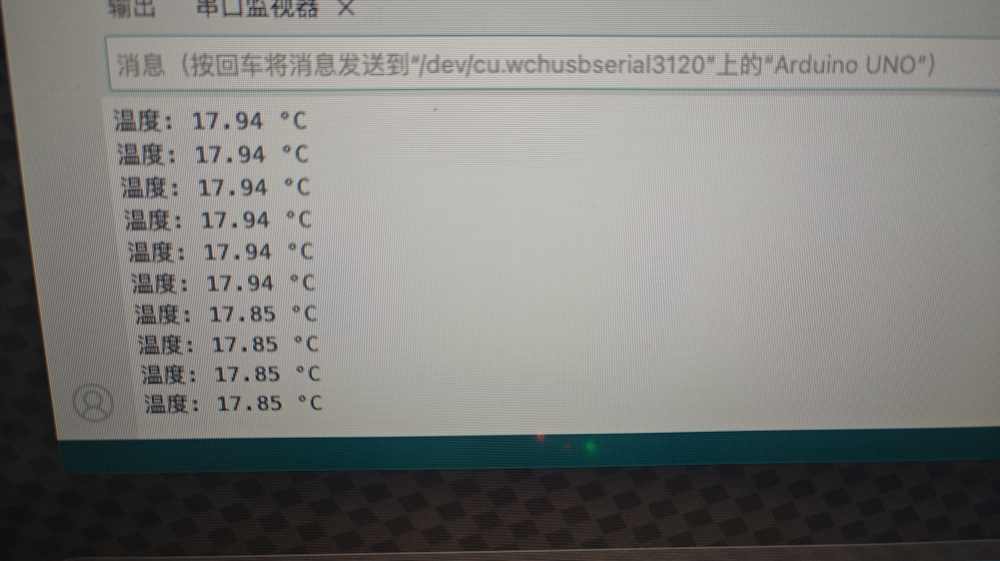

# Arduino Uno R3 Example

## Goal

This example shows how to use the TK12 - NTC THERMISTOR module on an Arduino Uno R3 to measure ambient temperature using the Beta equation.

## Wiring



- **VCC** → Arduino Uno R3 5V
- **GND** → Arduino Uno R3 GND
- **SIGNAL** → Arduino Uno R3 A0 (or the analog pin you set as `TEMP_PIN` in code)
- **NC** → Leave unconnected

## Code

```cpp
#include <math.h>  // For math functions (log)

// Pin number: change this to match your wiring
#define TEMP_PIN A0  // SIGNAL pin connected to Arduino analog input pin (e.g. A0)

// NTC thermistor parameters (adjust according to actual module specifications)
const float VCC = 5.0;           // Supply voltage (V)
const float R0 = 10000.0;        // NTC resistance at 25°C (Ω), usually 10KΩ
const float T0 = 25.0 + 273.15;  // Reference temperature (Kelvin), 25°C = 298.15K
const float BETA = 3950.0;       // Beta value (according to NTC specifications, common value is 3950, try 3435 or 4100 if temperature is inaccurate)
const float R_SERIES = 10000.0;  // Pull-up resistor value (Ω), usually 10KΩ, adjust if temperature is inaccurate
const float TEMP_OFFSET = 0.0;   // Temperature offset (°C), for calibration, set to negative if temperature is high, positive if low

void setup() {
  // Start serial for debugging (9600 baud)
  Serial.begin(9600);
  
  Serial.println("NTC thermistor program started");
  Serial.println("Using Beta equation to calculate temperature");
}

void loop() {
  // Read analog input value (0-1023)
  int sensorValue = analogRead(TEMP_PIN);
  
  // Convert analog value to voltage (0-5V)
  float voltage = sensorValue * (VCC / 1023.0);
  
  // Calculate NTC thermistor resistance
  // Using voltage divider formula: Vout = VCC * R_NTC / (R_SERIES + R_NTC)
  // Derived: R_NTC = R_SERIES * Vout / (VCC - Vout)
  float rNTC = 0.0;
  if (voltage > 0 && voltage < VCC) {
    rNTC = R_SERIES * voltage / (VCC - voltage);
  } else {
    // If voltage is out of range, use default value
    rNTC = R0;
  }
  
  // Calculate temperature using Beta equation (Kelvin)
  // T = 1 / (1/T0 + (1/BETA) * ln(R/R0))
  float temperatureK = 0.0;
  if (rNTC > 0 && rNTC < 1000000.0) {  // Limit resistance range to avoid abnormal values
    float lnR = log(rNTC / R0);
    temperatureK = 1.0 / (1.0 / T0 + (1.0 / BETA) * lnR);
  } else {
    temperatureK = T0;  // If calculation is abnormal, use reference temperature
  }
  
  // Convert to Celsius and apply offset
  float temperature = temperatureK - 273.15 + TEMP_OFFSET;
  
  // Limit temperature range (avoid abnormal values)
  if (temperature < -50.0) temperature = -50.0;
  if (temperature > 150.0) temperature = 150.0;
  
  // Print temperature value
  Serial.print("Temperature: ");
  Serial.print(temperature, 2);
  Serial.println(" °C");
  
  delay(1000);  // Wait 1 second before reading again
}
```

## Effect





## Code Walkthrough

**Line 1: Include library**

```cpp
#include <math.h>  // For math functions (log)
```

- **`#include <math.h>`:** Include math library for `log()` function to calculate logarithm.

**Line 4: Pin definition**

```cpp
#define TEMP_PIN A0  // SIGNAL pin connected to Arduino analog input pin (e.g. A0)
```

- **`TEMP_PIN`:** The Arduino analog input pin connected to NTC thermistor SIGNAL. Change this if you use another pin.

**Line 7–12: Define NTC thermistor parameters**

```cpp
const float VCC = 5.0;           // Supply voltage (V)
const float R0 = 10000.0;        // NTC resistance at 25°C (Ω), usually 10KΩ
const float T0 = 25.0 + 273.15;  // Reference temperature (Kelvin), 25°C = 298.15K
const float BETA = 3950.0;       // Beta value (according to NTC specifications, common value is 3950, try 3435 or 4100 if temperature is inaccurate)
const float R_SERIES = 10000.0;  // Pull-up resistor value (Ω), usually 10KΩ, adjust if temperature is inaccurate
const float TEMP_OFFSET = 0.0;   // Temperature offset (°C), for calibration, set to negative if temperature is high, positive if low
```

- **`VCC`:** Supply voltage (5V).
- **`R0`:** NTC resistance at 25°C (10KΩ), adjust according to actual module specifications.
- **`T0`:** Reference temperature (Kelvin, 25°C = 298.15K).
- **`BETA`:** Beta value (according to NTC specifications, common value is 3950, try 3435 or 4100 if temperature is inaccurate).
- **`R_SERIES`:** Pull-up resistor value (10KΩ), adjust if temperature is inaccurate.
- **`TEMP_OFFSET`:** Temperature offset (°C) for calibration, set to negative if temperature is high, positive if low.

**Line 14–20: Initialization (setup function)**

```cpp
void setup() {
  // Start serial for debugging (9600 baud)
  Serial.begin(9600);
  
  Serial.println("NTC thermistor program started");
  Serial.println("Using Beta equation to calculate temperature");
}
```

- **`setup()`:** Runs once when the Arduino starts.
- **`Serial.begin(9600)`:** Start serial at 9600 baud.
- **`Serial.println(...)`:** Print program start message and instructions to the Serial Monitor.

**Line 22–63: Main loop (loop function)**

```cpp
void loop() {
  // Read analog input value (0-1023)
  int sensorValue = analogRead(TEMP_PIN);
  
  // Convert analog value to voltage (0-5V)
  float voltage = sensorValue * (VCC / 1023.0);
  
  // Calculate NTC thermistor resistance
  // Using voltage divider formula: Vout = VCC * R_NTC / (R_SERIES + R_NTC)
  // Derived: R_NTC = R_SERIES * Vout / (VCC - Vout)
  float rNTC = 0.0;
  if (voltage > 0 && voltage < VCC) {
    rNTC = R_SERIES * voltage / (VCC - voltage);
  } else {
    // If voltage is out of range, use default value
    rNTC = R0;
  }
  
  // Calculate temperature using Beta equation (Kelvin)
  // T = 1 / (1/T0 + (1/BETA) * ln(R/R0))
  float temperatureK = 0.0;
  if (rNTC > 0 && rNTC < 1000000.0) {  // Limit resistance range to avoid abnormal values
    float lnR = log(rNTC / R0);
    temperatureK = 1.0 / (1.0 / T0 + (1.0 / BETA) * lnR);
  } else {
    temperatureK = T0;  // If calculation is abnormal, use reference temperature
  }
  
  // Convert to Celsius and apply offset
  float temperature = temperatureK - 273.15 + TEMP_OFFSET;
  
  // Limit temperature range (avoid abnormal values)
  if (temperature < -50.0) temperature = -50.0;
  if (temperature > 150.0) temperature = 150.0;
  
  // Print temperature value
  Serial.print("Temperature: ");
  Serial.print(temperature, 2);
  Serial.println(" °C");
  
  delay(1000);  // Wait 1 second before reading again
}
```

- **`loop()`:** Runs repeatedly.
- **`analogRead(TEMP_PIN)`:** Read analog input value (0-1023), corresponding to NTC thermistor voltage divider value.
- **`sensorValue * (VCC / 1023.0)`:** Convert analog value (0-1023) to voltage value (0-5V).
- **`R_SERIES * voltage / (VCC - voltage)`:** Calculate NTC thermistor resistance using voltage divider formula. Formula derivation: Vout = VCC * R_NTC / (R_SERIES + R_NTC), therefore R_NTC = R_SERIES * Vout / (VCC - Vout).
- **`log(rNTC / R0)`:** Calculate natural logarithm of resistance ratio for Beta equation.
- **`1.0 / (1.0 / T0 + (1.0 / BETA) * lnR)`:** Calculate temperature (Kelvin) using Beta equation. Formula: T = 1 / (1/T0 + (1/BETA) * ln(R/R0)).
- **`temperatureK - 273.15 + TEMP_OFFSET`:** Convert Kelvin temperature to Celsius and apply temperature offset for calibration.
- **`if (temperature < -50.0)` and `if (temperature > 150.0)`:** Limit temperature range to avoid abnormal values.
- **`Serial.print(...)` and `Serial.println(...)`:** Print temperature value (2 decimal places) to the Serial Monitor.
- **`delay(1000)`:** Wait 1000 milliseconds (1 second) before reading again to control output frequency.
