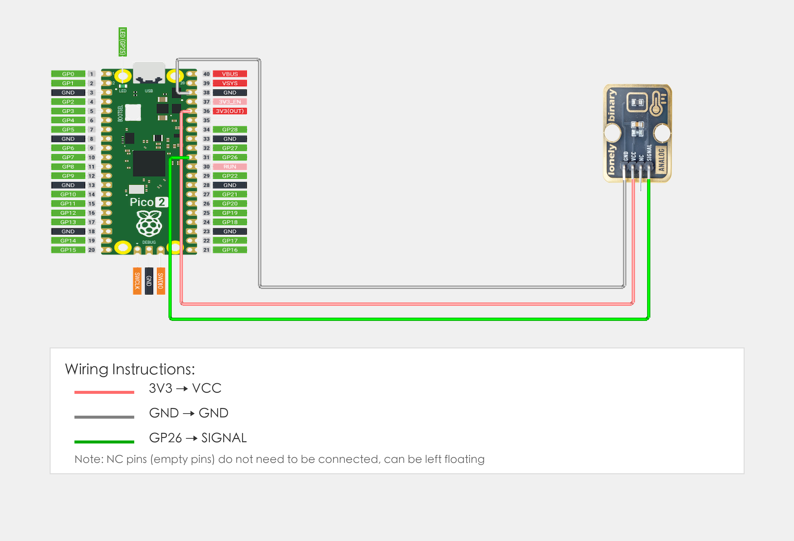
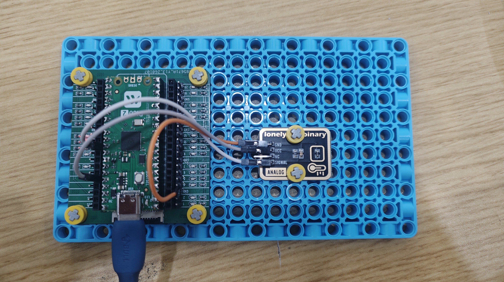

# Raspberry Pi Pico 2 Example

## Goal

This example shows how to use the TK12 - NTC THERMISTOR module on a Raspberry Pi Pico 2 to measure ambient temperature using the Beta equation.

## Wiring



- **VCC** → Raspberry Pi Pico 2 3.3V or 5V
- **GND** → Raspberry Pi Pico 2 GND
- **SIGNAL** → Raspberry Pi Pico 2 GPIO 26 (or the pin you set as `TEMP_PIN` in code, must be ADC-capable pin)
- **NC** → Leave unconnected

## Code

```python
# Import required modules
from machine import Pin, ADC  # GPIO control and ADC
import time                   # For delay (time.sleep)
import math                   # Math functions (log)

# Pin number: change this to match your wiring
TEMP_PIN = 26  # SIGNAL pin connected to GPIO (e.g. GPIO 26, must be ADC-capable pin)

# NTC thermistor parameters (adjust according to actual module specifications)
VCC = 3.3           # Supply voltage (V)
R0 = 10000.0        # NTC resistance at 25°C (Ω), usually 10KΩ
T0 = 25.0 + 273.15  # Reference temperature (Kelvin), 25°C = 298.15K
BETA = 3950.0       # Beta value (according to NTC specifications, common value is 3950, try 3435 or 4100 if temperature is inaccurate)
R_SERIES = 10000.0  # Pull-up resistor value (Ω), usually 10KΩ
TEMP_OFFSET = 0.0   # Temperature offset (°C), for calibration, set to negative if temperature is high, positive if low

# Create ADC object
temp = ADC(Pin(TEMP_PIN))  # Set temperature sensor pin as ADC mode (to read analog signal)

print("NTC thermistor program started")
print("Using Beta equation to calculate temperature")

# Main loop: runs forever
while True:
    # Read analog input value (0-65535)
    sensor_value = temp.read_u16()
    
    # Convert analog value to voltage (0-3.3V)
    voltage = sensor_value * (VCC / 65535.0)
    
    # Calculate NTC thermistor resistance
    # Using voltage divider formula: Vout = VCC * R_NTC / (R_SERIES + R_NTC)
    # Derived: R_NTC = R_SERIES * Vout / (VCC - Vout)
    if voltage > 0 and voltage < VCC:
        r_ntc = R_SERIES * voltage / (VCC - voltage)
    else:
        # If voltage is out of range, use default value
        r_ntc = R0
    
    # Calculate temperature using Beta equation (Kelvin)
    # T = 1 / (1/T0 + (1/BETA) * ln(R/R0))
    if r_ntc > 0 and r_ntc < 1000000.0:  # Limit resistance range to avoid abnormal values
        ln_r = math.log(r_ntc / R0)
        temperature_k = 1.0 / (1.0 / T0 + (1.0 / BETA) * ln_r)
    else:
        temperature_k = T0  # If calculation is abnormal, use reference temperature
    
    # Convert to Celsius and apply offset
    temperature = temperature_k - 273.15 + TEMP_OFFSET
    
    # Limit temperature range (avoid abnormal values)
    if temperature < -50.0:
        temperature = -50.0
    if temperature > 150.0:
        temperature = 150.0
    
    # Print temperature value
    print(f"Temperature: {temperature:.2f} °C")
    
    time.sleep(1)  # Wait 1 second before reading again
```

## Effect




## Code Walkthrough

**Lines 1–3: Imports**

```python
from machine import Pin, ADC  # GPIO control and ADC
import time                   # For delay (time.sleep)
import math                   # Math functions (log)
```

- **`machine.Pin`:** Used to control Pico GPIO pins.
- **`machine.ADC`:** Used to read analog signals.
- **`time`:** Provides `sleep()` and other time-related functions.
- **`math`:** Provides `log()` function to calculate logarithm.

**Lines 6–13: Pin definition and NTC thermistor parameters**

```python
TEMP_PIN = 26  # SIGNAL pin connected to GPIO (e.g. GPIO 26, must be ADC-capable pin)

# NTC thermistor parameters (adjust according to actual module specifications)
VCC = 3.3           # Supply voltage (V)
R0 = 10000.0        # NTC resistance at 25°C (Ω), usually 10KΩ
T0 = 25.0 + 273.15  # Reference temperature (Kelvin), 25°C = 298.15K
BETA = 3950.0       # Beta value (according to NTC specifications, common value is 3950, try 3435 or 4100 if temperature is inaccurate)
R_SERIES = 10000.0  # Pull-up resistor value (Ω), usually 10KΩ
TEMP_OFFSET = 0.0   # Temperature offset (°C), for calibration, set to negative if temperature is high, positive if low
```

- **`TEMP_PIN`:** GPIO number for temperature sensor SIGNAL (must be ADC-capable pin). Change this if you use another pin.
- **`VCC`:** Supply voltage (3.3V).
- **`R0`:** NTC resistance at 25°C (10KΩ), adjust according to actual module specifications.
- **`T0`:** Reference temperature (Kelvin, 25°C = 298.15K).
- **`BETA`:** Beta value (according to NTC specifications, common value is 3950, try 3435 or 4100 if temperature is inaccurate).
- **`R_SERIES`:** Pull-up resistor value (10KΩ).
- **`TEMP_OFFSET`:** Temperature offset (°C) for calibration, set to negative if temperature is high, positive if low.

**Line 16: Create ADC object**

```python
temp = ADC(Pin(TEMP_PIN))  # Set temperature sensor pin as ADC mode (to read analog signal)
```

- **`ADC(Pin(TEMP_PIN))`:** Create ADC object to read analog signal from temperature sensor.

**Lines 19–20: Print start message**

```python
print("NTC thermistor program started")
print("Using Beta equation to calculate temperature")
```

- **`print(...)`:** Print program start message and instructions to terminal.

**Lines 23–54: Main loop**

```python
while True:
    # Read analog input value (0-65535)
    sensor_value = temp.read_u16()
    
    # Convert analog value to voltage (0-3.3V)
    voltage = sensor_value * (VCC / 65535.0)
    
    # Calculate NTC thermistor resistance
    # Using voltage divider formula: Vout = VCC * R_NTC / (R_SERIES + R_NTC)
    # Derived: R_NTC = R_SERIES * Vout / (VCC - Vout)
    if voltage > 0 and voltage < VCC:
        r_ntc = R_SERIES * voltage / (VCC - voltage)
    else:
        # If voltage is out of range, use default value
        r_ntc = R0
    
    # Calculate temperature using Beta equation (Kelvin)
    # T = 1 / (1/T0 + (1/BETA) * ln(R/R0))
    if r_ntc > 0 and r_ntc < 1000000.0:  # Limit resistance range to avoid abnormal values
        ln_r = math.log(r_ntc / R0)
        temperature_k = 1.0 / (1.0 / T0 + (1.0 / BETA) * ln_r)
    else:
        temperature_k = T0  # If calculation is abnormal, use reference temperature
    
    # Convert to Celsius and apply offset
    temperature = temperature_k - 273.15 + TEMP_OFFSET
    
    # Limit temperature range (avoid abnormal values)
    if temperature < -50.0:
        temperature = -50.0
    if temperature > 150.0:
        temperature = 150.0
    
    # Print temperature value
    print(f"Temperature: {temperature:.2f} °C")
    
    time.sleep(1)  # Wait 1 second before reading again
```

- **`while True`:** Infinite loop; the program keeps running.
- **`temp.read_u16()`:** Read analog input value (0-65535), corresponding to NTC thermistor voltage divider value.
- **`sensor_value * (VCC / 65535.0)`:** Convert analog value (0-65535) to voltage value (0-3.3V).
- **`R_SERIES * voltage / (VCC - voltage)`:** Calculate NTC thermistor resistance using voltage divider formula. Formula derivation: Vout = VCC * R_NTC / (R_SERIES + R_NTC), therefore R_NTC = R_SERIES * Vout / (VCC - Vout).
- **`math.log(r_ntc / R0)`:** Calculate natural logarithm of resistance ratio for Beta equation.
- **`1.0 / (1.0 / T0 + (1.0 / BETA) * ln_r)`:** Calculate temperature (Kelvin) using Beta equation. Formula: T = 1 / (1/T0 + (1/BETA) * ln(R/R0)).
- **`temperature_k - 273.15 + TEMP_OFFSET`:** Convert Kelvin temperature to Celsius and apply temperature offset for calibration.
- **`if temperature < -50.0` and `if temperature > 150.0`:** Limit temperature range to avoid abnormal values.
- **`print(...)`:** Print temperature value (2 decimal places) to terminal.
- **`time.sleep(1)`:** Wait 1 second before reading again to control output frequency.
