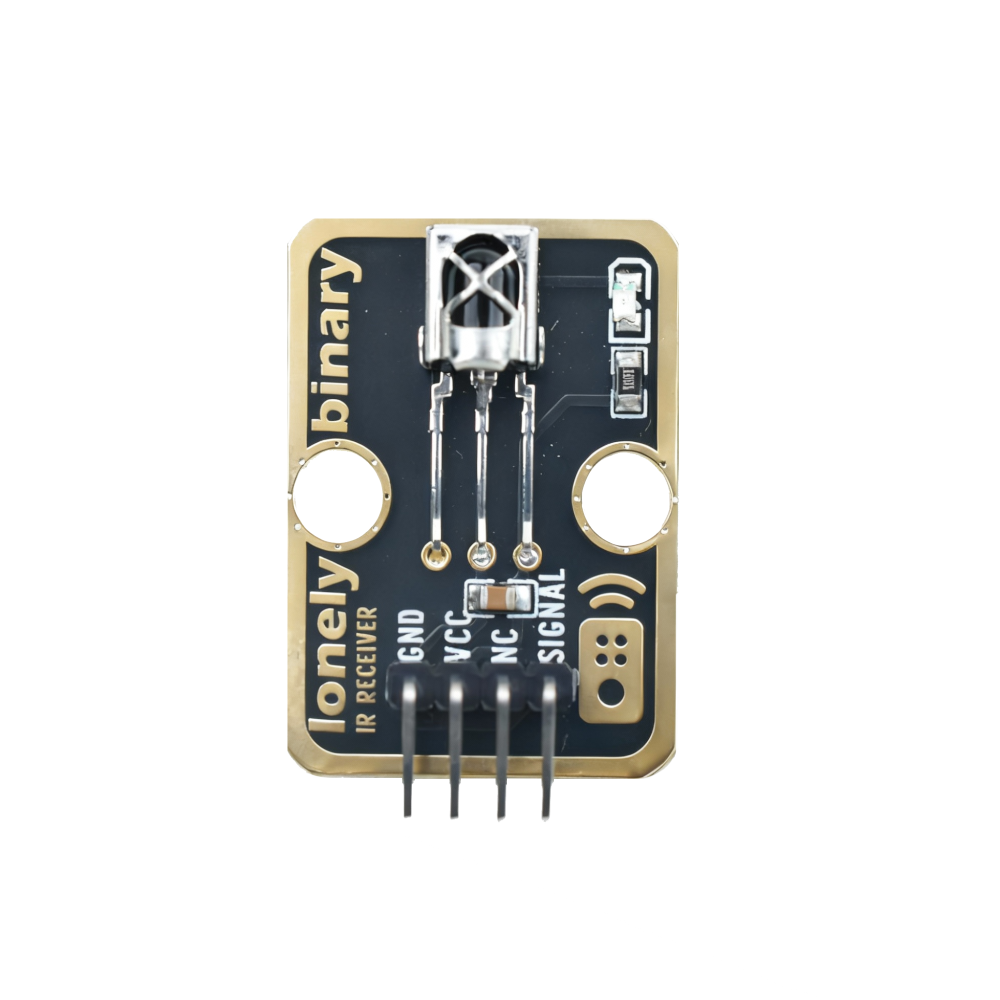
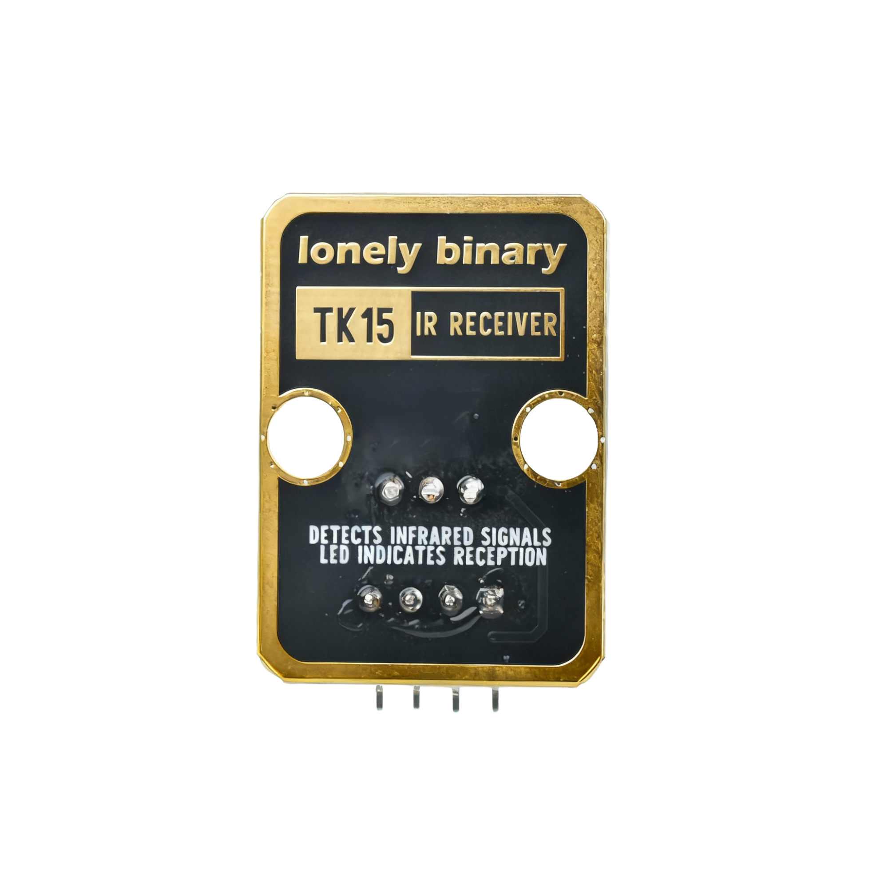
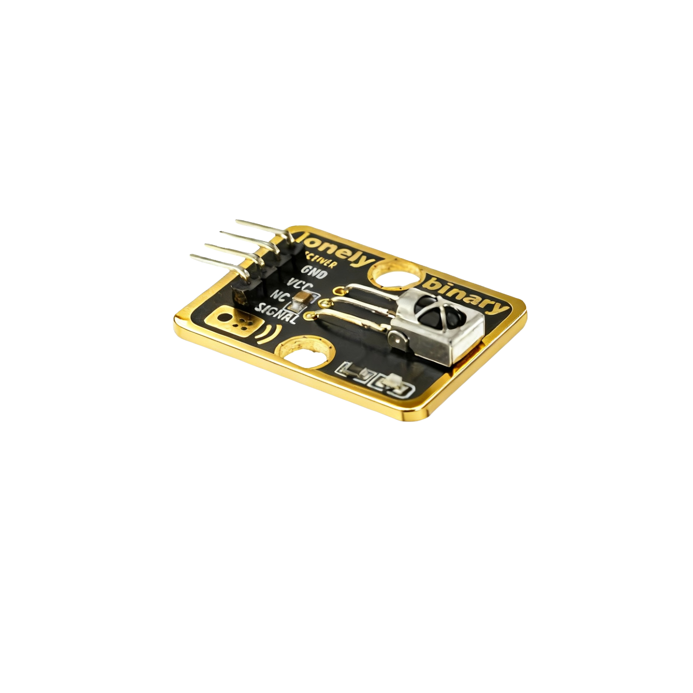

# Function

This module is an infrared receiver module that can receive signals from infrared remote controls. When an infrared signal is detected, the indicator light on the module lights up, indicating successful reception. Can be used to make infrared remote receivers, infrared remote control applications, etc.

# Appearance

|  |  |  |
| :-----------------------: | :-----------------------: | :-----------------------: |
|          **Front**          |          **Back**          |          **Side**          |

The module has an infrared receiver head, an indicator light, and a 4-pin header interface. Each pin can be identified by the silkscreen (text printed next to the pin).

# Pinout

- **GND** (negative): Like the negative terminal (-) of a battery, connect to the control board's GND
- **VCC** (positive): Like the positive terminal (+) of a battery, connect to the control board's 3.3V or 5V (this module supports both 3.3V and 5V)
- **NC** (no connection): No actual circuit connection, included for unified interface, can be left unconnected
- **SIGNAL** (signal output): Infrared signal output pin, connect to the control board's digital pin (e.g. Arduino D2 or Pico GPIO 0)
  - Outputs LOW (LOW/0) when infrared signal is received
  - Outputs HIGH (HIGH/1) when no signal is received

# Features

- Infrared reception: Can receive infrared remote control signals
- Indicator light: Lights up when signal is detected
- Operating voltage: 3.3V or 5V
- Reception distance: About 5-10 meters

# Quick Wiring

1. GND → Control board GND
2. VCC → Control board 3.3V or 5V
3. SIGNAL → Control board digital pin (use the pin defined in your program)
