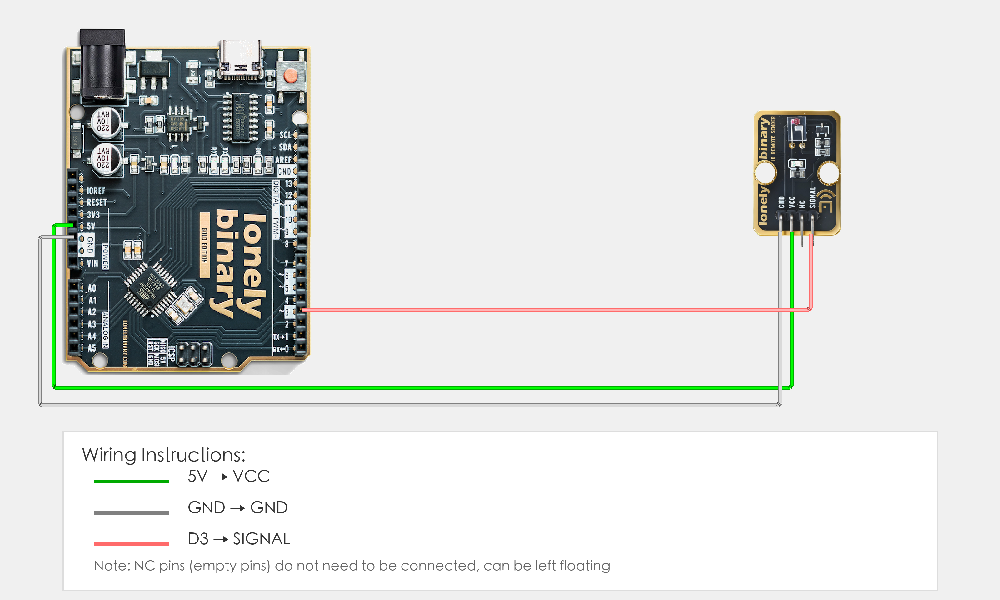

# Arduino Uno R3 Example

## Goal

This example shows how to use the TK16 - IR REMOTE SENSOR module on an Arduino Uno R3 to transmit infrared signals.

## Wiring



- **VCC** → Arduino Uno R3 5V
- **GND** → Arduino Uno R3 GND
- **SIGNAL** → Arduino Uno R3 D3
- **NC** → Leave unconnected

## Code

```cpp
// Note: This program requires the IRremote library
// Installation: Tools → Manage Libraries → Search "IRremote" → Install

#include <IRremote.h>  // Import IR transmission library

// Pin number: change this to match your wiring
#define IR_TX_PIN 3  // Arduino digital pin connected to SIGNAL (e.g. D3)

// Create IR transmitter object
IRsend irsend(IR_TX_PIN);

void setup() {
  // Start serial for debugging (9600 baud)
  Serial.begin(9600);
  
  Serial.println("IR remote transmitter program started");
  Serial.println("Transmitting IR signal every 2 seconds");
}

void loop() {
  // Send NEC format IR code (example)
  irsend.sendNEC(0xFF00FF, 32);  // Send NEC format IR code, 0xFF00FF is IR code value, 32 is bit count
  Serial.println("IR signal transmitted");
  delay(2000);  // Wait 2 seconds before transmitting again
}
```

## Effect


## Code Walkthrough

**Line 1–2: Include library**

```cpp
// Note: This program requires the IRremote library
// Installation: Tools → Manage Libraries → Search "IRremote" → Install

#include <IRremote.h>  // Import IR transmission library
```

- **`#include <IRremote.h>`:** Import IR transmission library for controlling IR transmitter (need to install IRremote library first).

**Line 5: Pin definition**

```cpp
#define IR_TX_PIN 3  // Arduino digital pin connected to SIGNAL (e.g. D3)
```

- **`IR_TX_PIN`:** The Arduino digital pin connected to IR transmitter SIGNAL. Change this if you use another pin.

**Line 8: Create IR transmitter object**

```cpp
IRsend irsend(IR_TX_PIN);
```

- **`IRsend irsend(IR_TX_PIN)`:** Create IR transmitter object to send IR signals using the specified pin.

**Line 10–16: Initialization (setup function)**

```cpp
void setup() {
  // Start serial for debugging (9600 baud)
  Serial.begin(9600);
  
  Serial.println("IR remote transmitter program started");
  Serial.println("Transmitting IR signal every 2 seconds");
}
```

- **`setup()`:** Runs once when the Arduino starts.
- **`Serial.begin(9600)`:** Start serial at 9600 baud.
- **`Serial.println(...)`:** Print program start message and instructions to Serial Monitor.

**Line 18–23: Main loop (loop function)**

```cpp
void loop() {
  // Send NEC format IR code (example)
  irsend.sendNEC(0xFF00FF, 32);  // Send NEC format IR code, 0xFF00FF is IR code value, 32 is bit count
  Serial.println("IR signal transmitted");
  delay(2000);  // Wait 2 seconds before transmitting again
}
```

- **`loop()`:** Runs repeatedly.
- **`irsend.sendNEC(0xFF00FF, 32)`:** Send NEC format IR code, 0xFF00FF is IR code value, 32 is bit count (can be modified according to actual remote control).
- **`Serial.println("IR signal transmitted")`:** Print IR signal transmitted message to Serial Monitor.
- **`delay(2000)`:** Wait 2000 milliseconds (2 seconds) before transmitting again to control transmission frequency.
