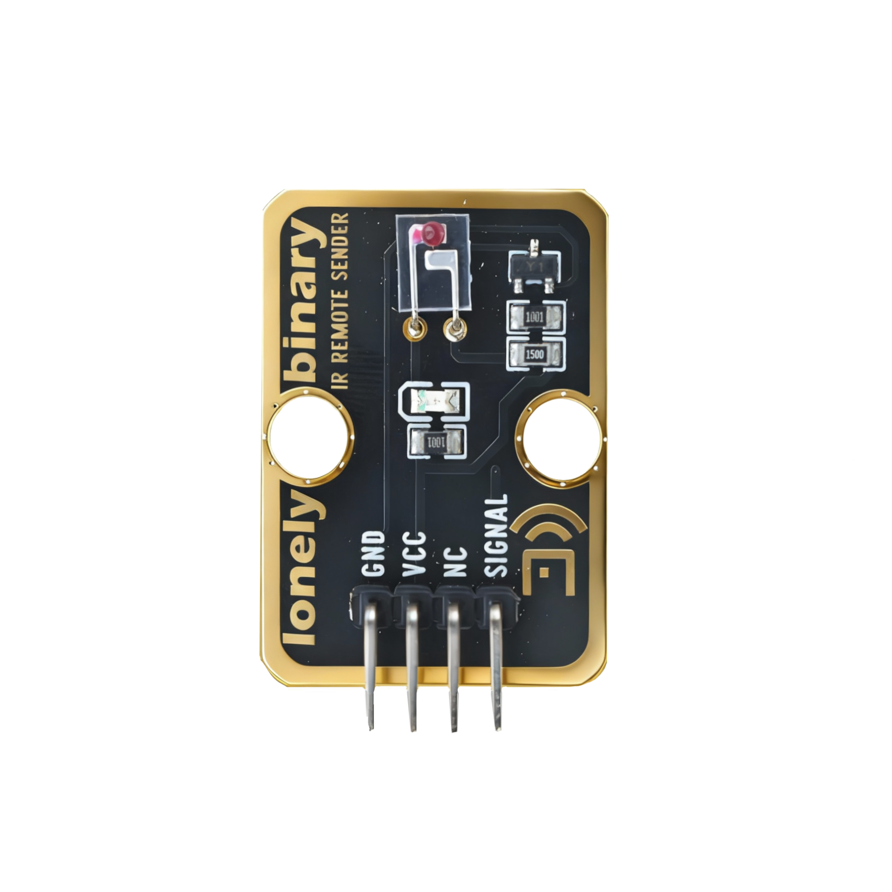
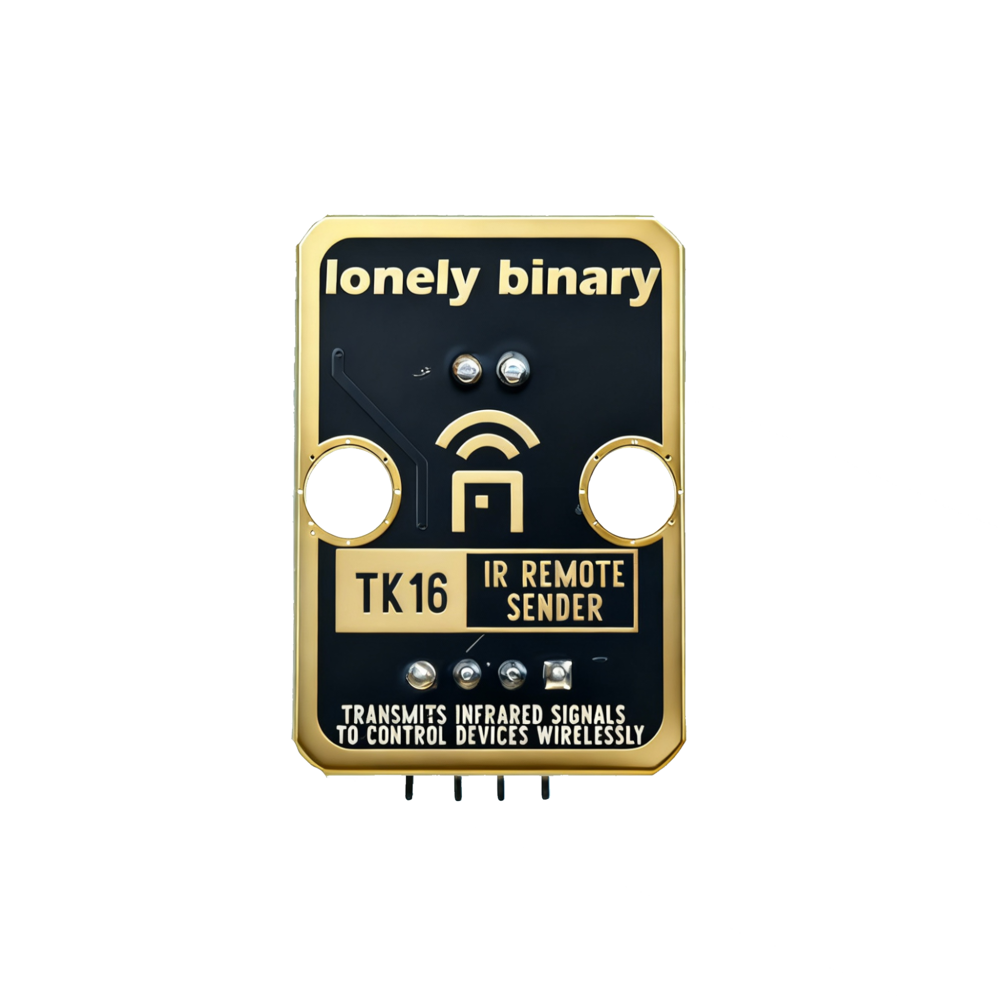
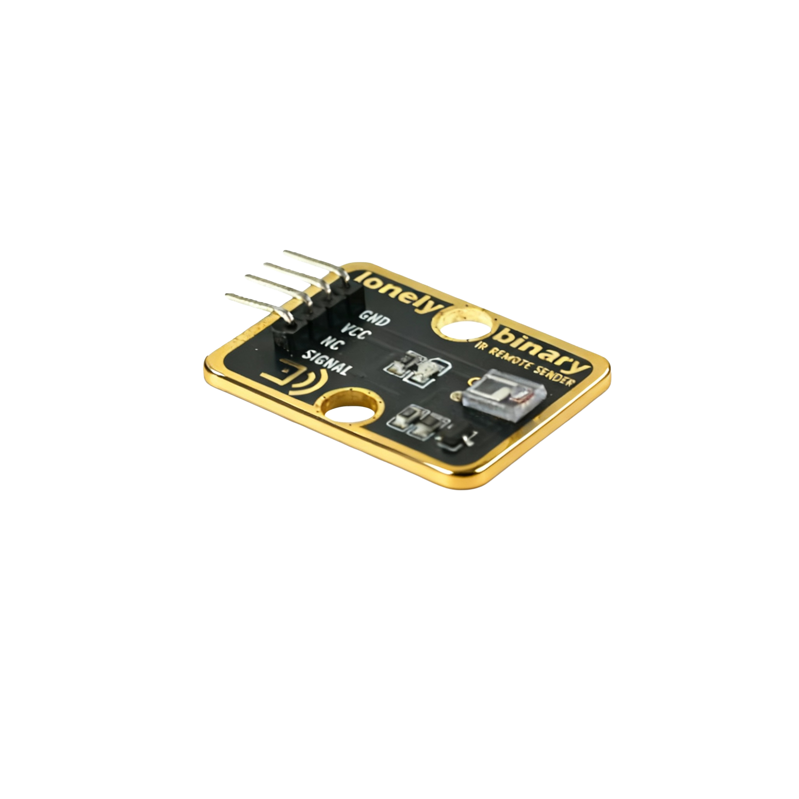

# Function

This module is an infrared remote transmitter module that can transmit infrared remote control signals. By controlling the transmission of infrared signals through programming, it can be used to control infrared devices such as TVs and air conditioners, or work together with infrared receivers for communication.

# Appearance

|  |  |  |
| :-----------------------: | :-----------------------: | :-----------------------: |
|          **Front**          |          **Back**          |          **Side**          |

The module has an infrared LED and a 4-pin header interface. Each pin can be identified by the silkscreen (text printed next to the pin).

# Pinout

- **GND** (negative): Like the negative terminal (-) of a battery, connect to the control board's GND
- **VCC** (positive): Like the positive terminal (+) of a battery, connect to the control board's 3.3V or 5V (this module supports both 3.3V and 5V)
- **NC** (no connection): No actual circuit connection, included for unified interface, can be left unconnected
- **SIGNAL** (signal input): Pin to control infrared transmission, connect to the control board's digital pin (e.g. Arduino D3 or Pico GPIO 0)
  - Requires 38kHz modulated signal to transmit infrared signals

# Features

- Infrared transmission: Transmits invisible infrared light signals
- Operating voltage: 3.3V or 5V
- Requires modulation: Usually requires 38kHz carrier frequency for modulation

# Quick Wiring

1. GND → Control board GND
2. VCC → Control board 3.3V or 5V
3. SIGNAL → Control board digital pin (use the pin defined in your program)
