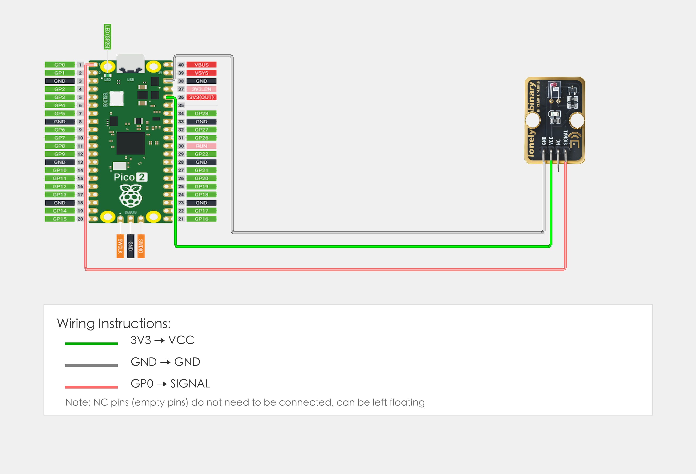

# Raspberry Pi Pico 2 Example

## Goal

This example shows how to use the TK16 - IR REMOTE SENSOR module on a Raspberry Pi Pico 2 to transmit infrared signals.

## Wiring



## Code

```python
# Import required modules
from machine import Pin, PWM  # GPIO control and PWM
import time                   # For delay (time.sleep)

# Pin number: change this to match your wiring
IR_TX_PIN = 0  # GPIO connected to SIGNAL (e.g. GPIO 0)

# Create PWM object
ir_tx = PWM(Pin(IR_TX_PIN))

# Set PWM frequency to 38kHz (common IR remote frequency)
ir_tx.freq(38000)

print("IR remote transmitter program started")
print("Transmitting IR signal every 2 seconds")

# Main loop: runs forever
while True:
    # Transmit IR signal (38kHz modulation)
    ir_tx.duty_u16(32767)     # Set duty cycle to 50% (32767 is half of 65535)
    time.sleep(0.1)           # Transmit for 100 milliseconds
    
    # Stop transmission
    ir_tx.duty_u16(0)         # Set duty cycle to 0%, stop transmission
    time.sleep(2)             # Wait 2 seconds before transmitting again
    
    print("IR signal transmitted")
```

## Effect


## Code Walkthrough

**Lines 1–2: Imports**

```python
from machine import Pin, PWM  # GPIO control and PWM
import time                   # For delay (time.sleep)
```

- **`machine.Pin`:** Used to control Pico GPIO pins.
- **`machine.PWM`:** Used to control Pico PWM output.
- **`time`:** Provides `sleep()` and other time-related functions.

**Line 5: Pin definition**

```python
IR_TX_PIN = 0  # GPIO connected to SIGNAL (e.g. GPIO 0)
```

- **`IR_TX_PIN = 0`:** GPIO number for IR SIGNAL. Change this if you use another pin.

**Lines 8–9: Create PWM object and configure frequency**

```python
ir_tx = PWM(Pin(IR_TX_PIN))
ir_tx.freq(38000)
```

- **`PWM(Pin(IR_TX_PIN))`:** Create PWM object for IR transmitter pin.
- **`freq(38000)`:** Set PWM frequency to 38000 Hz (38kHz), common frequency for IR remotes.

**Lines 12–13: Print start message**

```python
print("IR remote transmitter program started")
print("Transmitting IR signal every 2 seconds")
```

- **`print(...)`:** Print program start message and instructions to terminal.

**Lines 16–25: Main loop**

```python
while True:
    # Transmit IR signal (38kHz modulation)
    ir_tx.duty_u16(32767)     # Set duty cycle to 50% (32767 is half of 65535)
    time.sleep(0.1)           # Transmit for 100 milliseconds
    
    # Stop transmission
    ir_tx.duty_u16(0)         # Set duty cycle to 0%, stop transmission
    time.sleep(2)             # Wait 2 seconds before transmitting again
    
    print("IR signal transmitted")
```

- **`while True`:** Infinite loop; the program keeps running.
- **`ir_tx.duty_u16(32767)`:** Set PWM duty cycle to 50% to transmit IR signal.
- **`time.sleep(0.1)`:** Transmit for 100 milliseconds.
- **`ir_tx.duty_u16(0)`:** Set duty cycle to 0% to stop transmission.
- **`time.sleep(2)`:** Wait 2 seconds before transmitting again.
- **`print(...)`:** Print IR signal transmitted message to terminal.
