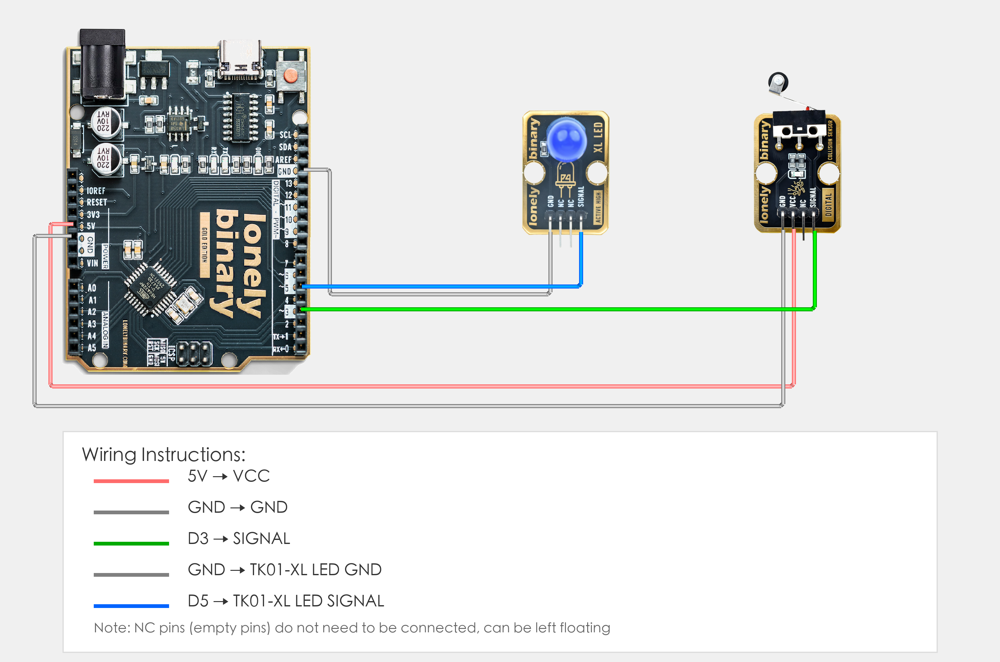

# Arduino Uno R3 Example

## Goal

This example shows how to use the TK17 - COLLISION SENSOR module on an Arduino Uno R3 to detect collisions.

## Wiring



- **VCC** → Arduino Uno R3 5V
- **GND** → Arduino Uno R3 GND
- **SIGNAL** → Arduino Uno R3 D3
- **NC** → Leave unconnected

## Code

```cpp
// Pin number: change this to match your wiring
#define COLLISION_PIN 3  // Arduino digital pin connected to SIGNAL (e.g. D2)
#define LED_PIN 5       // LED pin (Arduino built-in LED on pin 13, or external LED)

void setup() {
  // Initialize pin modes
  pinMode(COLLISION_PIN, INPUT);   // Set collision pin as input (to read collision state)
  pinMode(LED_PIN, OUTPUT);        // Set LED pin as output (to control LED on/off)
  
  // Start serial for debugging (9600 baud)
  Serial.begin(9600);
}

void loop() {
  // Read collision sensor state
  int collisionState = digitalRead(COLLISION_PIN);  // Read collision pin level: HIGH(1) = collision, LOW(0) = no collision
  
  // Control LED based on collision state
  if(collisionState == HIGH) {
    // Collision detected: turn LED on and print message
    digitalWrite(LED_PIN, HIGH);  // Output HIGH to turn LED on
    Serial.println("Collision detected!");  // Display message in Serial Monitor
  } else {
    // No collision detected: turn LED off
    digitalWrite(LED_PIN, LOW);   // Output LOW to turn LED off
  }
  
  // Delay 50 milliseconds to avoid reading too fast (give sensor stabilization time, prevent false triggers)
  delay(50);
}
```

## Effect


## Code Walkthrough

**Line 2–3: Pin definition**

```cpp
#define COLLISION_PIN 3  // Arduino digital pin connected to SIGNAL (e.g. D2)
#define LED_PIN 5       // LED pin (Arduino built-in LED on pin 13, or external LED)
```

- **`COLLISION_PIN`:** The Arduino digital pin connected to collision sensor SIGNAL. Change this if you use another pin.
- **`LED_PIN`:** The Arduino digital pin connected to LED (Arduino built-in LED on pin 13, or external LED).

**Line 5–12: Initialization (setup function)**

```cpp
void setup() {
  // Initialize pin modes
  pinMode(COLLISION_PIN, INPUT);   // Set collision pin as input (to read collision state)
  pinMode(LED_PIN, OUTPUT);        // Set LED pin as output (to control LED on/off)
  
  // Start serial for debugging (9600 baud)
  Serial.begin(9600);
}
```

- **`setup()`:** Runs once when the Arduino starts.
- **`pinMode(COLLISION_PIN, INPUT)`:** Set collision pin as input to read collision state.
- **`pinMode(LED_PIN, OUTPUT)`:** Set LED pin as output to control LED on/off.
- **`Serial.begin(9600)`:** Start serial at 9600 baud.

**Line 14–30: Main loop (loop function)**

```cpp
void loop() {
  // Read collision sensor state
  int collisionState = digitalRead(COLLISION_PIN);  // Read collision pin level: HIGH(1) = collision, LOW(0) = no collision
  
  // Control LED based on collision state
  if(collisionState == HIGH) {
    // Collision detected: turn LED on and print message
    digitalWrite(LED_PIN, HIGH);  // Output HIGH to turn LED on
    Serial.println("Collision detected!");  // Display message in Serial Monitor
  } else {
    // No collision detected: turn LED off
    digitalWrite(LED_PIN, LOW);   // Output LOW to turn LED off
  }
  
  // Delay 50 milliseconds to avoid reading too fast (give sensor stabilization time, prevent false triggers)
  delay(50);
}
```

- **`loop()`:** Runs repeatedly.
- **`digitalRead(COLLISION_PIN)`:** Read collision pin level, HIGH(1) means collision detected, LOW(0) means no collision.
- **`if(collisionState == HIGH)`:** Check if collision is detected; if detected, execute LED on operation.
- **`digitalWrite(LED_PIN, HIGH)`:** Output HIGH to turn LED on.
- **`digitalWrite(LED_PIN, LOW)`:** Output LOW to turn LED off.
- **`Serial.println("Collision detected!")`:** Print collision detected message to Serial Monitor.
- **`delay(50)`:** Wait 50 milliseconds before reading again to avoid reading too fast, give sensor stabilization time, prevent false triggers.
