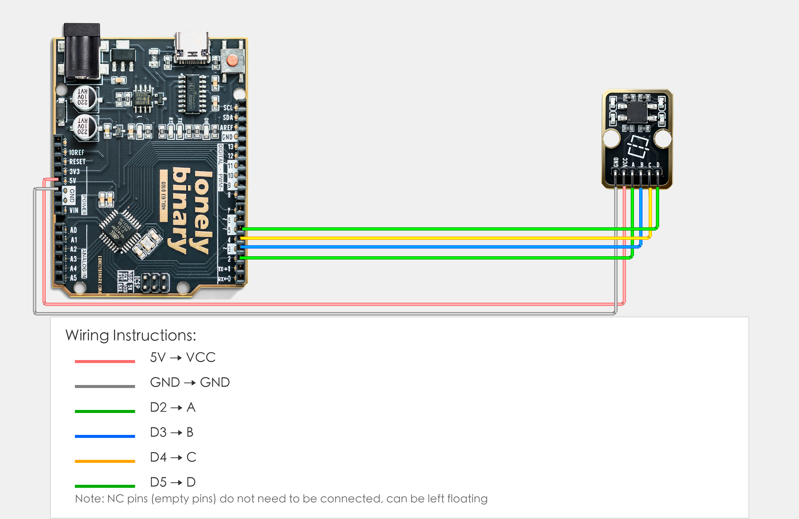

# Arduino Uno R3 Example

## Goal

This example shows how to use the TK19 - 4-DIRECTIONs TIL SENSOR module on an Arduino Uno R3 to detect tilt in four directions.

## Wiring



- **VCC** → Arduino Uno R3 5V
- **GND** → Arduino Uno R3 GND
- **A / B / C / D** → Any 4 Arduino digital pins (e.g. D2–D5)
 
> Wire A/B/C/D according to the silkscreen labels.

## Code

```cpp
// Drive-low scan (recommended)
// Idea: Drive ONE of A/B/C/D LOW (output), read the other three as INPUT_PULLUP.
// If the internal ball shorts two contacts, the partner input will be pulled LOW.

// Update these 4 pins to match your wiring.
// Order MUST be: A, B, C, D
const uint8_t PINS[4] = {2, 3, 4, 5};
const char*   N[4]    = {"A", "B", "C", "D"};

static void setHiZAll() {
  for (int i = 0; i < 4; i++) {
    pinMode(PINS[i], INPUT_PULLUP);
  }
}

static void driveLow(int i) {
  pinMode(PINS[i], OUTPUT);
  digitalWrite(PINS[i], LOW);
}

static int findPulledLow(int driveIdx) {
  for (int j = 0; j < 4; j++) {
    if (j == driveIdx) continue;
    if (digitalRead(PINS[j]) == LOW) return j;
  }
  return -1;
}

void setup() {
  Serial.begin(9600);
  setHiZAll();
  Serial.println("TK19 drive-low scan");
  Serial.println("Example: short: A-B means A is shorted to B");
}

void loop() {
  bool any = false;

  for (int i = 0; i < 4; i++) {
    setHiZAll();
    driveLow(i);
    delay(2);

    int j = findPulledLow(i);
    if (j >= 0) {
      any = true;
      Serial.print("short: ");
      Serial.print(N[i]);
      Serial.print("-");
      Serial.println(N[j]);
    }
  }

  if (!any) Serial.println("Level (no short)");
  Serial.println("---");
  delay(100);
}
```

## Effect


## Code Walkthrough

**Why “drive-low scan”?**

- The module outputs are **active-low**.
- The internal ball typically shorts a **pair** of contacts depending on tilt direction (often adjacent contacts; diagonals may not short).
- Driving one line LOW and reading the others is the most reliable way to determine which pair is currently shorted.

**Line 8–9: Configure wiring pins**

```cpp
const uint8_t PINS[4] = {2, 3, 4, 5};  // Order: A, B, C, D
const char*   N[4]    = {"A", "B", "C", "D"};
```

- **`PINS`:** Fill in the 4 Arduino digital pins you wired to A/B/C/D (keep the order A,B,C,D).
- **`N`:** Names used for serial output.

**Core logic**

```cpp
setHiZAll();   // Set all as INPUT_PULLUP (read)
driveLow(i);   // Drive one line LOW (source)
```

To map directions:

1. Upload the program and open Serial Monitor (9600).
2. Tilt the module toward your own “up / down / left / right” definition.
3. Record the stable `short: X-Y` outputs and build your mapping table.

**Line 25–68: Main loop (loop function)**

```cpp
void loop() {
  // Read tilt status of three directions
  // When B/C/D pins read LOW, it means tilt detected in corresponding direction
  int bState = digitalRead(B_PIN);   // Read B pin: LOW(0) = direction B tilt, HIGH(1) = no tilt
  int cState = digitalRead(C_PIN);   // Read C pin: LOW(0) = direction C tilt, HIGH(1) = no tilt
  int dState = digitalRead(D_PIN);   // Read D pin: LOW(0) = direction D tilt, HIGH(1) = no tilt
  
  // Detect and output tilt direction
  bool tilted = false;  // Flag to mark if tilt is detected
  
  if (bState == LOW) {
    Serial.println("Detected: Direction B tilt");
    tilted = true;
  }
  
  if (cState == LOW) {
    Serial.println("Detected: Direction C tilt");
    tilted = true;
  }
  
  if (dState == LOW) {
    Serial.println("Detected: Direction D tilt");
    tilted = true;
  }
  
  // If no direction is tilted, show level status
  if (!tilted) {
    Serial.println("Level");
  }
  
  // Display all pin states (for debugging)
  Serial.print("State: B=");
  Serial.print(bState);
  Serial.print("(LOW=tilt), C=");
  Serial.print(cState);
  Serial.print("(LOW=tilt), D=");
  Serial.print(dState);
  Serial.println("(LOW=tilt)");
  
  Serial.println("---");
  
  // Delay 100 milliseconds to avoid output too fast
  delay(100);
}
```

- **`loop()`:** Runs repeatedly.
- **`digitalRead(B_PIN)`、`digitalRead(C_PIN)`、`digitalRead(D_PIN)`:** Read tilt status of three directions, LOW(0) means tilt detected in corresponding direction, HIGH(1) means no tilt.
- **`bool tilted = false`:** Flag to mark if tilt is detected, used to determine if any direction is tilted.
- **`if (bState == LOW)`、`if (cState == LOW)`、`if (dState == LOW)`:** Check if each direction is tilted; if detected, print corresponding direction info and set tilted to true.
- **`if (!tilted)`:** If no direction is tilted, show level status.
- **`Serial.print(...)` and `Serial.println(...)`:** Print tilt direction and all pin states to Serial Monitor (for debugging).
- **`delay(100)`:** Wait 100 milliseconds before reading again to avoid output too fast and control output frequency.
