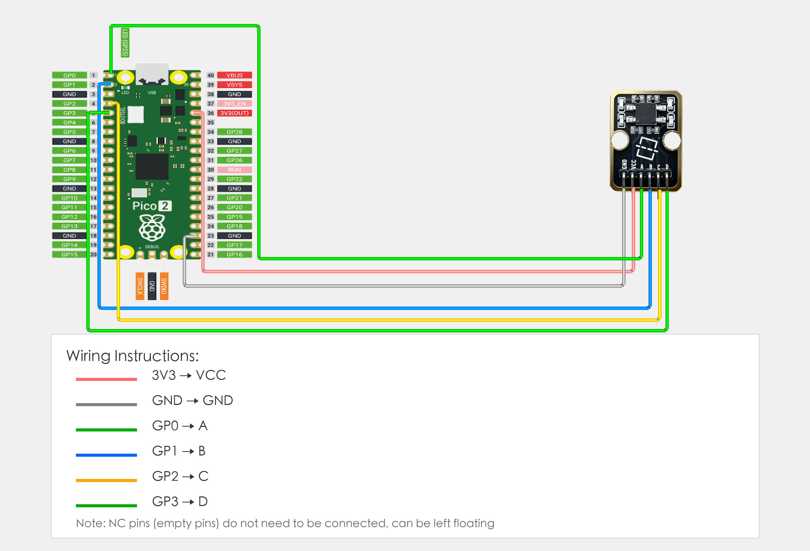

# Raspberry Pi Pico 2 Example

## Goal

This example shows how to use the TK19-4-DIRECTIONs TIL SENSOR module on a Raspberry Pi Pico 2 to detect tilt in four directions.

## Wiring



- **VCC** → Raspberry Pi Pico 2 3.3V or 5V
- **GND** → Raspberry Pi Pico 2 GND
- **A / B / C / D** → Any 4 GPIO pins on Pico 2 (e.g. GPIO 0–3)
 
> Wire A/B/C/D according to the silkscreen labels.

## Code

```python
# Drive-low scan (recommended)
# Idea: Drive ONE of A/B/C/D LOW (output), read the other three as inputs with pull-ups.
# If the internal ball shorts two contacts, the partner input will read LOW (0).

from machine import Pin
import time

# Update these to match your wiring (order MUST be A,B,C,D)
PINS = [0, 1, 2, 3]
NAMES = ["A", "B", "C", "D"]

def set_hiz_all():
    for p in PINS:
        Pin(p, Pin.IN, Pin.PULL_UP)

def drive_low(idx):
    out = Pin(PINS[idx], Pin.OUT)
    out.value(0)
    return out  # keep reference

def find_pulled_low(drive_idx):
    for j in range(4):
        if j == drive_idx:
            continue
        v = Pin(PINS[j], Pin.IN, Pin.PULL_UP).value()
        if v == 0:
            return j
    return -1

print("TK19 drive-low scan")
print("Example: short: A-B means A is shorted to B")

while True:
    any_short = False

    for i in range(4):
        set_hiz_all()
        _keep = drive_low(i)
        time.sleep_ms(2)

        j = find_pulled_low(i)
        if j >= 0:
            any_short = True
            print("short: {}-{}".format(NAMES[i], NAMES[j]))

    if not any_short:
        print("Level (no short)")

    print("---")
    time.sleep_ms(100)
```

## Effect


## Code Walkthrough

**Why “drive-low scan”?**

- Outputs are active-low.
- The internal ball shorts a pair of contacts depending on tilt direction (often adjacent contacts; diagonals may not short).
- Driving one line LOW and reading the others is the most reliable way to determine which pair is currently shorted.

**Lines 1–2: Imports**

```python
from machine import Pin  # GPIO control
import time              # For delay (time.sleep)
```

- **`machine.Pin`:** Used to control Pico GPIO pins.
- **`time`:** Provides `sleep_ms()` and other time-related functions.

**Pin config**

```python
PINS = [0, 1, 2, 3]      # order: A,B,C,D
NAMES = ["A", "B", "C", "D"]
```

- **`PINS`:** The 4 GPIO pins wired to A/B/C/D (keep the order A,B,C,D).
- **`NAMES`:** Labels used for printing.

**Core logic**

```python
set_hiz_all()        # all inputs with pull-ups
_keep = drive_low(i) # drive one line LOW
```

**Lines 20–22: Print start message**

```python
print("4-direction tilt sensor program started")
print("Detecting tilt status in four directions")
print("A pin as common (LOW), B/C/D pins detect tilt (0=tilt)")
```

- **`print(...)`:** Print program start message and instructions to terminal.

**Lines 25–47: Main loop**

```python
while True:
    # Read tilt status of three directions
    # When B/C/D pins read 0 (LOW), it means tilt detected in corresponding direction
    b_state = b.value()   # Read B pin: 0 = direction B tilt (LOW), 1 = no tilt (HIGH)
    c_state = c.value()   # Read C pin: 0 = direction C tilt (LOW), 1 = no tilt (HIGH)
    d_state = d.value()   # Read D pin: 0 = direction D tilt (LOW), 1 = no tilt (HIGH)
    
    # Detect and output tilt direction
    tilted = False  # Flag to mark if tilt is detected
    
    if b_state == 0:
        print("Detected: Direction B tilt")
        tilted = True
    
    if c_state == 0:
        print("Detected: Direction C tilt")
        tilted = True
    
    if d_state == 0:
        print("Detected: Direction D tilt")
        tilted = True
    
    # If no direction is tilted, show level status
    if not tilted:
        print("Level")
    
    # Display all pin states (for debugging)
    print(f"State: B={b_state}(0=tilt), C={c_state}(0=tilt), D={d_state}(0=tilt)")
    print("---")
    
    # Delay 100 milliseconds to avoid output too fast
    time.sleep_ms(100)
```

- **`while True`:** Infinite loop; the program keeps running.
- **`b.value()`、`c.value()`、`d.value()`:** Read B/C/D pin levels, returns 0 when tilt is detected (LOW), 1 when no tilt (HIGH).
- **`if b_state == 0`:** Check if direction B tilt is detected.
- **`tilted = True`:** Mark that tilt is detected.
- **`if not tilted`:** If no direction is tilted, show level status.
- **`print(f"State: ...")`:** Use f-string to format and print pin states.
- **`time.sleep_ms(100)`:** Wait 100 milliseconds before reading again to avoid output too fast.
