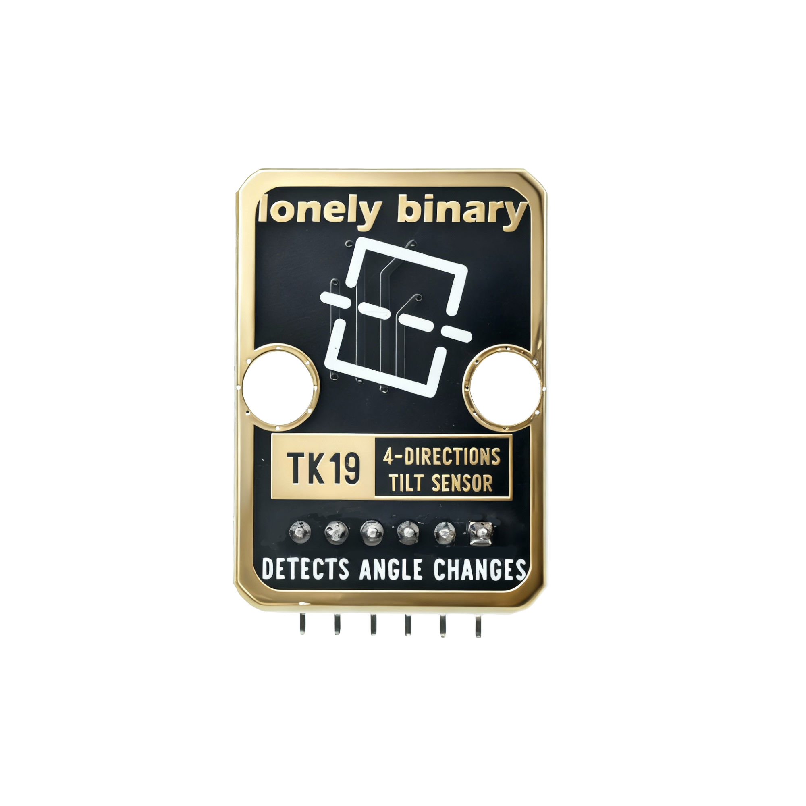

# Function

This module is a 4-direction tilt sensor module that can detect tilt status in four directions: up, down, left, and right. When the module tilts to a certain angle in a direction, the corresponding output pin outputs a HIGH signal. Can be used to make direction detectors, tilt alarms, and other applications.

# Appearance

|  |  |  |
| :-----------------------: | :-----------------------: | :-----------------------: |
|          **Front**          |          **Back**          |          **Side**          |

The module has a 4-direction tilt detection element and a pin header interface. Each pin can be identified by the silkscreen (text printed next to the pin).

# Pinout

- **GND** (negative): Like the negative terminal (-) of a battery, connect to the control board's GND
- **VCC** (positive): Like the positive terminal (+) of a battery, connect to the control board's 3.3V or 5V (this module supports both 3.3V and 5V)
- **A** (common): Connect to control board digital pin, set as OUTPUT mode and output LOW (as common/ground)
- **B** (direction B detection): Connect to control board digital pin, set as INPUT_PULLUP mode, reads LOW when direction B tilt is detected
- **C** (direction C detection): Connect to control board digital pin, set as INPUT_PULLUP mode, reads LOW when direction C tilt is detected
- **D** (direction D detection): Connect to control board digital pin, set as INPUT_PULLUP mode, reads LOW when direction D tilt is detected

# Features

- 4-direction detection: Can detect tilt in four directions: up, down, left, right
- Digital output: Each direction has an independent digital output pin
- Operating voltage: 3.3V or 5V
- High sensitivity: Can detect slight tilts

# Quick Wiring

1. GND → Control board GND
2. VCC → Control board 3.3V or 5V
3. A → Control board digital pin (set as OUTPUT, output LOW, as common)
4. B → Control board digital pin (set as INPUT_PULLUP, detect direction B tilt)
5. C → Control board digital pin (set as INPUT_PULLUP, detect direction C tilt)
6. D → Control board digital pin (set as INPUT_PULLUP, detect direction D tilt)
