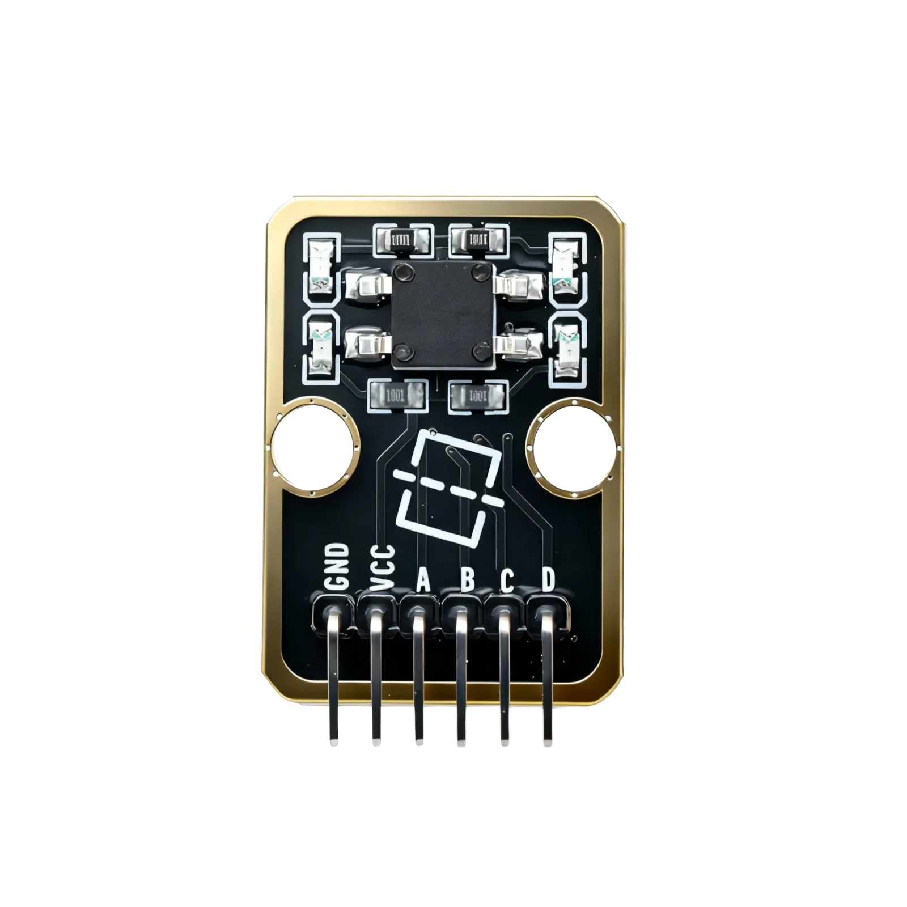
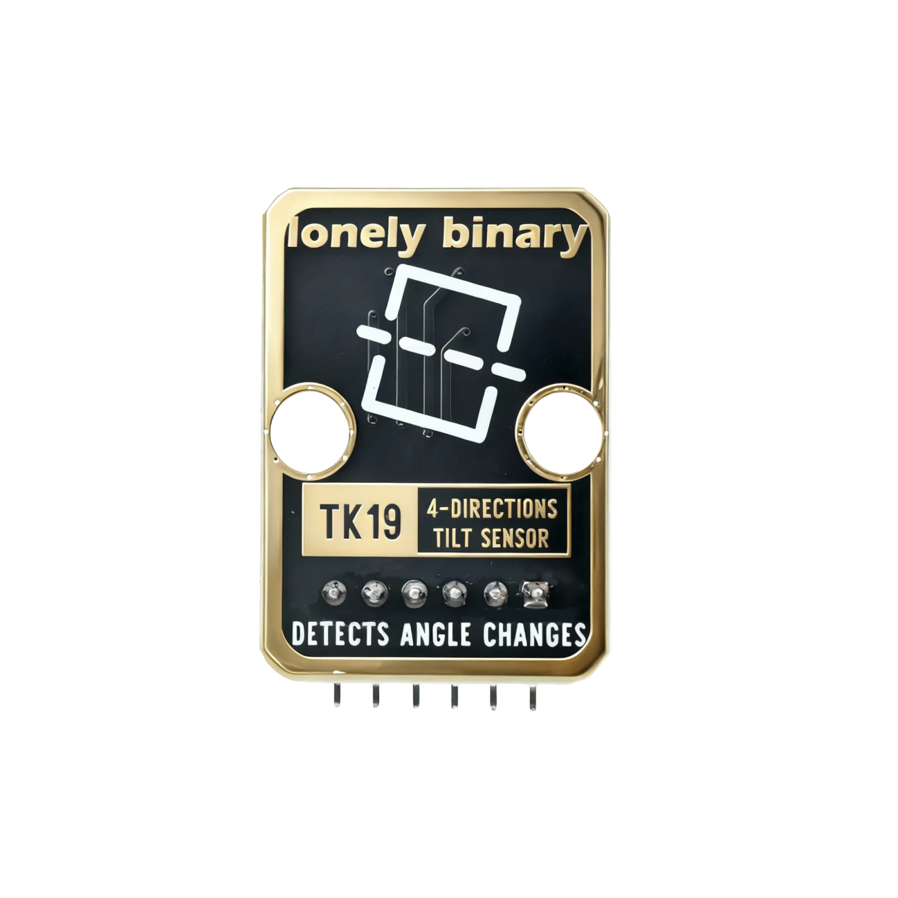
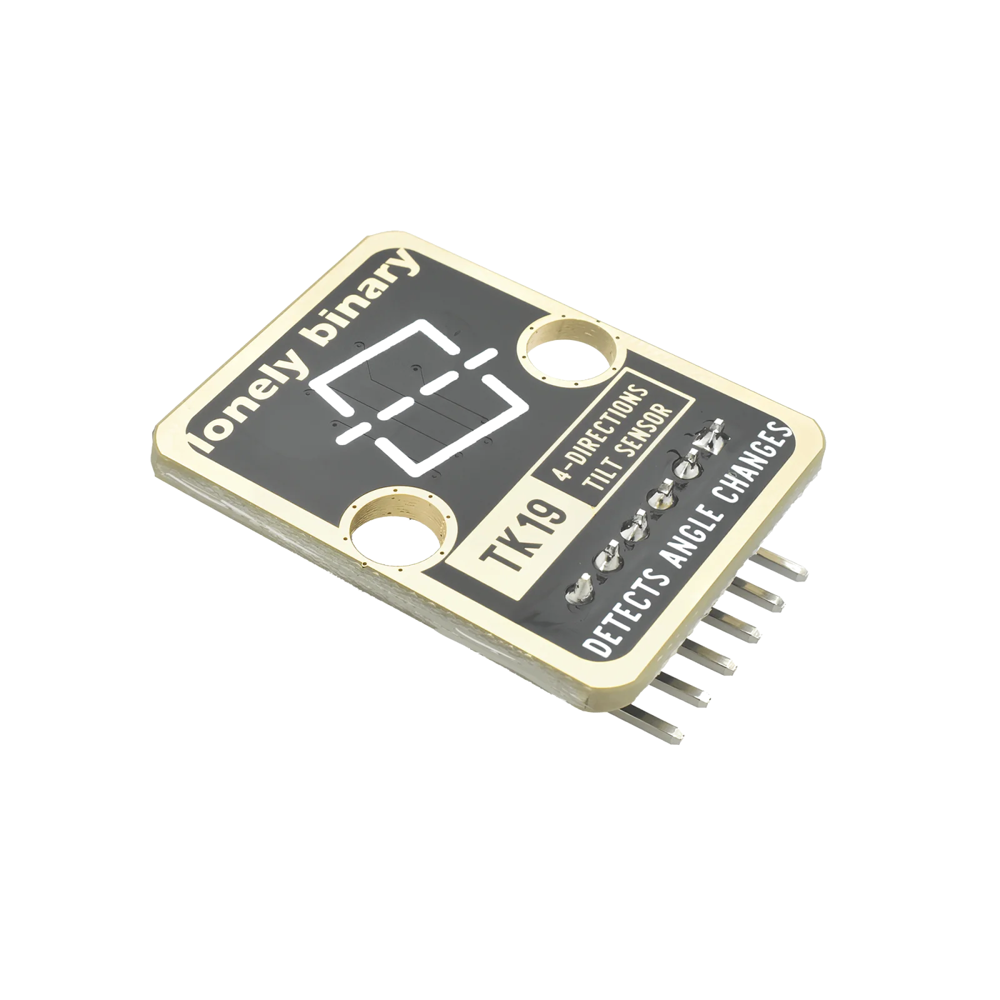

# Function

This module is a 4-direction tilt sensor module that can detect tilt status in four directions: up, down, left, and right. The outputs are **active-low**: when the module tilts to a certain angle, the internal ball shorts a pair of contacts so the corresponding signal can be pulled **LOW**. It can be used for direction detectors, tilt alarms, and more.

# Appearance

|  |  |  |
| :-----------------------: | :-----------------------: | :-----------------------: |
|          **Front**          |          **Back**          |          **Side**          |

The module has a 4-direction tilt detection element and a pin header interface. Each pin can be identified by the silkscreen (text printed next to the pin).

# Pinout

- **GND** (negative): Like the negative terminal (-) of a battery, connect to the control board's GND
- **VCC** (positive): Like the positive terminal (+) of a battery, connect to the control board's 3.3V or 5V (this module supports both 3.3V and 5V)
- **A / B / C / D**: Connect to 4 GPIO pins for reading/scanning the contact pair (**LOW indicates the contact is pulled/shorted**)
 
> Wire A/B/C/D according to the silkscreen labels.

## Why you can’t “just read 4 pins”

- **Default level**: A/B/C/D are typically **pulled up to VCC** on the board (through resistors/LEDs). Without a valid low/ground return path, they will stay **HIGH**.
- **Tilt behavior**: The internal ball shorts a **pair** of contacts depending on tilt direction (often adjacent contacts; diagonals may not short).
- **Implication**: If you configure all A/B/C/D as inputs and simply read them, you may see no changes while tilting.

That’s why the recommended method is the **drive-low scan**: drive one line LOW at a time and read the other three with pull-ups to determine the shorted pair (`short: X-Y`), then map it to up/down/left/right.

# Features

- 4-direction detection: Can detect tilt in four directions: up, down, left, right
- Digital output: Each direction has an independent digital output pin
- Operating voltage: 3.3V or 5V
- High sensitivity: Can detect slight tilts

# Quick Wiring

1. GND → Control board GND
2. VCC → Control board 3.3V or 5V
3. A/B/C/D → Any 4 GPIO pins (used to scan which pair is shorted when tilted)

## Recommended: “drive-low scan” (for stable 4-direction mapping)

Because the internal ball shorts different contact pairs depending on tilt direction (often adjacent contacts only; diagonals may not short), the most robust method is:

- Drive **one** of A/B/C/D LOW (GPIO output)
- Read the other **three** as inputs with pull-ups
- The shorted partner will read LOW

Then map the printed `short: X-Y` pairs to your own “up/down/left/right” definition.
