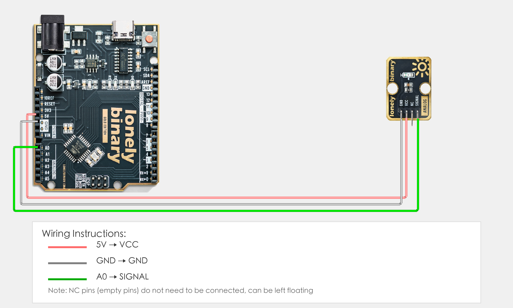

# Arduino Uno R3 Example

## Goal

This example shows how to use the TK20 - AMBIENT LIGHT module on an Arduino Uno R3 to detect ambient light intensity.

## Wiring



- **VCC** → Arduino Uno R3 5V
- **GND** → Arduino Uno R3 GND
- **SIGNAL** → Arduino Uno R3 A0
- **NC** → Leave unconnected

## Code

```cpp
// Pin number: change this to match your wiring
#define LIGHT_PIN A0  // Arduino analog input pin connected to SIGNAL (e.g. A0)

void setup() {
  // Start serial for debugging (9600 baud)
  Serial.begin(9600);
}

void loop() {
  // Read ambient light sensor analog value (0-1023)
  int lightValue = analogRead(LIGHT_PIN);  // Read analog value: 0 = darkest, 1023 = brightest
  
  // Convert analog value to voltage (0-5V)
  float voltage = lightValue * (5.0 / 1023.0);
  
  // Display values in Serial Monitor
  Serial.print("Light value: ");
  Serial.print(lightValue);
  Serial.print(" | Voltage: ");
  Serial.print(voltage);
  Serial.println("V");
  
  // Judge light intensity
  if(lightValue > 500) {
    Serial.println("Bright");
  } else if(lightValue > 200) {
    Serial.println("Moderate");
  } else {
    Serial.println("Dark");
  }
  
  // Delay 100 milliseconds to avoid printing too fast
  delay(100);
}
```

## Effect


## Code Walkthrough

**Line 2: Pin definition**

```cpp
#define LIGHT_PIN A0  // Arduino analog input pin connected to SIGNAL (e.g. A0)
```

- **`LIGHT_PIN`:** The Arduino analog input pin connected to ambient light sensor SIGNAL. Change this if you use another pin.

**Line 4–6: Initialization (setup function)**

```cpp
void setup() {
  // Start serial for debugging (9600 baud)
  Serial.begin(9600);
}
```

- **`setup()`:** Runs once when the Arduino starts.
- **`Serial.begin(9600)`:** Start serial at 9600 baud.

**Line 8–34: Main loop (loop function)**

```cpp
void loop() {
  // Read ambient light sensor analog value (0-1023)
  int lightValue = analogRead(LIGHT_PIN);  // Read analog value: 0 = darkest, 1023 = brightest
  
  // Convert analog value to voltage (0-5V)
  float voltage = lightValue * (5.0 / 1023.0);
  
  // Display values in Serial Monitor
  Serial.print("Light value: ");
  Serial.print(lightValue);
  Serial.print(" | Voltage: ");
  Serial.print(voltage);
  Serial.println("V");
  
  // Judge light intensity
  if(lightValue > 500) {
    Serial.println("Bright");
  } else if(lightValue > 200) {
    Serial.println("Moderate");
  } else {
    Serial.println("Dark");
  }
  
  // Delay 100 milliseconds to avoid printing too fast
  delay(100);
}
```

- **`loop()`:** Runs repeatedly.
- **`analogRead(LIGHT_PIN)`:** Read ambient light sensor analog value (0-1023), 0 means darkest, 1023 means brightest.
- **`lightValue * (5.0 / 1023.0)`:** Convert analog value (0-1023) to voltage value (0-5V).
- **`if(lightValue > 500)`:** Judge light intensity; if greater than 500, display "Bright".
- **`else if(lightValue > 200)`:** If light value is between 200-500, display "Moderate".
- **`else`:** If light value is less than 200, display "Dark".
- **`Serial.print(...)` and `Serial.println(...)`:** Print light value, voltage value, and light status to Serial Monitor.
- **`delay(100)`:** Wait 100 milliseconds before reading again to avoid printing too fast and control output frequency.
