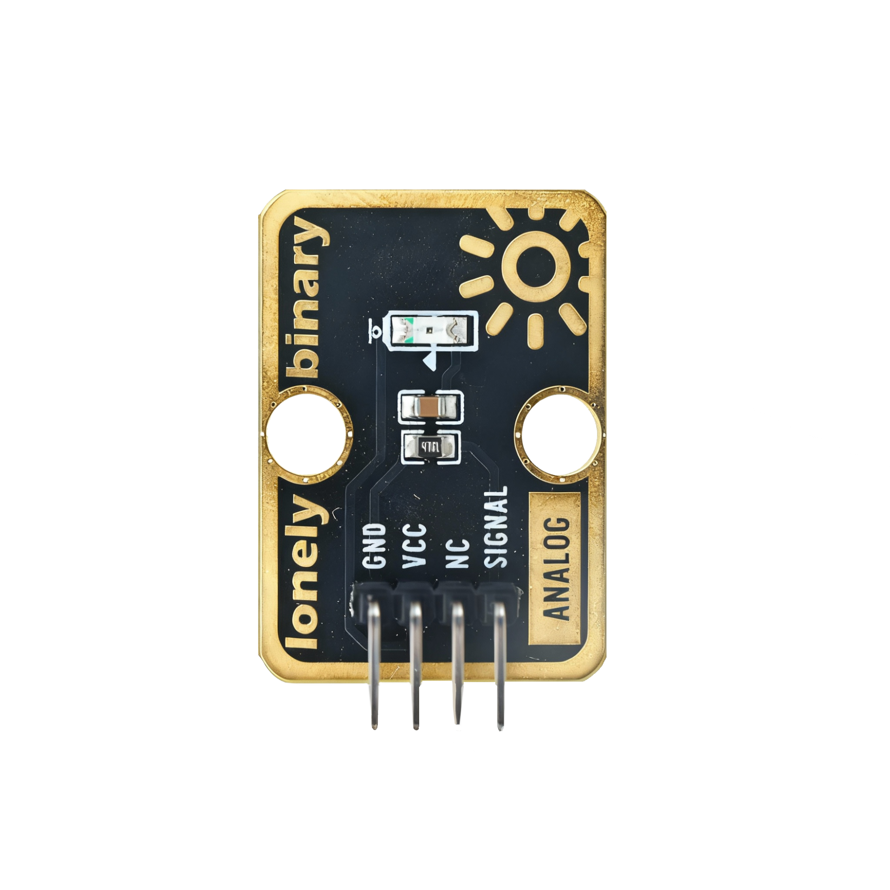
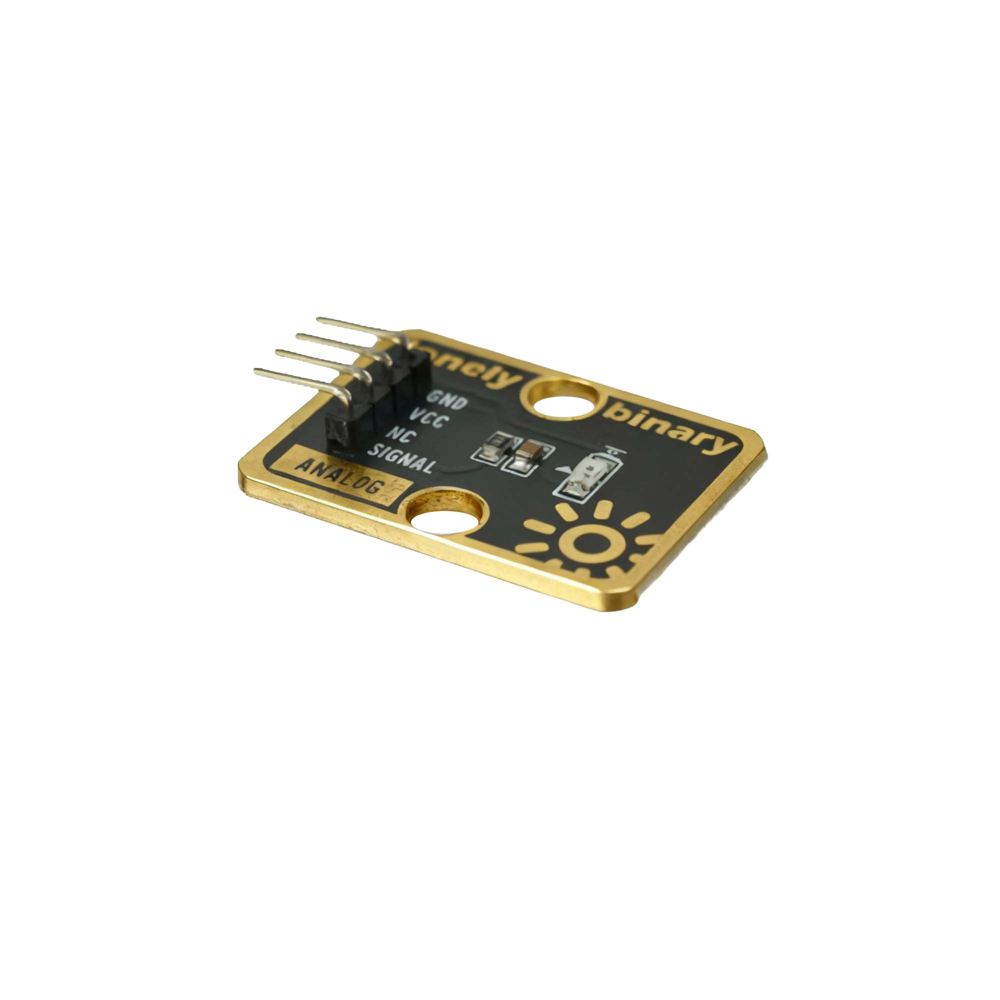

# Function

This module is an ambient light sensor module that can measure ambient light intensity. The stronger the light, the higher the output voltage. Can be used to make automatic dimming systems, light alarms, and other applications.

# Appearance

|  |  |  |
| :-----------------------: | :-----------------------: | :-----------------------: |
|          **Front**          |          **Back**          |          **Side**          |

The module has a photoresistor and a 4-pin header interface. Each pin can be identified by the silkscreen (text printed next to the pin).

# Pinout

- **GND** (negative): Like the negative terminal (-) of a battery, connect to the control board's GND
- **VCC** (positive): Like the positive terminal (+) of a battery, connect to the control board's 3.3V or 5V (this module supports both 3.3V and 5V)
- **NC** (no connection): No actual circuit connection, included for unified interface, can be left unconnected
- **SIGNAL** (signal output): Light intensity output pin, connect to the control board's analog input pin (e.g. Arduino A0 or Pico GPIO 26)
  - Stronger light = higher output voltage
  - Weaker light = lower output voltage

# Features

- Light detection: Can measure ambient light intensity
- Analog output: Outputs continuously varying voltage signal
- Operating voltage: 3.3V or 5V
- High sensitivity: Can detect subtle light changes

# Quick Wiring

1. GND → Control board GND
2. VCC → Control board 3.3V or 5V
3. SIGNAL → Control board analog input pin (use the pin defined in your program)
