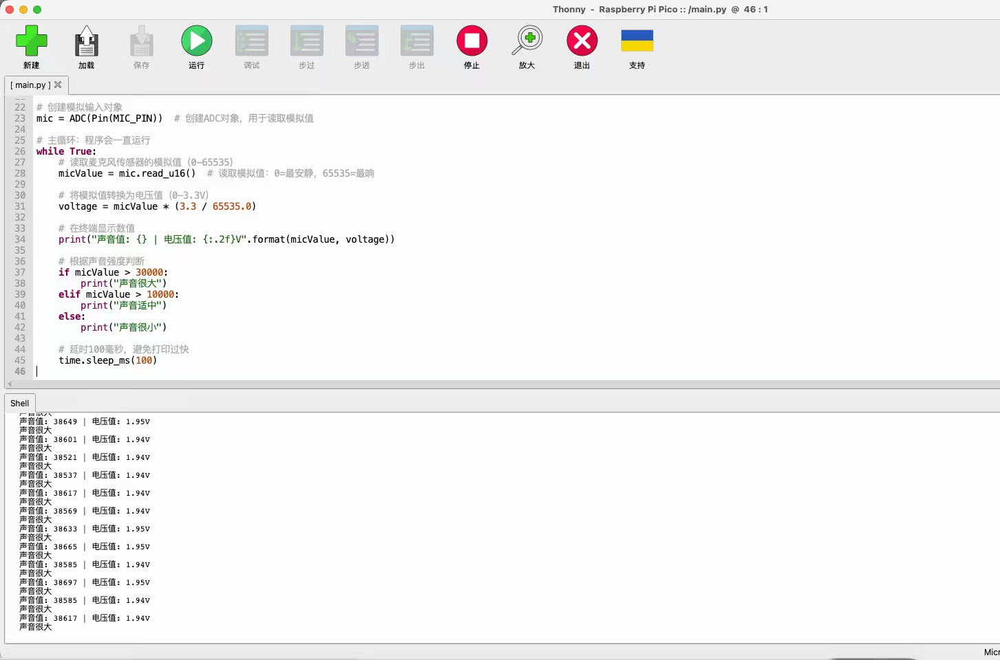

# Raspberry Pi Pico 2 Example

## Goal

This example shows how to use the TK27 - ANALOG MIC SENSOR module on a Raspberry Pi Pico 2 to detect sound intensity.

## Wiring


## Code

```python
# Import required modules
from machine import Pin, ADC  # GPIO control and analog input
import time                   # For delay (time.sleep)

# Pin number: change this to match your wiring
MIC_PIN = 26  # GPIO connected to SIGNAL (e.g. GPIO 26, must be ADC-capable pin)

# Create analog input object
mic = ADC(Pin(MIC_PIN))  # Create ADC object to read analog value

# Main loop: runs forever
while True:
    # Read microphone sensor analog value (0-65535)
    micValue = mic.read_u16()  # Read analog value: 0 = quietest, 65535 = loudest
    
    # Convert analog value to voltage (0-3.3V)
    voltage = micValue * (3.3 / 65535.0)
    
    # Display values in terminal
    print("Sound value: {} | Voltage: {:.2f}V".format(micValue, voltage))
    
    # Judge sound intensity
    if micValue > 30000:
        print("Very loud")
    elif micValue > 10000:
        print("Moderate")
    else:
        print("Very quiet")
    
    # Delay 100 milliseconds to avoid printing too fast
    time.sleep_ms(100)
```

## Effect





## Code Walkthrough

**Lines 1–2: Imports**

```python
from machine import Pin, ADC  # GPIO control and analog input
import time                   # For delay (time.sleep)
```

- **`machine.Pin`:** Used to control Pico GPIO pins.
- **`machine.ADC`:** Used to read analog signals.
- **`time`:** Provides `sleep()` and other time-related functions.

**Line 5: Pin definition**

```python
MIC_PIN = 26  # GPIO connected to SIGNAL (e.g. GPIO 26, must be ADC-capable pin)
```

- **`MIC_PIN = 26`:** GPIO number for analog microphone sensor SIGNAL (must be ADC-capable pin). Change this if you use another pin.

**Line 8: Create analog input object**

```python
mic = ADC(Pin(MIC_PIN))  # Create ADC object to read analog value
```

- **`ADC(Pin(MIC_PIN))`:** Create ADC object to read analog value.

**Lines 11–27: Main loop**

```python
while True:
    # Read microphone sensor analog value (0-65535)
    micValue = mic.read_u16()  # Read analog value: 0 = quietest, 65535 = loudest
    
    # Convert analog value to voltage (0-3.3V)
    voltage = micValue * (3.3 / 65535.0)
    
    # Display values in terminal
    print("Sound value: {} | Voltage: {:.2f}V".format(micValue, voltage))
    
    # Judge sound intensity
    if micValue > 30000:
        print("Very loud")
    elif micValue > 10000:
        print("Moderate")
    else:
        print("Very quiet")
    
    # Delay 100 milliseconds to avoid printing too fast
    time.sleep_ms(100)
```

- **`while True`:** Infinite loop; the program keeps running.
- **`mic.read_u16()`:** Read ADC analog value (0-65535), 0 means quietest, 65535 means loudest.
- **`micValue * (3.3 / 65535.0)`:** Convert analog value (0-65535) to voltage value (0-3.3V).
- **`if micValue > 30000`:** Judge sound intensity; if greater than 30000, output "Very loud".
- **`elif micValue > 10000`:** If greater than 10000, output "Moderate".
- **`else`:** Otherwise output "Very quiet".
- **`print(...)`:** Print sound value, voltage value, and status to terminal.
- **`time.sleep_ms(100)`:** Wait 100 milliseconds before reading again to avoid reading too fast.
