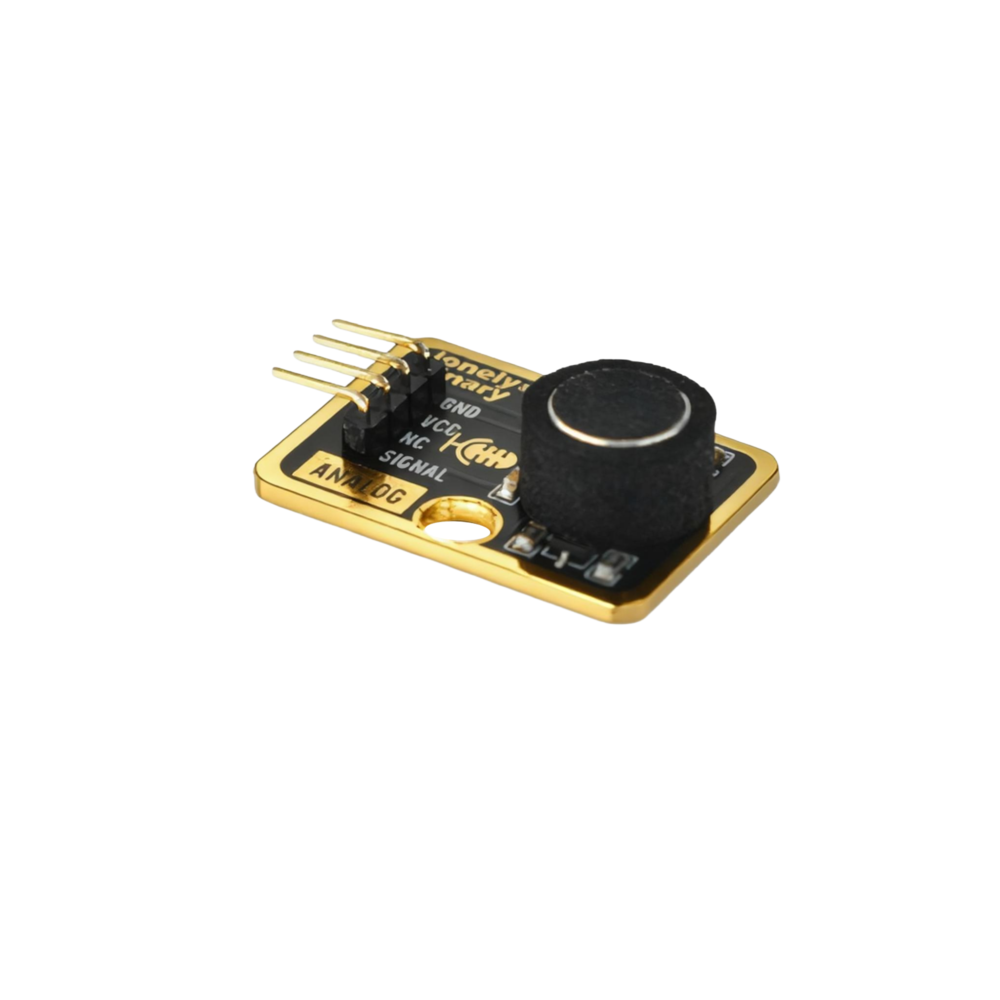

# Function

This module is an analog microphone sensor module that can detect sound intensity. The louder the sound, the higher the output voltage. Can be used to make sound detectors, voice-activated switches, volume indicators, and other applications.

# Appearance

|  |  |  |
| :-----------------------: | :-----------------------: | :-----------------------: |
|          **Front**          |          **Back**          |          **Side**          |

The module has a microphone and a 4-pin header interface. Each pin can be identified by the silkscreen (text printed next to the pin).

# Pinout

- **GND** (negative): Like the negative terminal (-) of a battery, connect to the control board's GND
- **VCC** (positive): Like the positive terminal (+) of a battery, connect to the control board's 3.3V or 5V (this module supports both 3.3V and 5V)
- **NC** (no connection): No actual circuit connection, included for unified interface, can be left unconnected
- **SIGNAL** (signal output): Sound intensity output pin, connect to the control board's analog input pin (e.g. Arduino A0 or Pico GPIO 26)
  - Louder sound = higher output voltage
  - Quieter sound = lower output voltage

# Features

- Sound detection: Can detect ambient sound intensity
- Analog output: Outputs continuously varying voltage signal
- Operating voltage: 3.3V or 5V
- Adjustable sensitivity: Module has a sensitivity adjustment potentiometer

# Quick Wiring

1. GND → Control board GND
2. VCC → Control board 3.3V or 5V
3. SIGNAL → Control board analog input pin (use the pin defined in your program)
