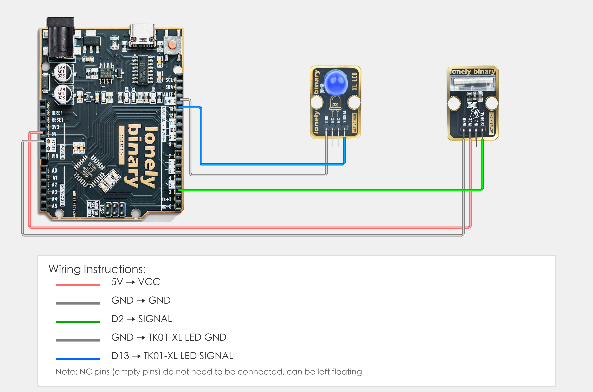

# Arduino Uno R3 Example

## Goal

This example shows how to use the TK28 - TAP SENSOR module on an Arduino Uno R3 to detect taps.

## Wiring



- **VCC** → Arduino Uno R3 5V
- **GND** → Arduino Uno R3 GND
- **SIGNAL** → Arduino Uno R3 D2
- **NC** → Leave unconnected

## Code

```cpp
// Pin number: change this to match your wiring
#define TAP_PIN 2      // Arduino digital pin connected to SIGNAL (e.g. D2)
#define LED_PIN 13     // LED pin (Arduino built-in LED on pin 13, or external LED)

void setup() {
  // Initialize pin modes
  pinMode(TAP_PIN, INPUT);   // Set tap sensor pin as input (to read detection state)
  pinMode(LED_PIN, OUTPUT);  // Set LED pin as output (to control LED on/off)
  
  // Start serial for debugging (9600 baud)
  Serial.begin(9600);
  
  Serial.println("Tap sensor program started");
  Serial.println("LED on when tap detected, LED off when no tap");
}

void loop() {
  // Read tap sensor state
  int tapState = digitalRead(TAP_PIN);  // Read sensor pin level: HIGH(1) = tap, LOW(0) = no tap
  
  // Control LED based on detection state
  if (tapState == HIGH) {
    // Tap detected: LED on
    digitalWrite(LED_PIN, HIGH);
    Serial.println("Tap detected - LED on");
  } else {
    // No tap detected: LED off
    digitalWrite(LED_PIN, LOW);
    Serial.println("No tap detected - LED off");
  }
  
  delay(100);  // Brief delay to avoid reading too fast
}
```

## Effect


## Code Walkthrough

**Line 2–3: Pin definition**

```cpp
#define TAP_PIN 2      // Arduino digital pin connected to SIGNAL (e.g. D2)
#define LED_PIN 13     // LED pin (Arduino built-in LED on pin 13, or external LED)
```

- **`TAP_PIN`:** The Arduino digital pin connected to tap sensor SIGNAL. Change this if you use another pin.
- **`LED_PIN`:** The Arduino digital pin connected to LED (Arduino built-in LED on pin 13, or external LED).

**Line 5–15: Initialization (setup function)**

```cpp
void setup() {
  // Initialize pin modes
  pinMode(TAP_PIN, INPUT);   // Set tap sensor pin as input (to read detection state)
  pinMode(LED_PIN, OUTPUT);  // Set LED pin as output (to control LED on/off)
  
  // Start serial for debugging (9600 baud)
  Serial.begin(9600);
  
  Serial.println("Tap sensor program started");
  Serial.println("LED on when tap detected, LED off when no tap");
}
```

- **`setup()`:** Runs once when the Arduino starts.
- **`pinMode(TAP_PIN, INPUT)`:** Set tap sensor pin as input to read detection state.
- **`pinMode(LED_PIN, OUTPUT)`:** Set LED pin as output to control LED on/off.
- **`Serial.begin(9600)`:** Start serial at 9600 baud.
- **`Serial.println(...)`:** Print program start message and instructions to Serial Monitor.

**Line 17–33: Main loop (loop function)**

```cpp
void loop() {
  // Read tap sensor state
  int tapState = digitalRead(TAP_PIN);  // Read sensor pin level: HIGH(1) = tap, LOW(0) = no tap
  
  // Control LED based on detection state
  if (tapState == HIGH) {
    // Tap detected: LED on
    digitalWrite(LED_PIN, HIGH);
    Serial.println("Tap detected - LED on");
  } else {
    // No tap detected: LED off
    digitalWrite(LED_PIN, LOW);
    Serial.println("No tap detected - LED off");
  }
  
  delay(100);  // Brief delay to avoid reading too fast
}
```

- **`loop()`:** Runs repeatedly.
- **`digitalRead(TAP_PIN)`:** Read sensor pin level, HIGH(1) means tap detected, LOW(0) means no tap.
- **`if (tapState == HIGH)`:** Check if tap is detected; if detected, execute LED on operation.
- **`digitalWrite(LED_PIN, HIGH)`:** Output HIGH to turn LED on.
- **`digitalWrite(LED_PIN, LOW)`:** Output LOW to turn LED off.
- **`Serial.println(...)`:** Print detection state and LED status to Serial Monitor.
- **`delay(100)`:** Wait 100 milliseconds before reading again to avoid reading too fast and reduce CPU usage.
