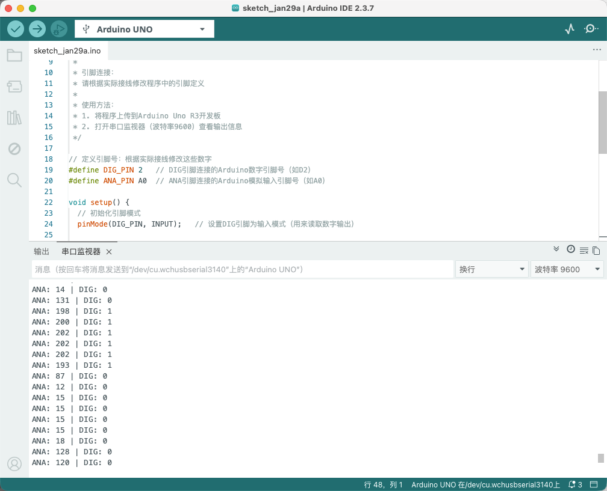

# Arduino Uno R3 Example

## Goal

This example shows how to use the TK29 - ADC MODULE on an Arduino Uno R3 to read analog and digital values.

## Wiring


- **VCC** → Arduino Uno R3 5V
- **GND** → Arduino Uno R3 GND
- **NC** → Leave unconnected

## Code

```cpp
// Pin number: change these to match your wiring
#define DIG_PIN 2   // Arduino digital pin connected to DIG (e.g. D2)
#define ANA_PIN A0  // Arduino analog input pin connected to ANA (e.g. A0)

void setup() {
  // Initialize pin modes
  pinMode(DIG_PIN, INPUT);   // Set DIG pin as input (to read digital output)
  
  // Start serial for debugging (9600 baud)
  Serial.begin(9600);
  
  Serial.println("TK29-ADC MODULE program started");
  Serial.println("Reading ANA (analog value) and DIG (digital value)");
}

void loop() {
  // Read analog input value (0-1023)
  int ana = analogRead(ANA_PIN);
  
  // Read digital output value
  int dig = digitalRead(DIG_PIN);
  
  // Serial output ANA and DIG values
  Serial.print("ANA: ");
  Serial.print(ana);
  Serial.print(" | DIG: ");
  Serial.println(dig);
  
  delay(100);  // Delay 100 milliseconds to avoid output too fast
}
```

## Effect





## Code Walkthrough

**Line 2–3: Pin definition**

```cpp
#define DIG_PIN 2   // Arduino digital pin connected to DIG (e.g. D2)
#define ANA_PIN A0  // Arduino analog input pin connected to ANA (e.g. A0)
```

- **`DIG_PIN`:** The Arduino digital pin connected to ADC module DIG. Change this if you use another pin.
- **`ANA_PIN`:** The Arduino analog input pin connected to ADC module ANA. Change this if you use another pin.

**Line 5–13: Initialization (setup function)**

```cpp
void setup() {
  // Initialize pin modes
  pinMode(DIG_PIN, INPUT);   // Set DIG pin as input (to read digital output)
  
  // Start serial for debugging (9600 baud)
  Serial.begin(9600);
  
  Serial.println("TK29-ADC MODULE program started");
  Serial.println("Reading ANA (analog value) and DIG (digital value)");
}
```

- **`setup()`:** Runs once when the Arduino starts.
- **`pinMode(DIG_PIN, INPUT)`:** Set DIG pin as input to read digital output.
- **`Serial.begin(9600)`:** Start serial at 9600 baud.
- **`Serial.println(...)`:** Print program start message and instructions to Serial Monitor.

**Line 15–34: Main loop (loop function)**

```cpp
void loop() {
  // Read analog input value (0-1023)
  int ana = analogRead(ANA_PIN);
  
  // Read digital output value
  int dig = digitalRead(DIG_PIN);
  
  // Serial output ANA and DIG values
  Serial.print("ANA: ");
  Serial.print(ana);
  Serial.print(" | DIG: ");
  Serial.println(dig);
  
  delay(100);  // Delay 100 milliseconds to avoid output too fast
}
```

- **`loop()`:** Runs repeatedly.
- **`analogRead(ANA_PIN)`:** Read ANA pin analog value (0-1023), corresponding to ADC module analog output.
- **`digitalRead(DIG_PIN)`:** Read DIG pin digital value (HIGH or LOW), corresponding to ADC module digital output.
- **`Serial.print(...)` and `Serial.println(...)`:** Print ANA and DIG values to Serial Monitor.
- **`delay(100)`:** Wait 100 milliseconds before reading again to avoid output too fast and control output frequency.
