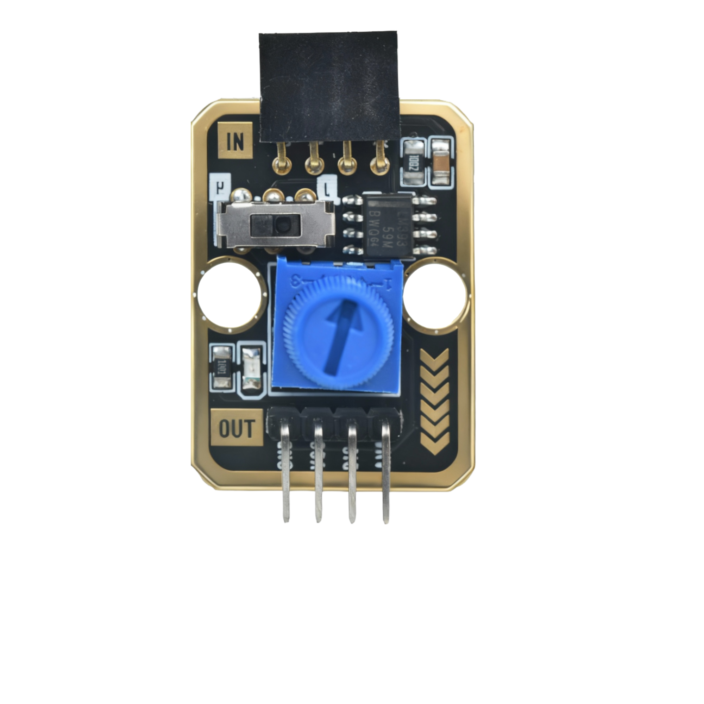
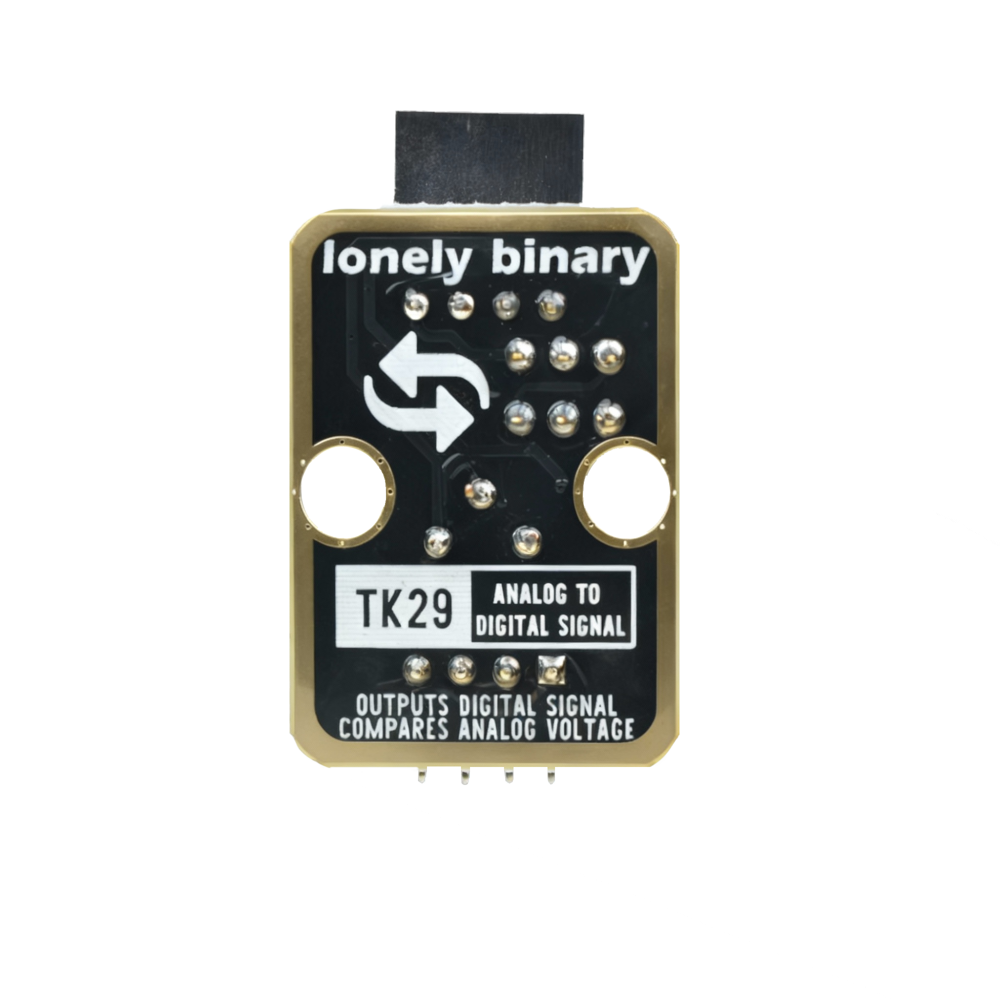
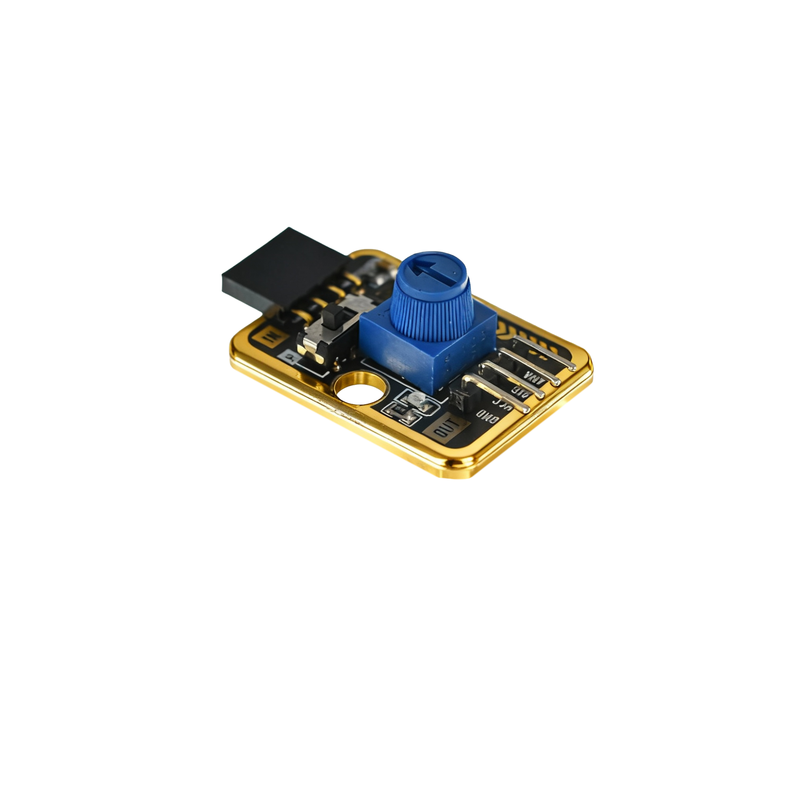

# Function

This module is an analog-to-digital converter module (ADC module) that can convert analog signals to digital signals. When an analog voltage signal is input, the module outputs a corresponding digital value. Can be used to expand the number of analog input channels on control boards, or perform high-precision analog-to-digital conversion.

# Appearance

|  |  |  |
| :-----------------------: | :-----------------------: | :-----------------------: |
|          **Front**          |          **Back**          |          **Side**          |

The module has an ADC chip and a 4-pin header interface. Each pin can be identified by the silkscreen (text printed next to the pin).

# Pinout

- **GND** (negative): Like the negative terminal (-) of a battery, connect to the control board's GND
- **VCC** (positive): Like the positive terminal (+) of a battery, connect to the control board's 3.3V or 5V (this module supports both 3.3V and 5V)
- **DIG** (digital output): Digital signal output pin, connect to the control board's digital pin (e.g. Arduino D2 or Pico GPIO 0)
  - Outputs HIGH when analog input exceeds threshold
  - Outputs LOW when analog input is below threshold
- **ANA** (analog input): Analog signal input pin, connect to the analog signal source to be converted
  - Input voltage range: 0V to VCC

# Features

- Analog-to-digital conversion: Can convert analog signals to digital signals
- Digital output: Provides digital threshold output
- Operating voltage: 3.3V or 5V
- Suitable for expanding analog input channels or performing high-precision conversion

# Quick Wiring

1. GND → Control board GND
2. VCC → Control board 3.3V or 5V
3. DIG → Control board digital pin (if digital output is needed)
4. ANA → Analog signal source (e.g. sensor, potentiometer)
