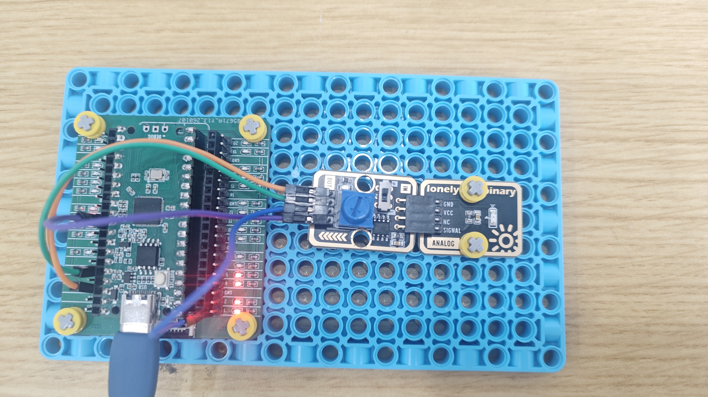

# Raspberry Pi Pico 2 Example

## Goal

This example shows how to use the TK29 - ADC MODULE on a Raspberry Pi Pico 2 to read analog and digital values.

## Wiring


## Code

```python
# Import required modules
from machine import Pin, ADC  # GPIO control and ADC
import time                   # For delay (time.sleep)

# Pin number: change these to match your wiring
DIG_PIN = 0   # GPIO connected to DIG (e.g. GPIO 0)
ANA_PIN = 26  # GPIO connected to ANA (e.g. GPIO 26, must be ADC-capable pin)

# Create pin objects
dig = Pin(DIG_PIN, Pin.IN)        # Set DIG pin as input (to read digital output)
ana = ADC(Pin(ANA_PIN))           # Set ANA pin as ADC mode (to read analog input)

print("TK29-ADC MODULE program started")
print("Reading ANA (analog value) and DIG (digital value)")

# Main loop: runs forever
while True:
    # Read analog input value (0-65535)
    ana_value = ana.read_u16()
    
    # Read digital output value
    dig_value = dig.value()
    
    # Serial output ANA and DIG values
    print(f"ANA: {ana_value} | DIG: {dig_value}")
    
    time.sleep_ms(100)  # Delay 100 milliseconds to avoid output too fast
```

## Effect




## Code Walkthrough

**Lines 1–2: Imports**

```python
from machine import Pin, ADC  # GPIO control and ADC
import time                   # For delay (time.sleep)
```

- **`machine.Pin`:** Used to control Pico GPIO pins.
- **`machine.ADC`:** Used to read analog signals.
- **`time`:** Provides `sleep()` and other time-related functions.

**Lines 5–6: Pin definition**

```python
DIG_PIN = 0   # GPIO connected to DIG (e.g. GPIO 0)
ANA_PIN = 26  # GPIO connected to ANA (e.g. GPIO 26, must be ADC-capable pin)
```

- **`DIG_PIN = 0`:** GPIO number for ADC module DIG. Change this if you use another pin.
- **`ANA_PIN = 26`:** GPIO number for ADC module ANA (must be ADC-capable pin). Change this if you use another pin.

**Lines 9–10: Create pin objects**

```python
dig = Pin(DIG_PIN, Pin.IN)        # Set DIG pin as input (to read digital output)
ana = ADC(Pin(ANA_PIN))           # Set ANA pin as ADC mode (to read analog input)
```

- **`Pin(DIG_PIN, Pin.IN)`:** Set DIG pin as input to read digital output.
- **`ADC(Pin(ANA_PIN))`:** Set ANA pin as ADC mode to read analog input.

**Lines 13–14: Print start message**

```python
print("TK29-ADC MODULE program started")
print("Reading ANA (analog value) and DIG (digital value)")
```

- **`print(...)`:** Print program start message and instructions to terminal.

**Lines 17–25: Main loop**

```python
while True:
    # Read analog input value (0-65535)
    ana_value = ana.read_u16()
    
    # Read digital output value
    dig_value = dig.value()
    
    # Serial output ANA and DIG values
    print(f"ANA: {ana_value} | DIG: {dig_value}")
    
    time.sleep_ms(100)  # Delay 100 milliseconds to avoid output too fast
```

- **`while True`:** Infinite loop; the program keeps running.
- **`ana.read_u16()`:** Read ANA pin analog value (0-65535).
- **`dig.value()`:** Read DIG pin digital value, returns 0 or 1.
- **`print(f"...")`:** Print ANA and DIG values to terminal.
- **`time.sleep_ms(100)`:** Wait 100 milliseconds before reading again to avoid output too fast.
