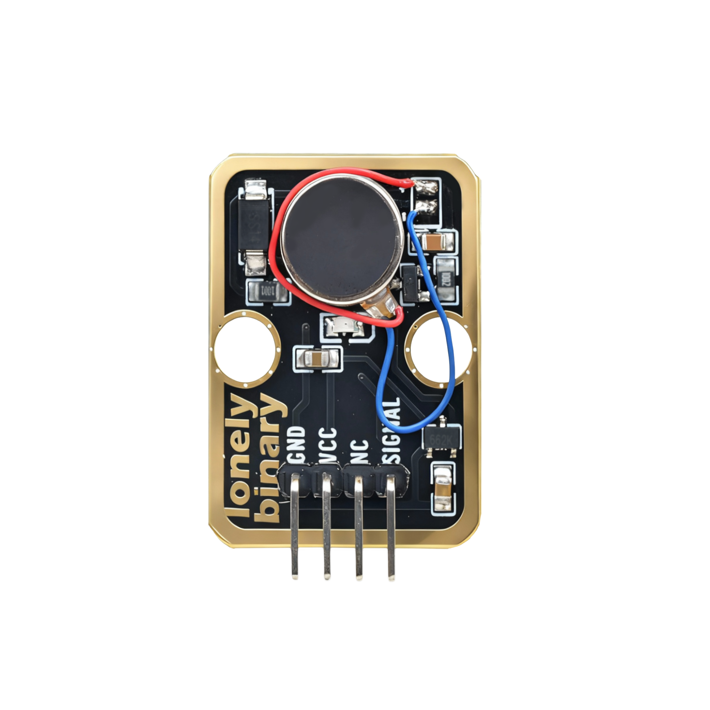
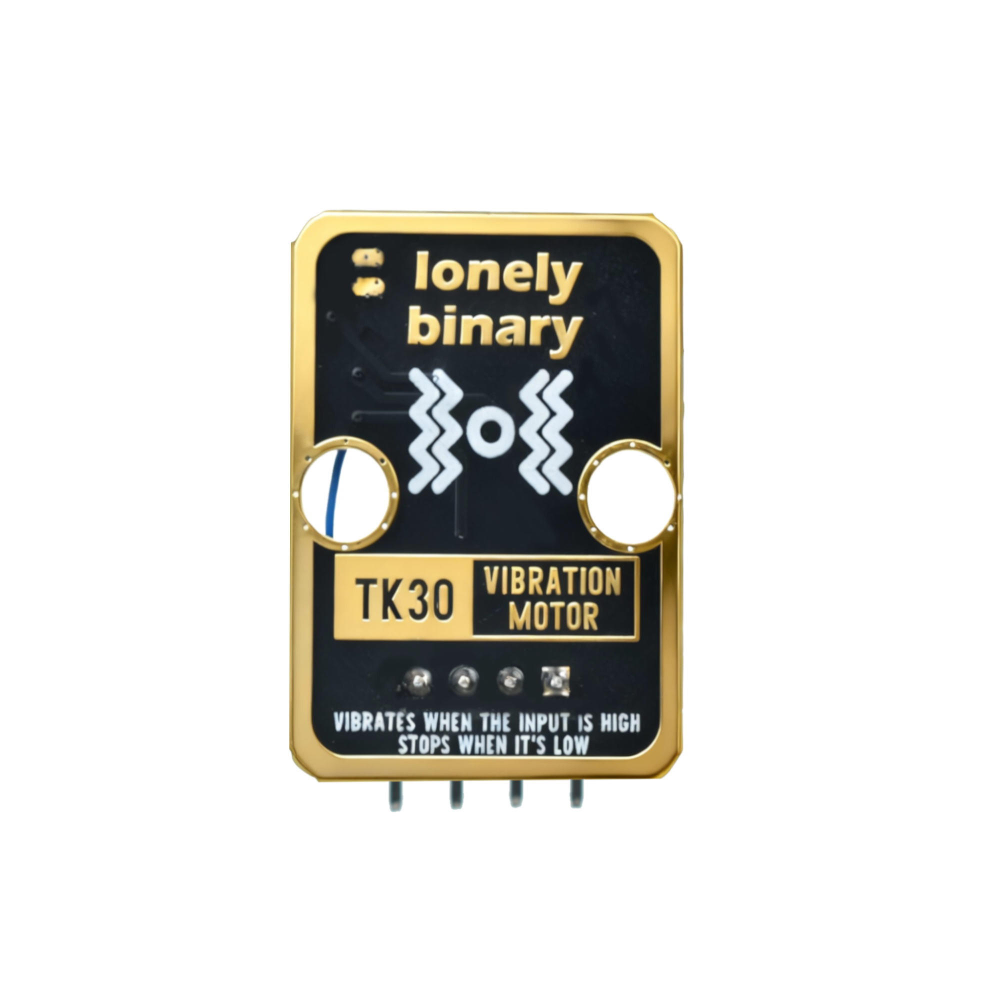

# Function

This module is a vibration motor module that can control motor vibration through programming. When a HIGH signal is received, the motor starts vibrating. Can be used to make vibration alerts, haptic feedback devices, and other applications.

# Appearance

|  |  |  |
| :-----------------------: | :-----------------------: | :-----------------------: |
|          **Front**          |          **Back**          |          **Side**          |

The module has a vibration motor and a 4-pin header interface. Each pin can be identified by the silkscreen (text printed next to the pin).

# Pinout

- **GND** (negative): Like the negative terminal (-) of a battery, connect to the control board's GND
- **VCC** (positive): Like the positive terminal (+) of a battery, connect to the control board's 3.3V or 5V (this module supports both 3.3V and 5V)
- **NC** (no connection): No actual circuit connection, included for unified interface, can be left unconnected
- **SIGNAL** (signal input): Pin to control motor vibration, connect to the control board's digital pin (e.g. Arduino D3 or Pico GPIO 0)
  - Motor vibrates when HIGH (HIGH/1)
  - Motor stops when LOW (LOW/0)

# Features

- Vibration output: Can produce vibration effects
- Operating voltage: 3.3V or 5V
- Low power consumption: Low current draw
- Suitable for making vibration alerts, haptic feedback devices

# Quick Wiring

1. GND → Control board GND
2. VCC → Control board 3.3V or 5V
3. SIGNAL → Control board digital pin (use the pin defined in your program)
