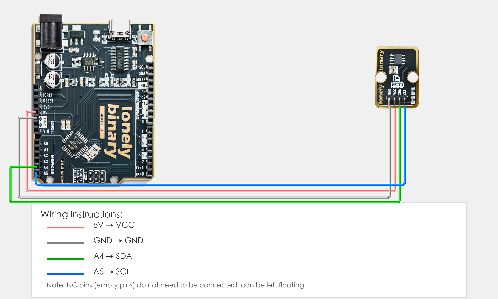

# Arduino Uno R3 Example

## Goal

This example shows how to use the TK31 - EEPROM MODULE on an Arduino Uno R3 to read and write data.

## Wiring



- **VCC** → Arduino Uno R3 5V
- **GND** → Arduino Uno R3 GND
- **NC** → Leave unconnected

## Code

```cpp
// Note: This program requires the Wire library (included with Arduino)
// Arduino Uno R3 I2C pins are fixed: SDA=A4, SCL=A5
#include <Wire.h>  // I2C communication library

// EEPROM address (usually 0x50)
#define EEPROM_ADDR 0x50

void setup() {
  // Start I2C communication
  Wire.begin();
  
  // Start serial for debugging (9600 baud)
  Serial.begin(9600);
  
  Serial.println("EEPROM module program started");
  
  // Write data
  writeEEPROM(0, 123);  // Write data 123 to address 0
  Serial.println("Data written to EEPROM");
  
  delay(100);  // Wait for write to complete
}

void loop() {
  // Read data
  int data = readEEPROM(0);  // Read data from address 0
  Serial.print("Data read from EEPROM: ");
  Serial.println(data);
  
  delay(2000);  // Wait 2 seconds
}

// Write EEPROM function
void writeEEPROM(int address, byte data) {
  Wire.beginTransmission(EEPROM_ADDR);
  Wire.write((int)(address >> 8));    // Address high byte
  Wire.write((int)(address & 0xFF));  // Address low byte
  Wire.write(data);                   // Write data
  Wire.endTransmission();
  delay(5);  // Wait for write to complete
}

// Read EEPROM function
byte readEEPROM(int address) {
  byte data = 0;
  Wire.beginTransmission(EEPROM_ADDR);
  Wire.write((int)(address >> 8));    // Address high byte
  Wire.write((int)(address & 0xFF));  // Address low byte
  Wire.endTransmission();
  Wire.requestFrom(EEPROM_ADDR, 1);  // Request 1 byte of data
  if (Wire.available()) {
    data = Wire.read();
  }
  return data;
}
```

## Effect


## Code Walkthrough

**Line 1–3: Include library**

```cpp
// Note: This program requires the Wire library (included with Arduino)
// Arduino Uno R3 I2C pins are fixed: SDA=A4, SCL=A5
#include <Wire.h>  // I2C communication library
```

- **`#include <Wire.h>`:** Include Wire library for I2C communication (Arduino Uno R3 I2C pins are fixed: SDA=A4, SCL=A5).

**Line 5: Define EEPROM address**

```cpp
// EEPROM address (usually 0x50)
#define EEPROM_ADDR 0x50
```

- **`EEPROM_ADDR`:** EEPROM module I2C address (usually 0x50).

**Line 7–20: Initialization (setup function)**

```cpp
void setup() {
  // Start I2C communication
  Wire.begin();
  
  // Start serial for debugging (9600 baud)
  Serial.begin(9600);
  
  Serial.println("EEPROM module program started");
  
  // Write data
  writeEEPROM(0, 123);  // Write data 123 to address 0
  Serial.println("Data written to EEPROM");
  
  delay(100);  // Wait for write to complete
}
```

- **`setup()`:** Runs once when the Arduino starts.
- **`Wire.begin()`:** Initialize I2C communication.
- **`Serial.begin(9600)`:** Start serial at 9600 baud.
- **`writeEEPROM(0, 123)`:** Write data 123 to address 0, demonstrating EEPROM write function.
- **`Serial.println(...)`:** Print program start message and write completion message to Serial Monitor.
- **`delay(100)`:** Wait 100 milliseconds to ensure write operation completes.

**Line 22–28: Main loop (loop function)**

```cpp
void loop() {
  // Read data
  int data = readEEPROM(0);  // Read data from address 0
  Serial.print("Data read from EEPROM: ");
  Serial.println(data);
  
  delay(2000);  // Wait 2 seconds
}
```

- **`loop()`:** Runs repeatedly.
- **`readEEPROM(0)`:** Read data from address 0, returns the read byte value.
- **`Serial.print(...)` and `Serial.println(...)`:** Print data read from EEPROM to Serial Monitor.
- **`delay(2000)`:** Wait 2000 milliseconds (2 seconds) before reading again to control output frequency.

**Line 30–38: Write EEPROM function (writeEEPROM function)**

```cpp
// Write EEPROM function
void writeEEPROM(int address, byte data) {
  Wire.beginTransmission(EEPROM_ADDR);
  Wire.write((int)(address >> 8));    // Address high byte
  Wire.write((int)(address & 0xFF));  // Address low byte
  Wire.write(data);                   // Write data
  Wire.endTransmission();
  delay(5);  // Wait for write to complete
}
```

- **`writeEEPROM()` function:** Function to write data to EEPROM.
- **`Wire.beginTransmission(EEPROM_ADDR)`:** Start I2C transmission, specify EEPROM I2C address.
- **`address >> 8`:** Shift address right by 8 bits to get address high byte (EEPROM address is 16-bit, needs to be sent in two bytes).
- **`address & 0xFF`:** Get address low byte (take lower 8 bits of address).
- **`Wire.write(data)`:** Send data to write.
- **`Wire.endTransmission()`:** End I2C transmission, execute write operation.
- **`delay(5)`:** Wait 5 milliseconds to ensure EEPROM write operation completes (EEPROM writes take time).

**Line 40–50: Read EEPROM function (readEEPROM function)**

```cpp
// Read EEPROM function
byte readEEPROM(int address) {
  byte data = 0;
  Wire.beginTransmission(EEPROM_ADDR);
  Wire.write((int)(address >> 8));    // Address high byte
  Wire.write((int)(address & 0xFF));  // Address low byte
  Wire.endTransmission();
  Wire.requestFrom(EEPROM_ADDR, 1);  // Request 1 byte of data
  if (Wire.available()) {
    data = Wire.read();
  }
  return data;
}
```

- **`readEEPROM()` function:** Function to read data from EEPROM.
- **`Wire.beginTransmission(EEPROM_ADDR)`:** Start I2C transmission, specify EEPROM I2C address.
- **`address >> 8` and `address & 0xFF`:** Send address high byte and low byte.
- **`Wire.endTransmission()`:** End address transmission, complete address write.
- **`Wire.requestFrom(EEPROM_ADDR, 1)`:** Request 1 byte of data from EEPROM.
- **`Wire.available()`:** Check if data is available.
- **`Wire.read()`:** Read returned data.
- **`return data`:** Return read data.
