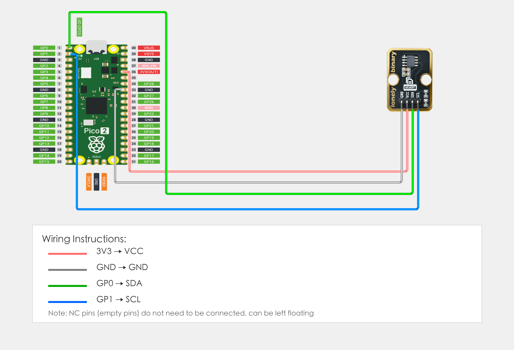
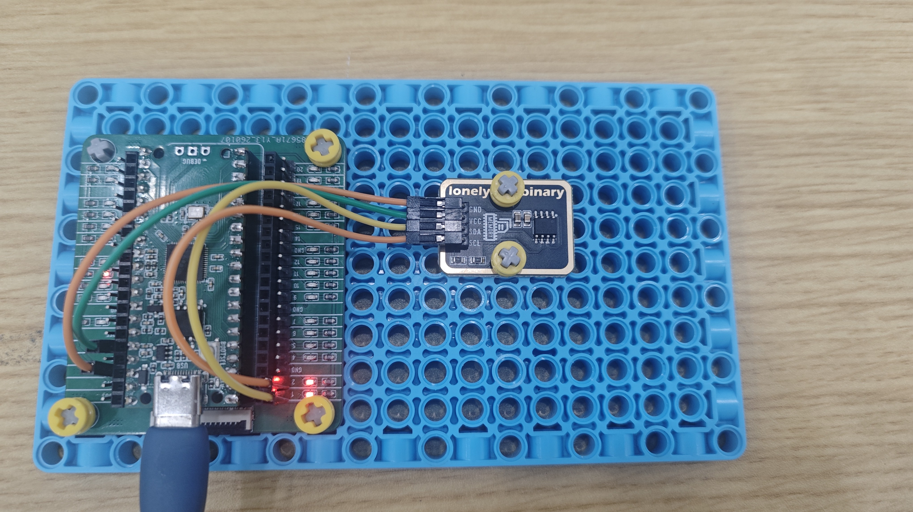

# Raspberry Pi Pico 2 Example

## Goal

This example shows how to use the TK31 - EEPROM MODULE on a Raspberry Pi Pico 2 to read and write data.

## Wiring



## Code

```python
# Import required modules
from machine import Pin, I2C  # GPIO control and I2C
import time                   # For delay (time.sleep)

# Define I2C pins
SDA_PIN = 0  # GPIO connected to SDA (e.g. GPIO 0)
SCL_PIN = 1  # GPIO connected to SCL (e.g. GPIO 1)

# EEPROM address (usually 0x50)
EEPROM_ADDR = 0x50

# Create I2C object
i2c = I2C(0, sda=Pin(SDA_PIN), scl=Pin(SCL_PIN), freq=100000)

print("EEPROM module program started")

# Write data function
def write_eeprom(address, data):
    # EEPROM requires 16-bit address, needs to be split into high and low bytes
    addr_high = (address >> 8) & 0xFF  # Address high byte
    addr_low = address & 0xFF          # Address low byte
    # Manually send address and data
    i2c.writeto(EEPROM_ADDR, bytes([addr_high, addr_low, data]))
    time.sleep(0.01)  # Wait for write to complete

# Read data function
def read_eeprom(address):
    # EEPROM requires 16-bit address, needs to be split into high and low bytes
    addr_high = (address >> 8) & 0xFF  # Address high byte
    addr_low = address & 0xFF           # Address low byte
    # Write address first
    i2c.writeto(EEPROM_ADDR, bytes([addr_high, addr_low]))
    # Then read data
    data = i2c.readfrom(EEPROM_ADDR, 1)
    return data[0]

# Write data
write_eeprom(0, 123)  # Write data 123 to address 0
print("Data written to EEPROM")

time.sleep(0.1)  # Wait for write to complete

# Main loop: runs forever
while True:
    # Read data
    data = read_eeprom(0)  # Read data from address 0
    print(f"Data read from EEPROM: {data}")
    
    time.sleep(2)  # Wait 2 seconds
```

## Effect




## Code Walkthrough

**Lines 1–2: Imports**

```python
from machine import Pin, I2C  # GPIO control and I2C
import time                   # For delay (time.sleep)
```

- **`machine.Pin`:** Used to control Pico GPIO pins.
- **`machine.I2C`:** Used for I2C communication.
- **`time`:** Provides `sleep()` and other time-related functions.

**Lines 4–6: Pin definition and EEPROM address**

```python
SDA_PIN = 0  # GPIO connected to SDA (e.g. GPIO 0)
SCL_PIN = 1  # GPIO connected to SCL (e.g. GPIO 1)
EEPROM_ADDR = 0x50
```

- **`SDA_PIN`:** GPIO number for I2C data pin connected to Pico GPIO 0. Change this if you use another pin.
- **`SCL_PIN`:** GPIO number for I2C clock pin connected to Pico GPIO 1. Change this if you use another pin.
- **`EEPROM_ADDR`:** EEPROM module I2C address (usually 0x50).

**Line 9: Create I2C object**

```python
i2c = I2C(0, sda=Pin(SDA_PIN), scl=Pin(SCL_PIN), freq=100000)
```

- **`I2C(0, ...)`:** Create I2C object, use I2C bus 0, frequency 100kHz.

**Lines 14–21: Write EEPROM function**

```python
def write_eeprom(address, data):
    # EEPROM requires 16-bit address, needs to be split into high and low bytes
    addr_high = (address >> 8) & 0xFF  # Address high byte
    addr_low = address & 0xFF          # Address low byte
    # Manually send address and data
    i2c.writeto(EEPROM_ADDR, bytes([addr_high, addr_low, data]))
    time.sleep(0.01)  # Wait for write to complete
```

- **`write_eeprom(address, data)`:** Write data to specified address. EEPROM requires 16-bit address, needs to be split into high and low bytes.
- **`i2c.writeto(...)`:** Write data to EEPROM via I2C.
- **`time.sleep(0.01)`:** Wait for write to complete.

**Lines 23–28: Read EEPROM function**

```python
def read_eeprom(address):
    # EEPROM requires 16-bit address, needs to be split into high and low bytes
    addr_high = (address >> 8) & 0xFF  # Address high byte
    addr_low = address & 0xFF           # Address low byte
    # Write address first
    i2c.writeto(EEPROM_ADDR, bytes([addr_high, addr_low]))
    # Then read data
    data = i2c.readfrom(EEPROM_ADDR, 1)
    return data[0]
```

- **`read_eeprom(address)`:** Read data from specified address. Write address first, then read data.
- **`i2c.readfrom(...)`:** Read data from EEPROM via I2C.

**Lines 43–47: Main loop**

```python
while True:
    # Read data
    data = read_eeprom(0)  # Read data from address 0
    print(f"Data read from EEPROM: {data}")
    
    time.sleep(2)  # Wait 2 seconds
```

- **`while True`:** Infinite loop; the program keeps running.
- **`read_eeprom(0)`:** Read data from address 0.
- **`print(f"...")`:** Print read data to terminal.
- **`time.sleep(2)`:** Wait 2 seconds before reading again.
