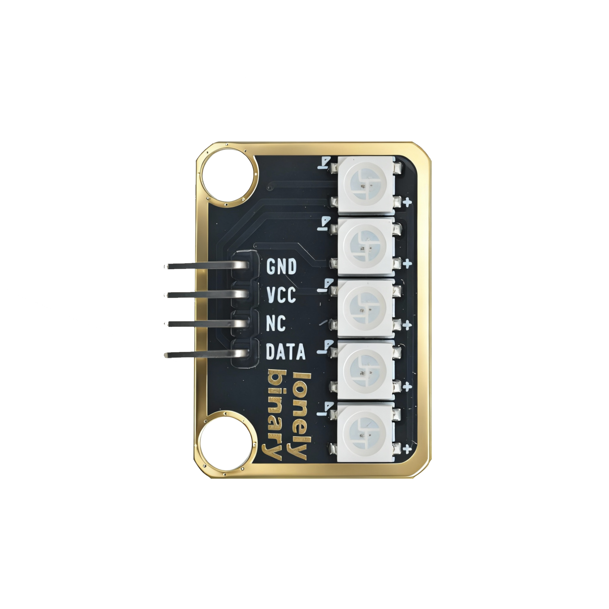
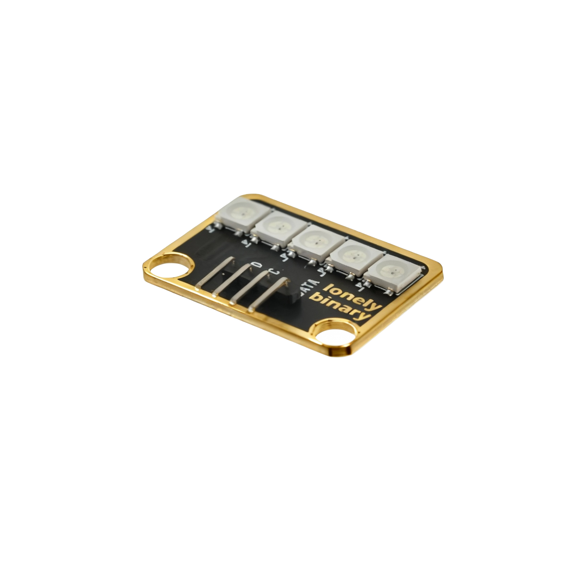

# Function

This module is a WS2812 RGB LED module that can control 5 LED beads to display any color through programming. Each LED bead can be controlled independently, enabling rainbow, flowing, blinking, and other lighting effects.

# Appearance

|  |  |  |
| :-----------------------: | :-----------------------: | :-----------------------: |
|          **Front**          |          **Back**          |          **Side**          |

The board has 5 LED beads arranged in a row, each can display different colors independently. The module has a 4-pin header interface. Each pin can be identified by the silkscreen (text printed next to the pin).

# Pinout

- **GND** (negative): Like the negative terminal (-) of a battery, connect to the control board's GND
- **VCC** (positive): Like the positive terminal (+) of a battery, connect to the control board's 5V (Note: Must connect to 5V, cannot use 3.3V)
- **DATA** (data line): Transmits control signals, connect to the control board's digital pin (e.g. Arduino D6 or Pico GPIO 0)
- **NC** (no connection): No actual circuit connection, included for unified interface, can be left unconnected

# Features

- 5 LED beads, each can display different colors
- Only one data line needed to control all LED beads
- Operating voltage: 5V

# Quick Wiring

1. GND → Control board GND
2. VCC → Control board 5V
3. DATA → Control board digital pin (use the pin defined in your program)
