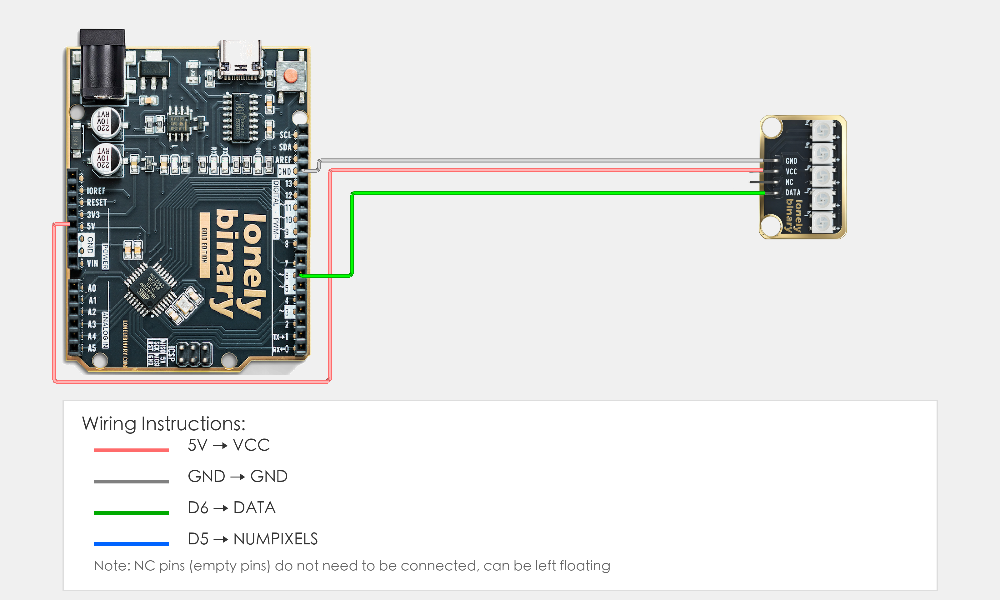

# Arduino Uno R3 Example

## Goal

This example shows how to use the TK33 - WS2812 LED module on an Arduino Uno R3 to create rainbow effects.

## Wiring



- **VCC** → Arduino Uno R3 5V
- **GND** → Arduino Uno R3 GND
- **NC** → Leave unconnected

## Code

```cpp
// Include FastLED library for controlling WS2812 LEDs
#include <FastLED.h>

// Pin number and LED count: change these to match your wiring
#define PIN 6        // Arduino digital pin connected to DATA (e.g. D6)
#define NUMPIXELS 5  // Number of LEDs (this module has 5 LEDs)

// Create color array to store color values for each LED
CRGB leds[NUMPIXELS];

void setup() {
  // Initialize WS2812 LEDs
  FastLED.addLeds<WS2812, PIN, GRB>(leds, NUMPIXELS);
  // WS2812: LED type
  // PIN: Data pin (pin 6)
  // GRB: Color order is Green-Red-Blue (WS2812 standard)
  // leds: Color array
  // NUMPIXELS: Number of LEDs (5)
  
  // Set brightness to 50 (range 0-255, 0=off, 255=brightest)
  // 50 is about 20% brightness, visible effect without being too bright
  FastLED.setBrightness(50);
}

void loop() {
  // Rainbow gradient effect: make each LED display different colors, forming a flowing rainbow
  for(int i=0; i<NUMPIXELS; i++) {
    // Calculate hue value (color type) for each LED
    // i * 256 / NUMPIXELS: Give each LED a different starting color, forming rainbow distribution
    // millis() / 20: Increment over time, making rainbow flow (larger number = slower flow)
    // % 256: Ensure hue value cycles within 0-255 range
    int hue = ((i * 256 / NUMPIXELS) + (millis() / 20)) % 256;
    
    // Set LED color (HSV to RGB)
    // CHSV: FastLED library HSV color function
    // hue: Hue value (0-255), controls color (0=red, 85=green, 170=blue, 255=red)
    // 255: Maximum saturation (most vivid color)
    // 255: Maximum brightness (already controlled to 50 by setBrightness())
    leds[i] = CHSV(hue, 255, 255);
  }
  
  // Send all colors to LEDs at once (update together to avoid flickering)
  FastLED.show();
  
  // Delay 10 milliseconds to control animation speed (smaller number = faster flow)
  delay(10);
}
```

## Effect


## Code Walkthrough

**Line 1: Include library**

```cpp
#include <FastLED.h>
```

- **`#include <FastLED.h>`:** Include FastLED library for controlling WS2812 LEDs.

**Line 3–4: Pin and LED count definition**

```cpp
#define PIN 6        // Arduino digital pin connected to DATA (e.g. D6)
#define NUMPIXELS 5  // Number of LEDs (this module has 5 LEDs)
```

- **`PIN 6`:** Arduino digital pin number connected to DATA (change this if you use another pin).
- **`NUMPIXELS 5`:** Number of LEDs (this module has 5 LEDs).

**Line 6: Create color array**

```cpp
CRGB leds[NUMPIXELS];
```

- **`CRGB leds[NUMPIXELS]`:** Create color array to store color values for each LED.

**Line 8–12: Initialization (setup function)**

```cpp
void setup() {
  FastLED.addLeds<WS2812, PIN, GRB>(leds, NUMPIXELS);
  FastLED.setBrightness(50);
}
```

- **`setup()`:** Runs once when the Arduino starts.
- **`FastLED.addLeds<WS2812, PIN, GRB>(leds, NUMPIXELS)`:** Initialize WS2812 LEDs (WS2812 type, PIN pin, GRB color order).
- **`FastLED.setBrightness(50)`:** Set brightness to 50 (range 0-255).

**Line 14–35: Main loop (loop function)**

```cpp
void loop() {
  // Rainbow gradient effect: make each LED display different colors, forming a flowing rainbow
  for(int i=0; i<NUMPIXELS; i++) {
    // Calculate hue value (color type) for each LED
    // i * 256 / NUMPIXELS: Give each LED a different starting color, forming rainbow distribution
    // millis() / 20: Increment over time, making rainbow flow (larger number = slower flow)
    // % 256: Ensure hue value cycles within 0-255 range
    int hue = ((i * 256 / NUMPIXELS) + (millis() / 20)) % 256;
    
    // Set LED color (HSV to RGB)
    // CHSV: FastLED library HSV color function
    // hue: Hue value (0-255), controls color (0=red, 85=green, 170=blue, 255=red)
    // 255: Maximum saturation (most vivid color)
    // 255: Maximum brightness (already controlled to 50 by setBrightness())
    leds[i] = CHSV(hue, 255, 255);
  }
  
  // Send all colors to LEDs at once (update together to avoid flickering)
  FastLED.show();
  
  // Delay 10 milliseconds to control animation speed (smaller number = faster flow)
  delay(10);
}
```

- **`loop()`:** Runs repeatedly.
- **`for(int i=0; i<NUMPIXELS; i++)`:** Loop through each LED, set different colors for each LED.
- **`i * 256 / NUMPIXELS`:** Give each LED a different starting color, forming rainbow distribution (5 LEDs display red, orange, yellow, green, blue, etc.).
- **`millis() / 20`:** Increment over time to make rainbow flow (`millis()` returns program runtime in milliseconds, divide by 20 to control flow speed, larger number = slower flow).
- **`% 256`:** Ensure hue value cycles within 0-255 range, achieving color cycling.
- **`CHSV(hue, 255, 255)`:** Use HSV color mode to set LED color, hue is hue value (0-255), 255 is saturation (maximum), 255 is brightness (maximum, but already controlled to 50 by `setBrightness(50)`).
- **`FastLED.show()`:** Send all colors to LEDs at once, update together to avoid flickering.
- **`delay(10)`:** Wait 10 milliseconds before updating again to control animation speed (smaller number = faster flow).
