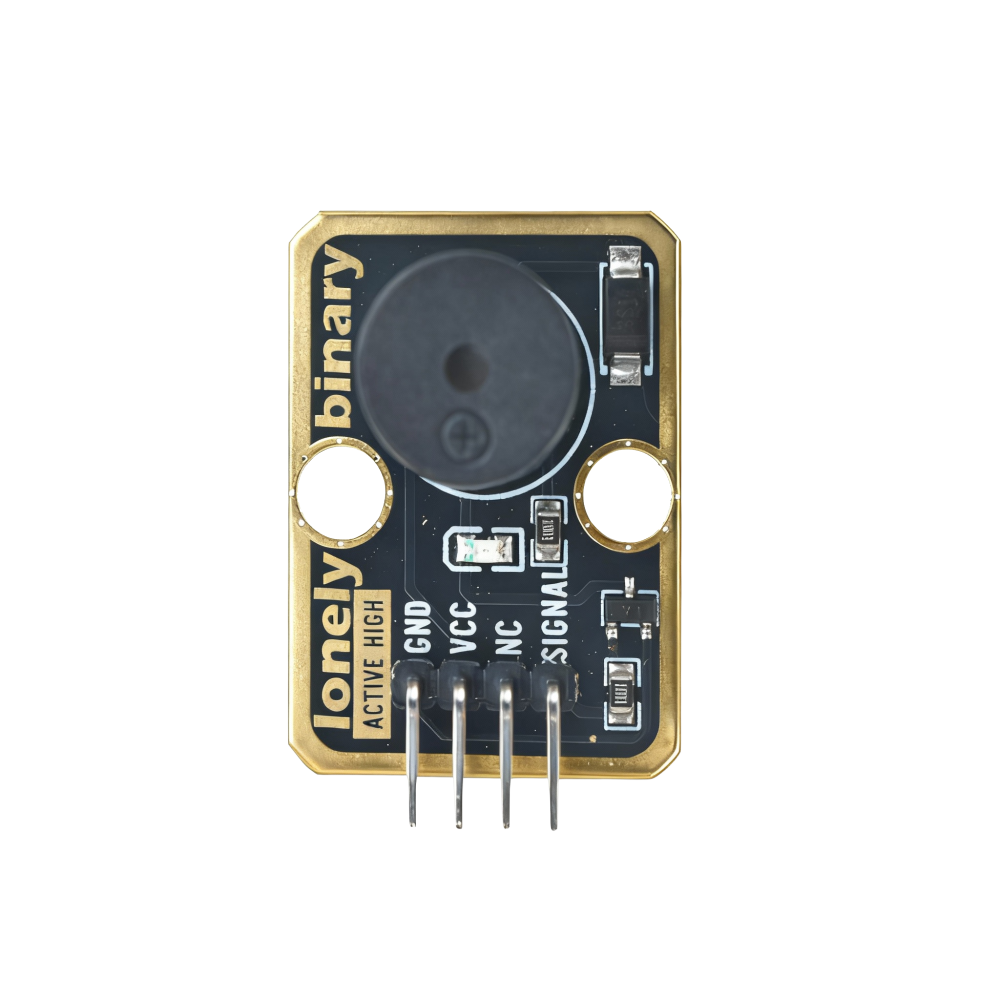

# Function

This module is an active buzzer module that automatically emits a fixed frequency sound when powered on. By controlling the pin HIGH/LOW level, you can control the buzzer on/off. Can be used to make alert sounds, alarms, keypress sounds, and other applications.

# Appearance

|  |  |  |
| :-----------------------: | :-----------------------: | :-----------------------: |
|          **Front**          |          **Back**          |          **Side**          |

The module has an active buzzer and a 4-pin header interface. Each pin can be identified by the silkscreen (text printed next to the pin).

# Pinout

- **GND** (negative): Like the negative terminal (-) of a battery, connect to the control board's GND
- **VCC** (positive): Like the positive terminal (+) of a battery, connect to the control board's 3.3V or 5V (this module supports both 3.3V and 5V)
- **NC** (no connection): No actual circuit connection, included for unified interface, can be left unconnected
- **SIGNAL** (signal input): Pin to control buzzer, connect to the control board's digital pin (e.g. Arduino D3 or Pico GPIO 0)
  - When HIGH (HIGH/1) is input, buzzer emits sound
  - When LOW (LOW/0) is input, buzzer stops
  - Can only emit fixed frequency sound, cannot change pitch

# Features

- Active buzzer: Has internal oscillator circuit, sounds when powered
- Fixed pitch: Can only emit fixed frequency sound, cannot change pitch
- Operating voltage: 3.3V or 5V
- Suitable for making simple alert sounds, alarms, and other applications

# Quick Wiring

1. GND → Control board GND
2. VCC → Control board 3.3V or 5V
3. SIGNAL → Control board digital pin (use the pin defined in your program)
