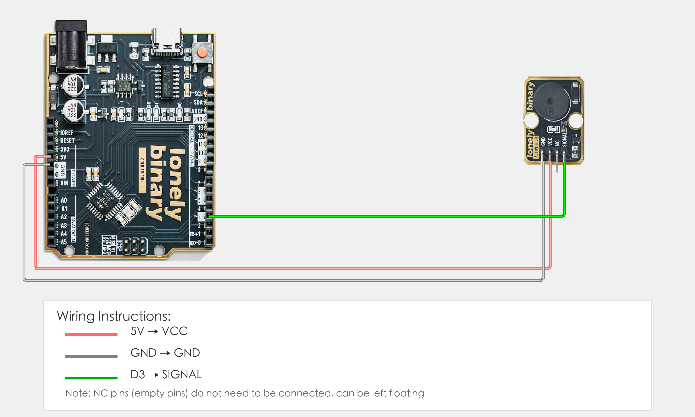
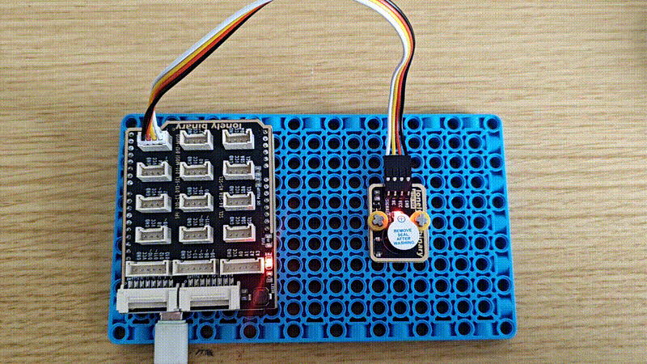

# Arduino Uno R3 Example

## Goal

This example shows how to use the TK36 - ACTIVE BUZZER module on an Arduino Uno R3 to control buzzer on/off.

## Wiring



- **VCC** → Arduino Uno R3 5V
- **GND** → Arduino Uno R3 GND
- **SIGNAL** → Arduino Uno R3 D3
- **NC** → Leave unconnected

## Code

```cpp
// Pin number: change this to match your wiring
#define BUZZER_PIN 3  // Arduino digital pin connected to SIGNAL (e.g. D3)

void setup() {
  // Initialize pin mode
  pinMode(BUZZER_PIN, OUTPUT);
  
  // Start serial for debugging (9600 baud)
  Serial.begin(9600);
  
  Serial.println("Active buzzer program started");
}

void loop() {
  // Buzzer on for 0.5 seconds
  digitalWrite(BUZZER_PIN, HIGH);  // Turn on buzzer
  Serial.println("Buzzer on");
  delay(500);  // Wait 0.5 seconds
  
  // Buzzer off for 0.5 seconds
  digitalWrite(BUZZER_PIN, LOW);   // Turn off buzzer
  Serial.println("Buzzer off");
  delay(500);  // Wait 0.5 seconds
}
```

## Effect




## Code Walkthrough

**Line 2: Pin definition**

```cpp
#define BUZZER_PIN 3  // Arduino digital pin connected to SIGNAL (e.g. D3)
```

- **`BUZZER_PIN`:** The Arduino digital pin connected to active buzzer SIGNAL. Change this if you use another pin.

**Line 4–10: Initialization (setup function)**

```cpp
void setup() {
  // Initialize pin mode
  pinMode(BUZZER_PIN, OUTPUT);
  
  // Start serial for debugging (9600 baud)
  Serial.begin(9600);
  
  Serial.println("Active buzzer program started");
}
```

- **`setup()`:** Runs once when the Arduino starts.
- **`pinMode(BUZZER_PIN, OUTPUT)`:** Set buzzer pin as output to control buzzer on/off.
- **`Serial.begin(9600)`:** Start serial at 9600 baud.
- **`Serial.println(...)`:** Print program start message to Serial Monitor.

**Line 12–25: Main loop (loop function)**

```cpp
void loop() {
  // Buzzer on for 0.5 seconds
  digitalWrite(BUZZER_PIN, HIGH);  // Turn on buzzer
  Serial.println("Buzzer on");
  delay(500);  // Wait 0.5 seconds
  
  // Buzzer off for 0.5 seconds
  digitalWrite(BUZZER_PIN, LOW);   // Turn off buzzer
  Serial.println("Buzzer off");
  delay(500);  // Wait 0.5 seconds
}
```

- **`loop()`:** Runs repeatedly.
- **`digitalWrite(BUZZER_PIN, HIGH)`:** Output HIGH to turn on active buzzer (active buzzer has built-in oscillator circuit, only needs power to sound).
- **`digitalWrite(BUZZER_PIN, LOW)`:** Output LOW to turn off active buzzer.
- **`Serial.println(...)`:** Print buzzer status to Serial Monitor.
- **`delay(500)`:** Wait 500 milliseconds (0.5 seconds) to control buzzer on and off duration.
