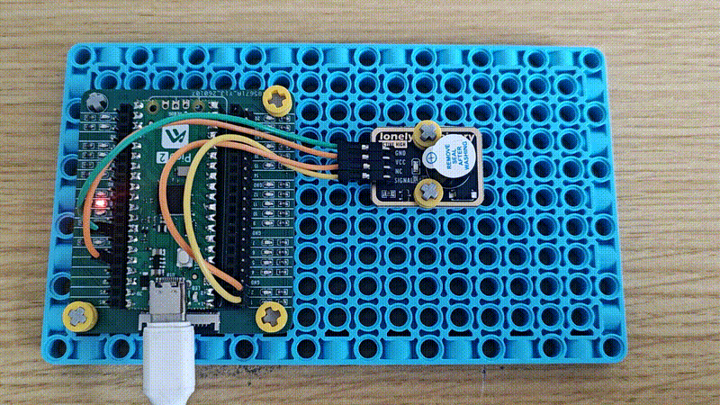

# Raspberry Pi Pico 2 Example

## Goal

This example shows how to use the TK36 - ACTIVE BUZZER module on a Raspberry Pi Pico 2 to control buzzer on/off.

## Wiring


## Code

```python
# Import required modules
from machine import Pin  # GPIO control
import time              # For delay (time.sleep)

# Pin number: change this to match your wiring
BUZZER_PIN = 0  # GPIO connected to SIGNAL (e.g. GPIO 0)

# Create Pin object, set as output mode
buzzer = Pin(BUZZER_PIN, Pin.OUT)

print("Active buzzer program started")

# Main loop: runs forever
while True:
    # Buzzer on for 0.5 seconds
    buzzer.on()  # Turn on buzzer
    print("Buzzer on")
    time.sleep(0.5)  # Wait 0.5 seconds
    
    # Buzzer off for 0.5 seconds
    buzzer.off()  # Turn off buzzer
    print("Buzzer off")
    time.sleep(0.5)  # Wait 0.5 seconds
```

## Effect




## Code Walkthrough

**Lines 1–2: Imports**

```python
from machine import Pin  # GPIO control
import time              # For delay (time.sleep)
```

- **`machine.Pin`:** Used to control Pico GPIO pins.
- **`time`:** Provides `sleep()` and other time-related functions.

**Line 5: Pin definition**

```python
BUZZER_PIN = 0  # GPIO connected to SIGNAL (e.g. GPIO 0)
```

- **`BUZZER_PIN = 0`:** GPIO number for active buzzer SIGNAL. Change this if you use another pin.

**Line 8: Create Pin object**

```python
buzzer = Pin(BUZZER_PIN, Pin.OUT)
```

- **`Pin(BUZZER_PIN, Pin.OUT)`:** Set buzzer pin as output to control buzzer on/off.

**Lines 13–22: Main loop**

```python
while True:
    # Buzzer on for 0.5 seconds
    buzzer.on()  # Turn on buzzer
    print("Buzzer on")
    time.sleep(0.5)  # Wait 0.5 seconds
    
    # Buzzer off for 0.5 seconds
    buzzer.off()  # Turn off buzzer
    print("Buzzer off")
    time.sleep(0.5)  # Wait 0.5 seconds
```

- **`while True`:** Infinite loop; the program keeps running.
- **`buzzer.on()`:** Output HIGH to turn on active buzzer.
- **`buzzer.off()`:** Output LOW to turn off active buzzer.
- **`print(...)`:** Print buzzer status to terminal.
- **`time.sleep(0.5)`:** Wait 0.5 seconds to control buzzer on and off duration.
