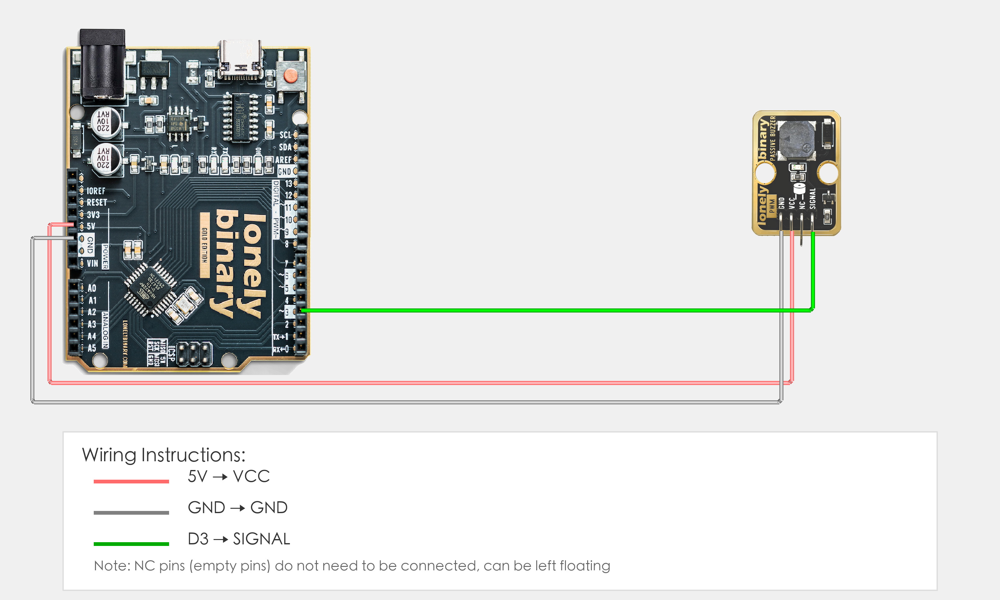

# Arduino Uno R3 Example

## Goal

This example shows how to use the TK37 - PASSIVE BUZZER module on an Arduino Uno R3 to play musical notes.

## Wiring



- **VCC** → Arduino Uno R3 5V
- **GND** → Arduino Uno R3 GND
- **SIGNAL** → Arduino Uno R3 D3
- **NC** → Leave unconnected

## Code

```cpp
// Pin number: change this to match your wiring
#define BUZZER_PIN 3  // Arduino digital pin connected to SIGNAL (e.g. D3)

void setup() {
  // Start serial for debugging (9600 baud)
  Serial.begin(9600);
  
  Serial.println("Passive buzzer program started");
}

void loop() {
  // Play scale: Do Re Mi Fa Sol La Si
  // C4=262Hz, D4=294Hz, E4=330Hz, F4=349Hz, G4=392Hz, A4=440Hz, B4=494Hz
  
  int notes[] = {262, 294, 330, 349, 392, 440, 494};  // Scale frequencies
  String noteNames[] = {"Do", "Re", "Mi", "Fa", "Sol", "La", "Si"};  // Note names
  
  for (int i = 0; i < 7; i++) {
    tone(BUZZER_PIN, notes[i]);  // Play sound at specified frequency
    Serial.print("Playing: ");
    Serial.print(noteNames[i]);
    Serial.print(" (");
    Serial.print(notes[i]);
    Serial.println(" Hz)");
    delay(500);  // Each note plays for 0.5 seconds
  }
  
  noTone(BUZZER_PIN);  // Stop playing
  Serial.println("Playback complete, waiting 0.5 seconds before repeating");
  delay(500);
}
```

## Effect


## Code Walkthrough

**Line 2: Pin definition**

```cpp
#define BUZZER_PIN 3  // Arduino digital pin connected to SIGNAL (e.g. D3)
```

- **`BUZZER_PIN`:** The Arduino digital pin connected to passive buzzer SIGNAL (must be PWM-capable pin). Change this if you use another pin.

**Line 4–8: Initialization (setup function)**

```cpp
void setup() {
  // Start serial for debugging (9600 baud)
  Serial.begin(9600);
  
  Serial.println("Passive buzzer program started");
}
```

- **`setup()`:** Runs once when the Arduino starts.
- **`Serial.begin(9600)`:** Start serial at 9600 baud.
- **`Serial.println(...)`:** Print program start message to Serial Monitor.

**Line 10–33: Main loop (loop function)**

```cpp
void loop() {
  // Play scale: Do Re Mi Fa Sol La Si
  // C4=262Hz, D4=294Hz, E4=330Hz, F4=349Hz, G4=392Hz, A4=440Hz, B4=494Hz
  
  int notes[] = {262, 294, 330, 349, 392, 440, 494};  // Scale frequencies
  String noteNames[] = {"Do", "Re", "Mi", "Fa", "Sol", "La", "Si"};  // Note names
  
  for (int i = 0; i < 7; i++) {
    tone(BUZZER_PIN, notes[i]);  // Play sound at specified frequency
    Serial.print("Playing: ");
    Serial.print(noteNames[i]);
    Serial.print(" (");
    Serial.print(notes[i]);
    Serial.println(" Hz)");
    delay(500);  // Each note plays for 0.5 seconds
  }
  
  noTone(BUZZER_PIN);  // Stop playing
  Serial.println("Playback complete, waiting 0.5 seconds before repeating");
  delay(500);
}
```

- **`loop()`:** Runs repeatedly.
- **`notes[]`:** Scale frequency array, contains frequencies of 7 notes (C4=262Hz, D4=294Hz, E4=330Hz, F4=349Hz, G4=392Hz, A4=440Hz, B4=494Hz).
- **`noteNames[]`:** Note name array, corresponding to each note's name.
- **`for (int i = 0; i < 7; i++)`:** Loop to play 7 notes.
- **`tone(BUZZER_PIN, notes[i])`:** Use `tone()` function to play sound at specified frequency (passive buzzer needs external frequency signal to sound).
- **`noTone(BUZZER_PIN)`:** Stop playing sound.
- **`Serial.print(...)` and `Serial.println(...)`:** Print current note name and frequency to Serial Monitor.
- **`delay(500)`:** Wait 500 milliseconds (0.5 seconds) to control each note's playback duration and loop interval.
