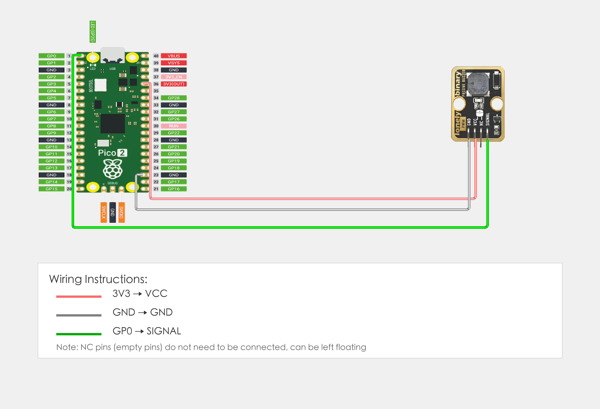

# Raspberry Pi Pico 2 Example

## Goal

This example shows how to use the TK37 - PASSIVE BUZZER module on a Raspberry Pi Pico 2 to play musical notes.

## Wiring



## Code

```python
# Import required modules
from machine import Pin, PWM  # GPIO control and PWM
import time                   # For delay (time.sleep)

# Pin number: change this to match your wiring
BUZZER_PIN = 0  # GPIO connected to SIGNAL (e.g. GPIO 0)

# Create PWM object
buzzer = PWM(Pin(BUZZER_PIN))

print("Passive buzzer program started")

# Main loop: runs forever
while True:
    # Play scale: Do Re Mi Fa Sol La Si
    # C4=262Hz, D4=294Hz, E4=330Hz, F4=349Hz, G4=392Hz, A4=440Hz, B4=494Hz
    
    notes = [262, 294, 330, 349, 392, 440, 494]  # Scale frequencies
    note_names = ["Do", "Re", "Mi", "Fa", "Sol", "La", "Si"]  # Note names
    
    for i in range(7):
        buzzer.freq(notes[i])      # Set frequency
        buzzer.duty_u16(32767)     # Set duty cycle to 50% (32767 is half of 65535)
        print(f"Playing: {note_names[i]} ({notes[i]} Hz)")
        time.sleep(0.5)            # Each note plays for 0.5 seconds
    
    buzzer.duty_u16(0)            # Stop playing (duty cycle = 0)
    print("Playback complete, waiting 0.5 seconds before repeating")
    time.sleep(0.5)
```

## Effect


## Code Walkthrough

**Lines 1–2: Imports**

```python
from machine import Pin, PWM  # GPIO control and PWM
import time                   # For delay (time.sleep)
```

- **`machine.Pin`:** Used to control Pico GPIO pins.
- **`machine.PWM`:** Used to control Pico PWM output.
- **`time`:** Provides `sleep()` and other time-related functions.

**Line 5: Pin definition**

```python
BUZZER_PIN = 0  # GPIO connected to SIGNAL (e.g. GPIO 0)
```

- **`BUZZER_PIN = 0`:** GPIO number for passive buzzer SIGNAL. Change this if you use another pin.

**Line 8: Create PWM object**

```python
buzzer = PWM(Pin(BUZZER_PIN))
```

- **`PWM(Pin(BUZZER_PIN))`:** Create PWM object for buzzer pin.

**Lines 13–28: Main loop**

```python
while True:
    # Play scale: Do Re Mi Fa Sol La Si
    # C4=262Hz, D4=294Hz, E4=330Hz, F4=349Hz, G4=392Hz, A4=440Hz, B4=494Hz
    
    notes = [262, 294, 330, 349, 392, 440, 494]  # Scale frequencies
    note_names = ["Do", "Re", "Mi", "Fa", "Sol", "La", "Si"]  # Note names
    
    for i in range(7):
        buzzer.freq(notes[i])      # Set frequency
        buzzer.duty_u16(32767)     # Set duty cycle to 50% (32767 is half of 65535)
        print(f"Playing: {note_names[i]} ({notes[i]} Hz)")
        time.sleep(0.5)            # Each note plays for 0.5 seconds
    
    buzzer.duty_u16(0)            # Stop playing (duty cycle = 0)
    print("Playback complete, waiting 0.5 seconds before repeating")
    time.sleep(0.5)
```

- **`while True`:** Infinite loop; the program keeps running.
- **`notes[]`:** Scale frequency array (C4=262Hz, D4=294Hz, E4=330Hz, F4=349Hz, G4=392Hz, A4=440Hz, B4=494Hz).
- **`note_names[]`:** Note name array.
- **`for i in range(7)`:** Loop to play 7 notes.
- **`buzzer.freq(notes[i])`:** Set PWM frequency to specified note frequency.
- **`buzzer.duty_u16(32767)`:** Set duty cycle to 50% (32767 is half of 65535) for sound output.
- **`buzzer.duty_u16(0)`:** Set duty cycle to 0 to stop playing.
- **`print(f"...")`:** Print current note information to terminal.
- **`time.sleep(0.5)`:** Each note plays for 0.5 seconds, wait 0.5 seconds after playback completes before repeating.
