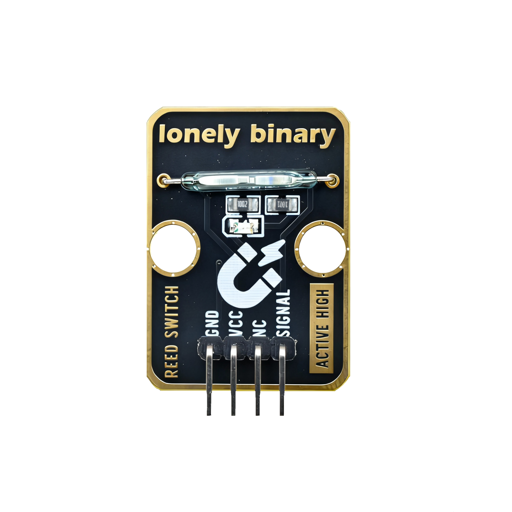

# Function

This module is a magnetic switch module that can detect magnetic fields. When a magnet approaches, the magnetic switch closes and outputs a HIGH signal. Can be used to make door sensors, position detection, magnetic field detection, and other applications.

# Appearance

|  |  |  |
| :-----------------------: | :-----------------------: | :-----------------------: |
|          **Front**          |          **Back**          |          **Side**          |

The module has a magnetic switch and a 4-pin header interface. Each pin can be identified by the silkscreen (text printed next to the pin).

# Pinout

- **GND** (negative): Like the negative terminal (-) of a battery, connect to the control board's GND
- **VCC** (positive): Like the positive terminal (+) of a battery, connect to the control board's 3.3V or 5V (this module supports both 3.3V and 5V)
- **NC** (no connection): No actual circuit connection, included for unified interface, can be left unconnected
- **SIGNAL** (signal output): Magnetic field detection output pin, connect to the control board's digital pin (e.g. Arduino D2 or Pico GPIO 0)
  - Outputs HIGH (HIGH/1) when magnetic field is detected
  - Outputs LOW (LOW/0) when no magnetic field is detected

# Features

- Magnetic field detection: Outputs HIGH when magnetic field is detected
- Operating voltage: 3.3V or 5V
- Suitable for making door sensors, position detection, and other applications

# Quick Wiring

1. GND → Control board GND
2. VCC → Control board 3.3V or 5V
3. SIGNAL → Control board digital pin (use the pin defined in your program)
