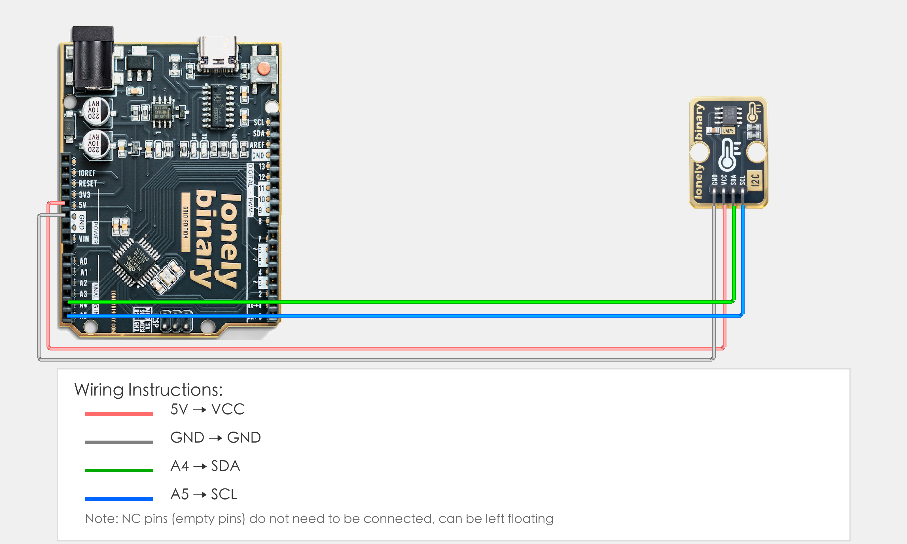
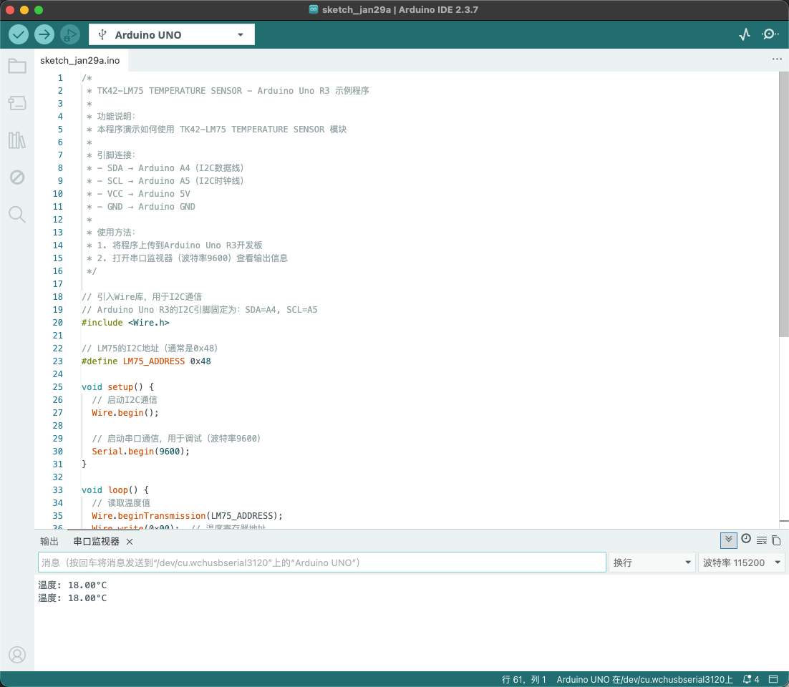

# Arduino Uno R3 Example

## Goal

This example shows how to use the TK42 - LM75 TEMPERATURE SENSOR module on an Arduino Uno R3 to read temperature.

## Wiring



- **VCC** → Arduino Uno R3 5V
- **GND** → Arduino Uno R3 GND
- **NC** → Leave unconnected

## Code

```cpp
// Include Wire library for I2C communication
// Arduino Uno R3 I2C pins are fixed: SDA=A4, SCL=A5
#include <Wire.h>

// LM75 I2C address (usually 0x48)
#define LM75_ADDRESS 0x48

void setup() {
  // Start I2C communication
  Wire.begin();
  
  // Start serial for debugging (9600 baud)
  Serial.begin(9600);
}

void loop() {
  // Read temperature value
  Wire.beginTransmission(LM75_ADDRESS);
  Wire.write(0x00);  // Temperature register address
  Wire.endTransmission();
  
  // Read 2 bytes of data
  Wire.requestFrom(LM75_ADDRESS, 2);
  if(Wire.available() >= 2) {
    int highByte = Wire.read();      // High byte
    int lowByte = Wire.read();        // Low byte
    
    // Combine into 16-bit temperature value
    int tempRaw = (highByte << 8) | lowByte;
    
    // Convert to actual temperature (unit: Celsius)
    // LM75 temperature value is 11-bit, highest bit is sign bit
    float temperature = (tempRaw >> 5) * 0.125;
    
    // Display temperature on Serial Monitor
    Serial.print("Temperature: ");
    Serial.print(temperature);
    Serial.println("°C");
  }
  
  // Delay 1 second to avoid reading too fast
  delay(1000);
}
```

## Effect





## Code Walkthrough

**Lines 1–3: Include library**

```cpp
// Include Wire library for I2C communication
// Arduino Uno R3 I2C pins are fixed: SDA=A4, SCL=A5
#include <Wire.h>
```

- **`#include <Wire.h>`:** Include Wire library for I2C communication (Arduino Uno R3 I2C pins are fixed: SDA=A4, SCL=A5).

**Line 5: Define LM75 address**

```cpp
// LM75 I2C address (usually 0x48)
#define LM75_ADDRESS 0x48
```

- **`LM75_ADDRESS`:** LM75 temperature sensor I2C address (usually 0x48).

**Lines 7–12: Initialization (setup function)**

```cpp
void setup() {
  // Start I2C communication
  Wire.begin();
  
  // Start serial for debugging (9600 baud)
  Serial.begin(9600);
}
```

- **`setup()`:** Runs once when the Arduino starts.
- **`Wire.begin()`:** Initialize I2C communication.
- **`Serial.begin(9600)`:** Start serial at 9600 baud.

**Lines 14–43: Main loop (loop function)**

```cpp
void loop() {
  // Read temperature value
  Wire.beginTransmission(LM75_ADDRESS);
  Wire.write(0x00);  // Temperature register address
  Wire.endTransmission();
  
  // Read 2 bytes of data
  Wire.requestFrom(LM75_ADDRESS, 2);
  if(Wire.available() >= 2) {
    int highByte = Wire.read();      // High byte
    int lowByte = Wire.read();        // Low byte
    
    // Combine into 16-bit temperature value
    int tempRaw = (highByte << 8) | lowByte;
    
    // Convert to actual temperature (unit: Celsius)
    // LM75 temperature value is 11-bit, highest bit is sign bit
    float temperature = (tempRaw >> 5) * 0.125;
    
    // Display temperature on Serial Monitor
    Serial.print("Temperature: ");
    Serial.print(temperature);
    Serial.println("°C");
  }
  delay(1000);
}
```

- **`loop()`:** Runs repeatedly.
- **`Wire.beginTransmission(LM75_ADDRESS)`:** Start I2C transmission, specify LM75 I2C address.
- **`Wire.write(0x00)`:** Write temperature register address (0x00), specify register to read.
- **`Wire.endTransmission()`:** End address transmission, complete register address write.
- **`Wire.requestFrom(LM75_ADDRESS, 2)`:** Request 2 bytes of data from LM75 (temperature value consists of 2 bytes).
- **`Wire.available() >= 2`:** Check if enough data is available (at least 2 bytes).
- **`Wire.read()`:** Read high byte and low byte, high byte first, low byte second.
- **`(highByte << 8) | lowByte`:** Shift high byte left by 8 bits and combine with low byte to form 16-bit raw temperature value.
- **`(tempRaw >> 5) * 0.125`:** Shift raw temperature value right by 5 bits and multiply by 0.125 to convert to actual temperature (LM75 temperature value is 11-bit, highest bit is sign bit, resolution is 0.125°C).
- **`Serial.print(...)` and `Serial.println(...)`:** Print temperature value (unit: °C) to Serial Monitor.
- **`delay(1000)`:** Wait 1000 milliseconds (1 second) before reading again to avoid reading too fast and control output frequency.
